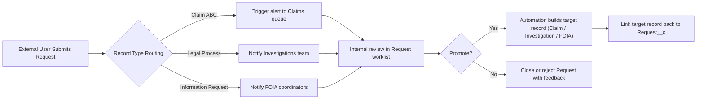

# Request Intake Lifecycle

## Overview

`Request__c` is the controlled entry point for data submitted by Experience Cloud users and other external channels. External members can create and update requests, but they cannot touch downstream objects such as Claim or Investigation. Internal teams review each request, trigger notifications, and promote the data into the substantive Salesforce records only after validation.

## Experience Site Access Model

- **External visibility**: Community profiles have create/read access to `Request__c` only. No access is granted to Matters, Claims, Investigations, or Contacts beyond what is surfaced in the request.
- **Internal visibility**: Internal users maintain full access to Requests plus the rest of the Recon data model.
- **Guardrails**: The staging pattern prevents community users from creating duplicate claims, contacts, or other sensitive records directly.

## Intake Flow
{: .text-delta }

## Request Record Design

| Aspect | Recommendation |
|--------|----------------|
| Record Types | Map each inbound scenario (e.g., Claim ABC, Legal Process, Information Request) to a record type with tailored page layouts and validation. |
| Fields | Capture only the data external users should provide (summary, attachments, priority, contact details). Use descriptions and help text to enforce quality. |
| Validation Rules | Enforce required fields per record type so automation can promote without additional cleanup. |
| Sharing Model | Keep external sharing `Private` and use sharing sets for community access if needed. |
| UI | Use Experience Cloud forms or screen flows to guide submitters while preventing direct access to downstream records. |

## Automation Patterns

### Alerts and Notifications
- **Owner assignment**: Queue or user assignment based on record type, channel, or region.
- **Notifications**: Use Flow, Email Alerts, or Slack notifications to inform intake teams instantly.
- **Worklists**: Create list views or Omni-Channel work queues for quick triage.

### Promotion Flows
- **Flow Orchestration**: Launch an autolaunched flow when a request status changes to “Ready for Promotion.” Build the target record, copy field values, and create supporting child records.
- **Triggers / Apex**: Use for complex transformations or cross-object validation (e.g., matching existing Contacts before creating new ones).
- **Platform Events**: Emit events when a request is approved so downstream systems can react without direct API access to Experience users.

### Duplication Controls
- Search for existing Contacts, Matters, or Claims before creating new records.
- Require an internal approver to confirm matches, or use screen flows to guide the decision.
- Log rejection reasons (e.g., duplicate submission, incomplete information) to coach portal users.

## Linking Back to Requests

- Every promoted object includes a lookup to the originating `Request__c` record (`Claim__c.Request__c`, `Investigation__c.Request__c`, `FOIA__c.Request__c`, etc.).
- List the Request lookup on page layouts so internal users can navigate between the intake record and substantive data quickly.
- Build roll-up summaries or formula fields on Request to display the status of the promoted record (e.g., `Promoted_Record_URL__c`).

## Best Practices

1. **Separate Staging from Production Data**
   - Keep intake-specific fields on Request; only move vetted data to the target objects.
   - Avoid granting Experience Cloud users create permissions on core objects.

2. **Standardize Promotion Criteria**
   - Define a clear checklist (data completeness, duplicates resolved, approvals) before the Request can be promoted.
   - Track promotion status (`Draft`, `Under Review`, `Promoted`, `Rejected`) with picklists and automation.

3. **Audit Trail**
   - Use field history tracking or audit fields to capture who reviewed and promoted the request.
   - Retain request attachments even after a record is promoted for compliance inquiries.

4. **User Experience**
   - Provide confirmation screens and follow-up emails to Experience users so they know their request was received.
   - Surface knowledge articles or inline guidance to reduce incomplete submissions.

5. **Reporting**
   - Monitor volume, approval rates, and rejection reasons via dashboards.
   - Track time from submission to promotion to highlight operational bottlenecks.

Following this pattern ensures that Experience Cloud contributors can initiate work without risking uncontrolled data creation, while internal teams maintain governance over the Salesforce data model.
