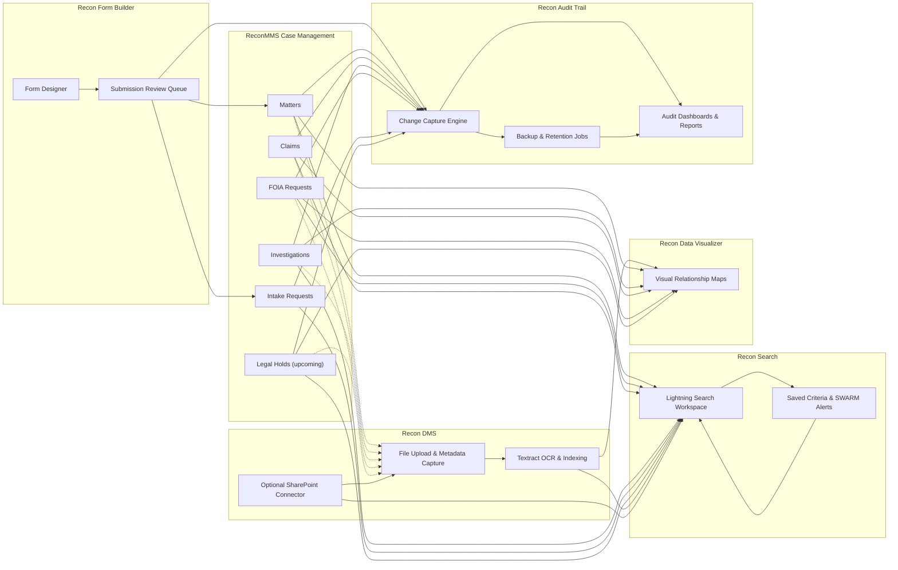

# Recon Platform Architecture

This page provides a high-level view of how the Recon products work together across intake, change tracking, discovery, and visualization workflows.

> **Audience**  
> Product owners, solution architects, and stakeholders who want to understand the major integration touch points between Recon modules.

## Overall Flow

## Module Interactions

- **ReconMMS (Case Management)**  
  Entry points include Matters, FOIA Requests, Claims, Investigations, Legal Holds and intake Requests.  
  - Matters, Investigations, and Claims feed Recon Search, Recon Data Visualizer, and Recon Audit Trail for downstream analysis.  
  - FOIA and Legal Hold records can reference files stored in Recon DMS. Legal Hold flags can mark files as **read-only** while the hold is active.  
  - Intake Requests can be generated directly or sourced from Recon Form Builder submissions before hand-off to case teams.

- **Recon Form Builder**  
  - Power users assemble Experience Cloud or internal forms with a drag-and-drop designer.  
  - Each form publishes JSON definitions that drive the runtime experience and, in the future, external integration mappings.  
  - Submissions land in the `Submission` object for review and can promote into Matters, Requests, or other ReconMMS records.

- **Recon Search**  
  - Provides a configurable Lightning workspace that aggregates internal object data and Recon DMS content.  
  - Saved criteria and SWARM alerts notify case teams when new documents or records match their watchlists.  
  - Changes to saved criteria or search configurations are captured by Recon Audit Trail for governance.

- **Recon DMS**  
  - Stores source documents, runs Textract for OCR, and indexes results in OpenSearch.  
  - Files can be associated with Matters, FOIA requests, Claims, Investigations, Legal Holds, and Submission records.  
  - Optional SharePoint integration brings external repositories into the same search experience.

- **Recon Audit Trail**  
  - Monitors up to 300 fields per object across ReconMMS, Recon Form Builder submissions, and Recon Search configuration records.  
  - Automates backup jobs to Salesforce Files or Google Drive with retention controls and permanent-history flags.  
  - Surfaces change activity through native reports, dashboards, and list views for auditors and compliance teams.

- **Recon Data Visualizer**  
  - Presents interactive graphs showing relationships across Matters, Investigations, Claims, FOIA requests, Requests, Legal Holds, and Submission artifacts.  
  - Leverages metadata produced by Recon Search, Recon DMS, and Recon Audit Trail to surface related people, organizations, documents, and change events.

## Key Data Contracts

| Integration | Data Shared | Notes |
|-------------|-------------|-------|
| ReconMMS → Recon Search | Core object records, related lists, saved criteria | Recon Search respects Salesforce security and CRUD/FLS. |
| ReconMMS → Recon DMS | File associations, Legal Hold/FOIA flags | Legal Hold can mark files as read-only until release. |
| Recon DMS → Recon Search | Textract JSON, metadata, SharePoint references | Indexed in OpenSearch; surfaced in Lightning workspace. |
| Recon Search → Recon Data Visualizer | Search results, related entity links | Visualizer highlights relationships uncovered by search. |
| Recon DMS → Recon Data Visualizer | Document relationships, Textract insights | Visual nodes can display document activity alongside Matter timelines. |
| Recon Form Builder → ReconMMS | Form submissions, routing metadata, approval outcomes | Drives new Matters, Requests, or External Intake extensions. |
| Recon Form Builder → External Integrations *(future)* | Published form JSON, field mappings, validation rules | Planned tooling will repurpose form definitions to feed partner systems. |
| Recon Audit Trail → Storage Targets | Backup archives, retention policies, permanent snapshots | Currently supports Salesforce Files and Google Drive; S3 integration is on the roadmap. |
| Recon Audit Trail → Analytics | Aggregated change logs, audit metrics | Powers Salesforce dashboards and enables point-in-time restore workflows. |

## Looking Ahead

- **Legal Hold object** – Will enable automated file restrictions, notifications, and dashboarding alongside Matters and Investigations.  
- **FOIA integration** – Files tied to FOIA requests can trigger custom workflows (e.g., anonymization, disclosure tracking).  
- **AI Text Search** – Optional agent-based extension that augments Recon Search without altering the overall interaction model.  
- **Form Builder JSON Mapping** – Reuse form definitions as integration blueprints for external intake endpoints.  
- **Audit Trail Enhancements** – S3 backup support and point-in-time restore tooling for selected records.

## Related Documentation

- [Recon DMS Deployment Overview](recon-dms/)  
- [Recon Search Product Landing](recon-search)  
- [Recon Data Visualizer Overview](recon-data-visualizer)  
- [Recon Audit Trail Overview](recon-audit-trail)  
- [Recon Form Builder Overview](recon-form-builder)  
- [ReconMMS Case Management (external documentation)](https://example.com/) *(replace with internal link if available)*
