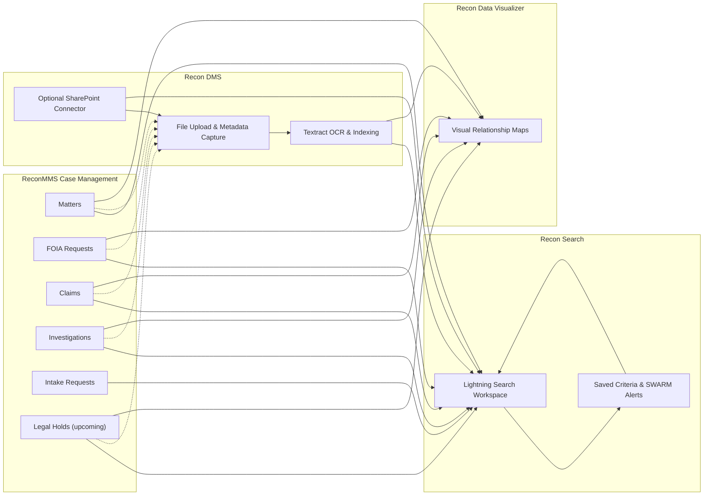

# Recon Platform Architecture

This page provides a high-level view of how the four Recon products work together across data capture, discovery, and visualization workflows.

> **Audience**  
> Product owners, solution architects, and stakeholders who want to understand the major integration touch points between Recon modules.

## Overall Flow

## Module Interactions

- **ReconMMS (Case Management)**  
  Entry points include Matters, FOIA Requests, Claims, Investigations, and intake Requests. A forthcoming **Legal Hold** object will also originate in ReconMMS.  
  - Matters, Investigations, and Claims feed Recon Search and Recon Data Visualizer for advanced analysis.  
  - FOIA and Legal Hold records can reference files stored in Recon DMS. Legal Hold flags can mark files as **read-only** while the hold is active.  
  - Requests initiate intake workflows that often produce new Matters, FoIA cases, or Legal Holds.

- **Recon Search**  
  - Provides a configurable Lightning workspace that aggregates internal object data and Recon DMS content.  
  - Saved criteria and SWARM alerts notify case teams when new documents or records match their watchlists.

- **Recon DMS**  
  - Stores source documents, runs Textract for OCR, and indexes results in OpenSearch.  
  - Files can be associated with Matters, FOIA requests, Claims, Investigations, and Legal Holds.  
  - Optional SharePoint integration brings external repositories into the same search experience.

- **Recon Data Visualizer**  
  - Presents interactive graphs showing relationships across Matters, Investigations, Claims, FOIA requests, Requests, and (soon) Legal Holds.  
  - Leverages metadata produced by Recon Search and Recon DMS to surface related people, organizations, and documents.

## Key Data Contracts

| Integration | Data Shared | Notes |
|-------------|-------------|-------|
| ReconMMS → Recon Search | Core object records, related lists, saved criteria | Recon Search respects Salesforce security and CRUD/FLS. |
| ReconMMS → Recon DMS | File associations, Legal Hold/FOIA flags | Legal Hold can mark files as read-only until release. |
| Recon DMS → Recon Search | Textract JSON, metadata, SharePoint references | Indexed in OpenSearch; surfaced in Lightning workspace. |
| Recon Search → Recon Data Visualizer | Search results, related entity links | Visualizer highlights relationships uncovered by search. |
| Recon DMS → Recon Data Visualizer | Document relationships, Textract insights | Visual nodes can display document activity alongside Matter timelines. |

## Looking Ahead

- **Legal Hold object** – Will enable automated file restrictions, notifications, and dashboarding alongside Matters and Investigations.  
- **FOIA integration** – Files tied to FOIA requests can trigger custom workflows (e.g., anonymization, disclosure tracking).  
- **AI Text Search** – Optional agent-based extension that augments Recon Search without altering the overall interaction model.

## Related Documentation

- [Recon DMS Deployment Overview](recon-dms/)  
- [Recon Search Product Landing](recon-search)  
- [Recon Data Visualizer Overview](recon-data-visualizer)  
- [ReconMMS Case Management (external documentation)](https://example.com/) *(replace with internal link if available)*
