# Recon Data Visualizer

Salesforce User Guide

## Version 2.0

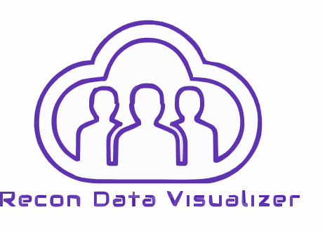

# About Recon Visualizer

The Recon Visualizer application enables users to display and explore relationships between Salesforce records through advanced data visualization. This application provides comprehensive tools for viewing connections between parent and child records, with the ability to display additional record attributes through interactive node exploration.

The application features streamlined record navigation, allowing users to traverse relationships with minimal clicks. This eliminates the need to manually access individual records and review related lists, providing instant visualization of parent-child relationships based on customized configuration settings.

# Component Overview

## Visualizer Admin

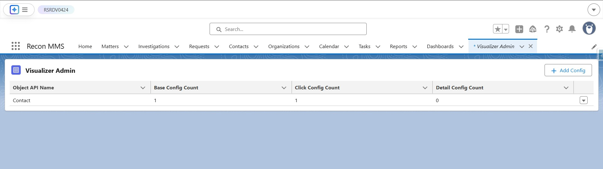
This administrative component enables configuration management for new objects, providing both basic and detailed views for comprehensive setup control.

### Detail View

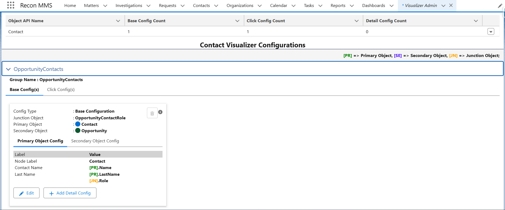

## Data Visualizer

This component renders relationship visualizations according to established configurations. The example below demonstrates the relationship mapping between Contact and Matter objects.

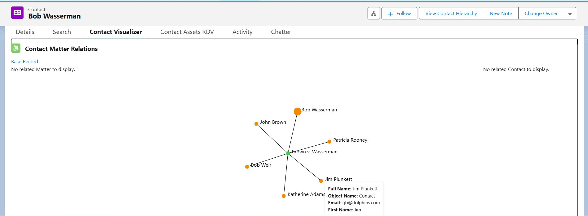

# Configuration Types

The system supports three distinct configuration levels for visualizer setup:

## Basic Configuration (Required)
The foundational configuration establishes the initial parameters for object visualization and defines the relationship structure between nodes.

## Detail Configuration (Optional)
This configuration level enables detailed information display for selected nodes. Upon node selection, the system retrieves and displays related details in the dedicated detail panel.

## Click Configuration (Optional)
This advanced configuration requires prior Detail Configuration setup. It enables the "Show in Visualizer" functionality, which dynamically updates the visualization when activated to display new record relationships.

For accessing object details, utilize the action button associated with each record and select "Show Details" from the menu to display comprehensive object information.

# Setup Instructions

This section demonstrates the configuration process for visualizing Matter-Contact relationships, where a single contact may be associated with multiple matters.

## Initial Setup

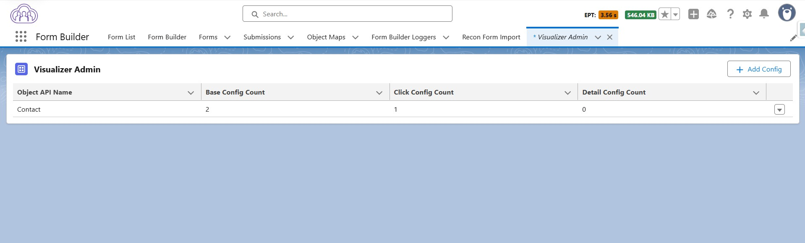
1. Navigate to the App Launcher and search for "Visualizer Admin"

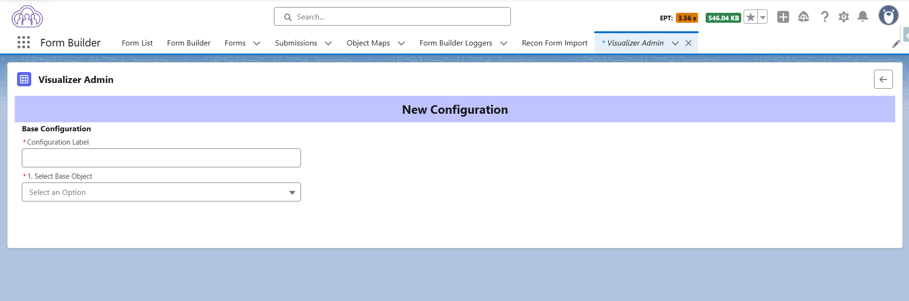
2. Select the "+ Add Config" button in the top-right corner to initiate a new configuration

## Configuration Parameters

The configuration interface dynamically displays relevant fields based on your selections. Key parameters include:

### Configuration Label
A descriptive identifier that appears in the list view for easy reference.

### Select Base Object
Choose the primary object for visualization configuration. For example, selecting "Contact" enables matter relationship visualization for contacts.

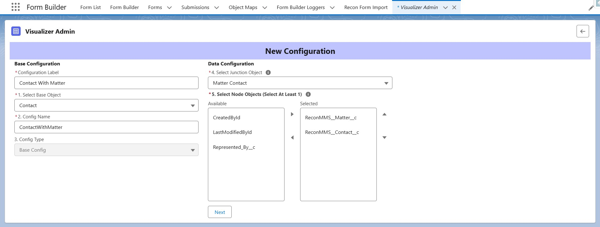

### Additional Fields

- **Config Name**: A unique identifier without spaces or special characters (underscores permitted)
- **Config Type**: Auto-populated field indicating the current configuration type
- **Select Junction Object**: Displays all objects with lookup or master-detail relationships to the base object
- **Select Node Objects**: Select one or more options to define which nodes appear with details in the visualization

## Advanced Configuration

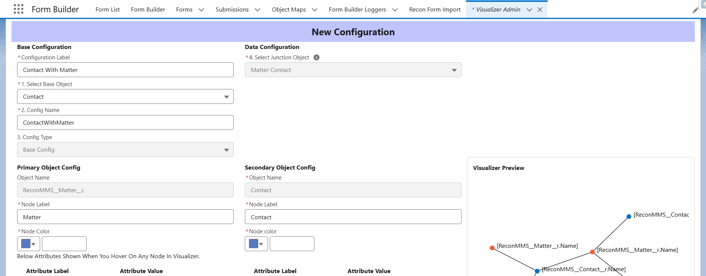

After completing initial setup, proceed to the advanced configuration screen containing three sections:

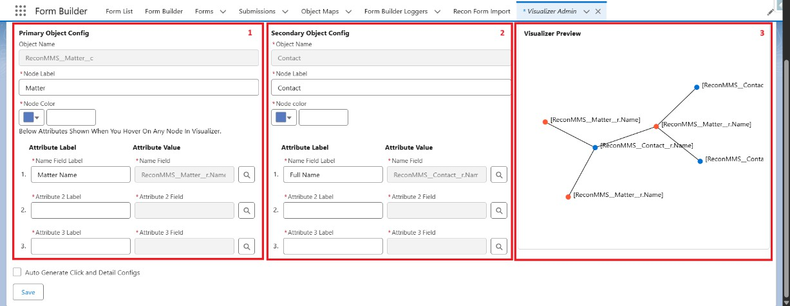

### Primary Object Configuration
Define parameters for the primary object or child nodes. Configure up to three attributes from either junction or current objects.

### Secondary Object Configuration
Configure the secondary or base object with field selections from junction or current objects.

### Visualizer Preview
Displays a configuration preview with field names that will be replaced with actual record values in production.

## Field Selection Process

1. Select node colors for visual differentiation
2. Configure empty attributes using the "Find" button adjacent to each field
3. In the dialog, select the appropriate object and corresponding field

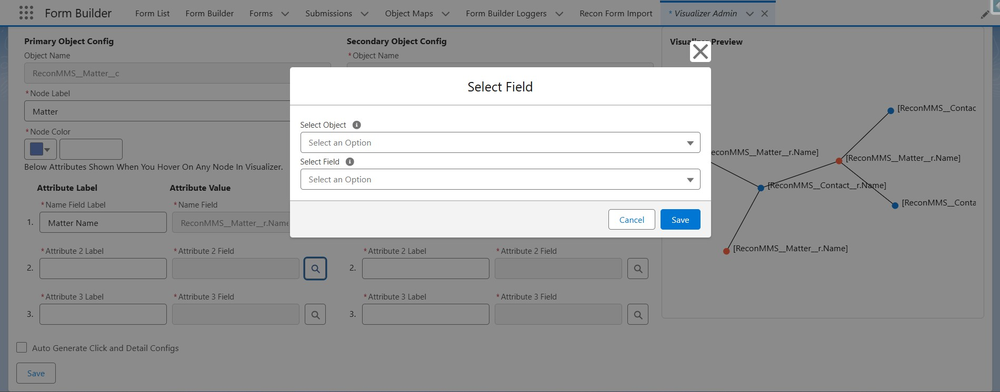
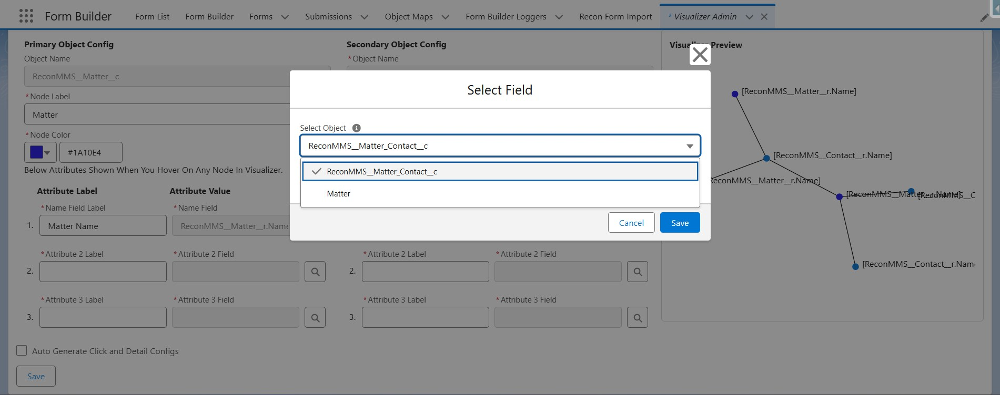
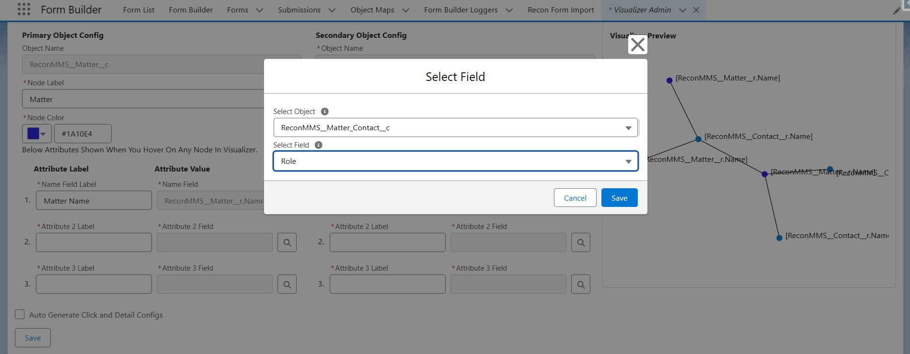

## Auto-Generation Option

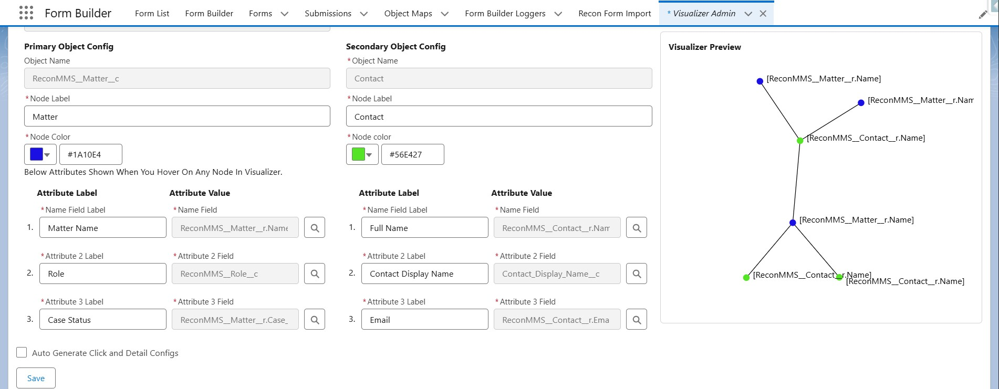

Enable "Auto Generate Click and Detail Configs" to automatically create Click and Detail configurations without manual setup.

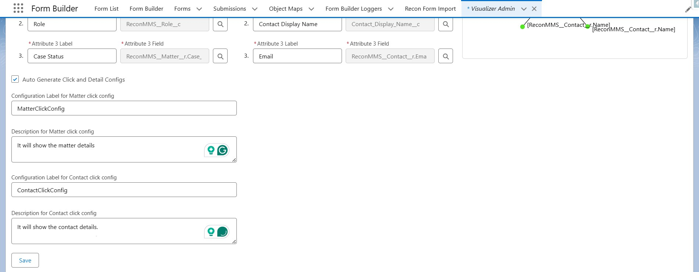

Complete the additional fields and save the configuration. The system will display status messages confirming successful setup.

# Record Detail Page Setup

## Component Placement

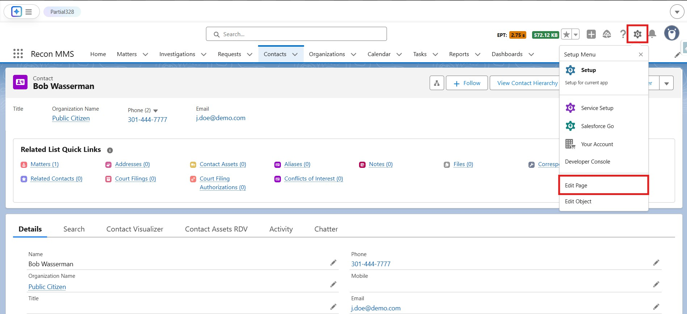

1. Navigate to a Contact record with existing junction records
2. Access Edit Page through the gear icon
3. Search for "Data Visualizer" in the component library

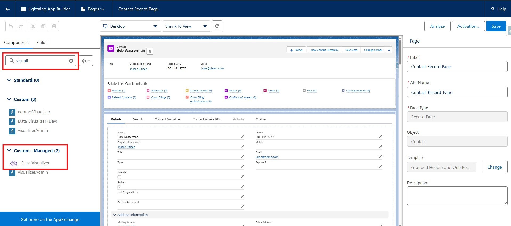
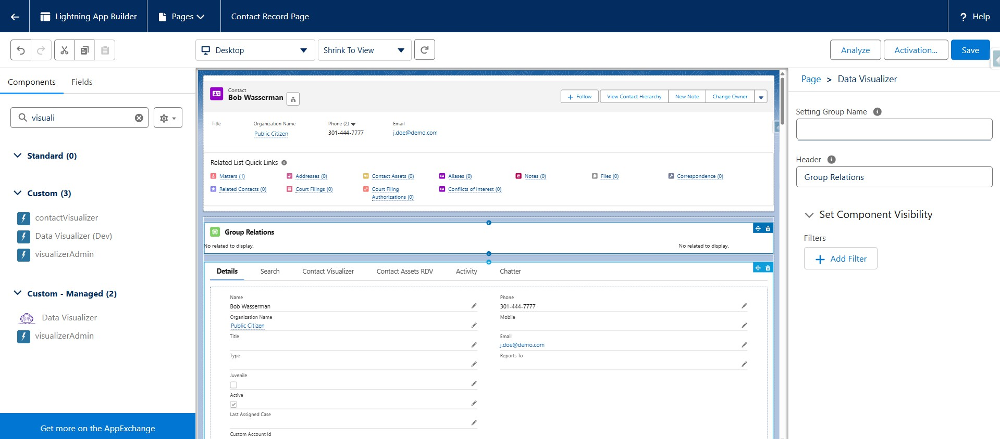

4. Drag the Data Visualizer component from the Managed section to your desired page location

## Component Configuration

Configure the following parameters in the component properties panel:

- **Setting Group Name**: Enter the unique configuration name (e.g., "ContactWithMatter")
- **Header**: Customize the display header (default value can be modified)

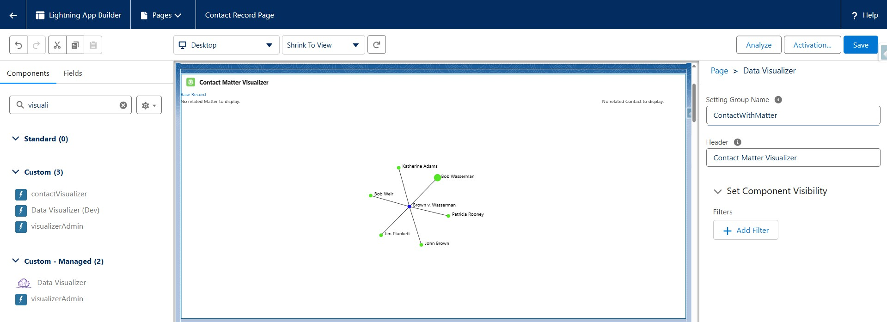

The component renders immediately upon configuration. Save changes and activate the page to complete setup.

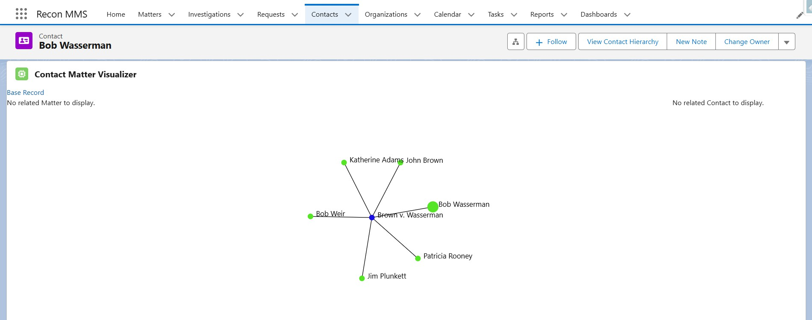

# Node Navigation

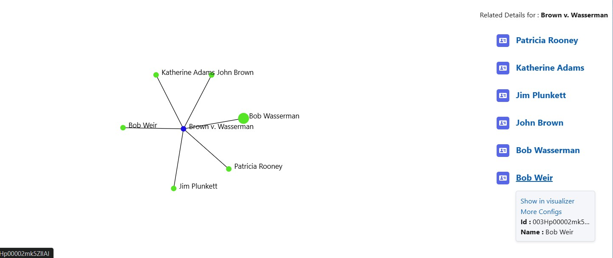

The Data Visualizer enables seamless navigation between related records without leaving the current page. Click any node to display its relationships and access additional details through hover interactions.

## Available Actions

### Show in Visualizer
Refreshes the component to display relationships for the selected record.

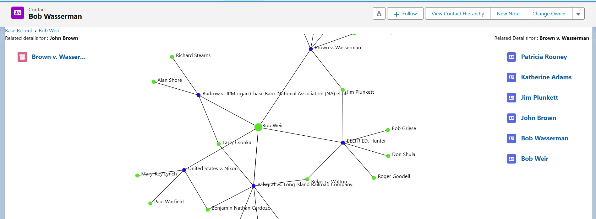

### More Configs
Displays alternative configurations applicable to the current node type.

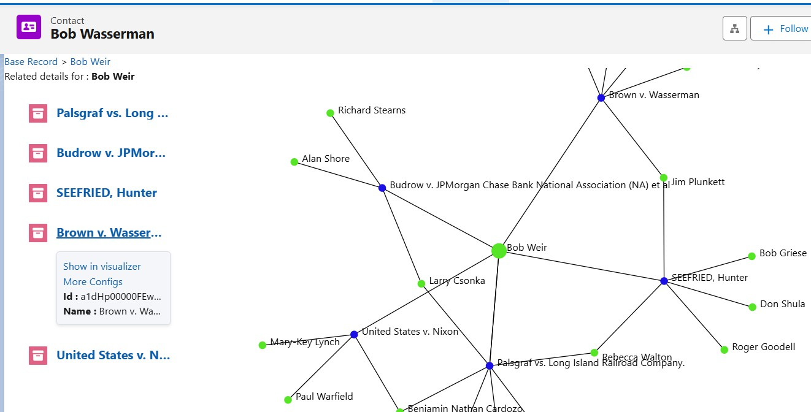
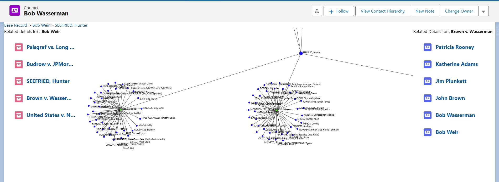

# Configuration Management

## Viewing Configurations

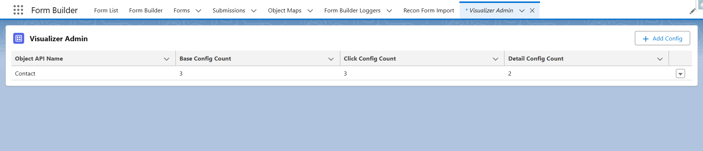

Access the Visualizer Admin tab to view all defined configurations. Use the action button to display detailed configuration information in an expandable accordion layout.

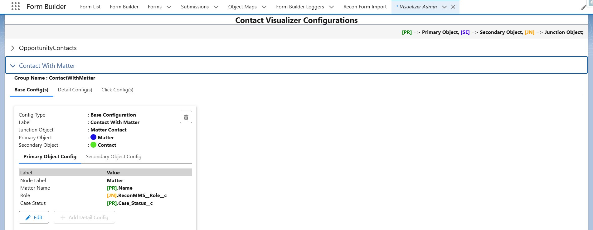

### Field Notation
- **[PR]**: Primary object field
- **[SE]**: Secondary object field
- **[JN]**: Junction/Reference object field

# Configuration Type Details

## Base Configuration

The Base Configuration is mandatory for component rendering and includes:

- **Config Type**: Always displays "Base Configuration"
- **Label**: User-friendly configuration name
- **Junction Object**: Name of the junction object
- **Primary Object**: Primary object name with color coding
- **Object Config**: Detailed attributes for each object type

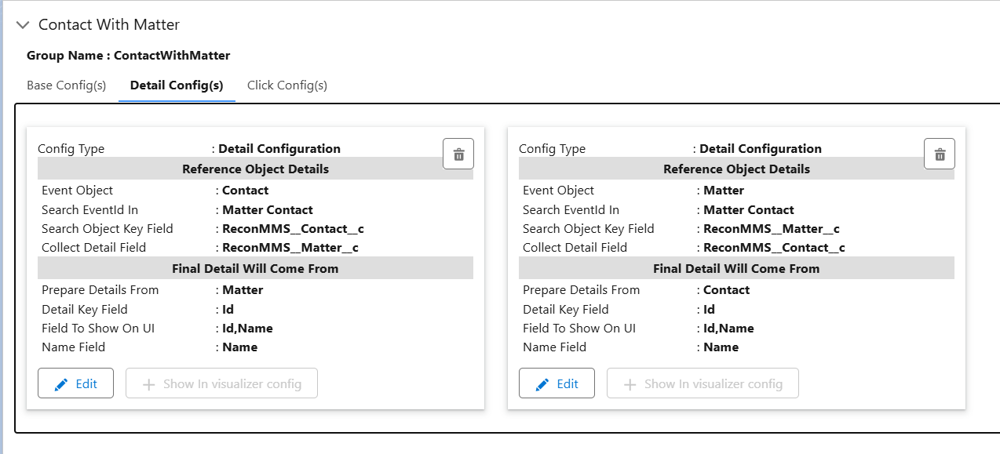

## Detail Configuration

Activated when nodes are clicked, the Detail Configuration manages the display of related information with the following parameters:

- **Event Object**: Triggers detail loading upon node selection
- **Search EventId In**: Object where the node is searched
- **Search Object Key Field**: Comparison field for node matching
- **Collect Detail Field**: Node name collection for detail generation
- **Prepare Details From**: Source object for detail provision
- **Detail Key Field**: Filtering field for detail collection
- **Field To Show On UI**: Display fields in the detail panel
- **Name Field**: Label display for list items

## Click Configuration

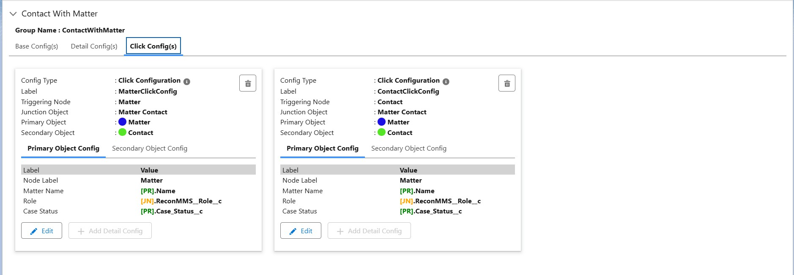

Similar to Base Configuration with the addition of a "Triggering Node" attribute, this configuration manages the "Show in Visualizer" action functionality.

# Connected App and Named Credentials Setup

The delete functionality requires Metadata API Callout configuration. Ensure "Allow creation of connected apps" is enabled in External Client App Settings before proceeding.

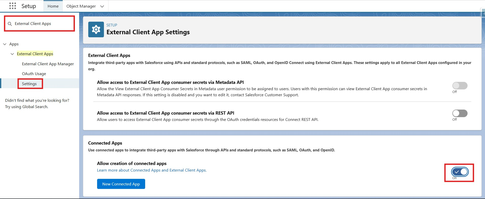

**Note**: Replace [instance] placeholders with your actual instance name in all URLs.

## Connected App Configuration

1. Navigate to Setup
2. Search for "External Client Apps"
3. Select "Settings"
4. Click "New Connected App"

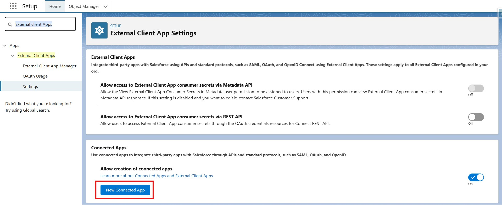

### Required Settings

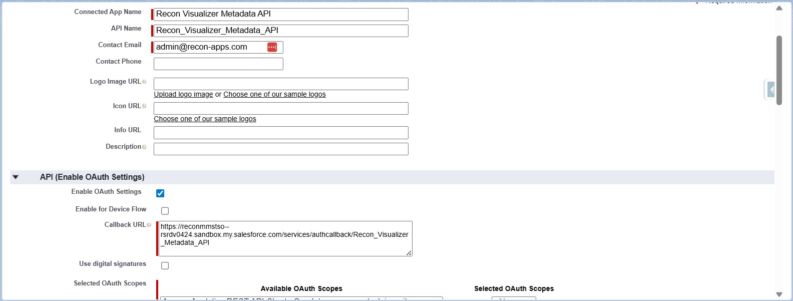
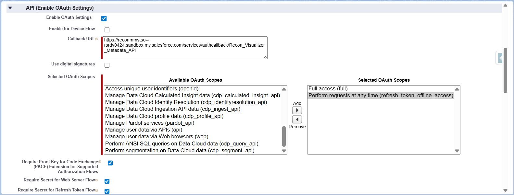

- **Connected App Name**: Recon Visualizer Metadata API
- **API Name**: Recon_Visualizer_Metadata_API (do not modify)
- **Contact Email**: Your administrator email
- **Enable OAuth Settings**: Enabled
- **Callback URL**: `https://[InstanceName].my.salesforce.com/services/authcallback/Recon_Visualizer_Metadata_API`
- **Selected OAuth Scopes**: Full access, Perform requests at any time
- **Require PKCE Extension**: Enabled
- **Require Secret for Web Server Flow**: Enabled
- **Require Secret for Refresh Token Flow**: Enabled

Save the configuration and retrieve client credentials through "Manage Consumer Details".

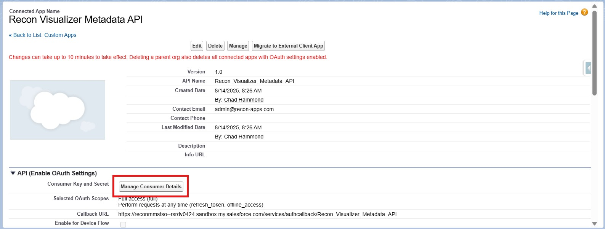
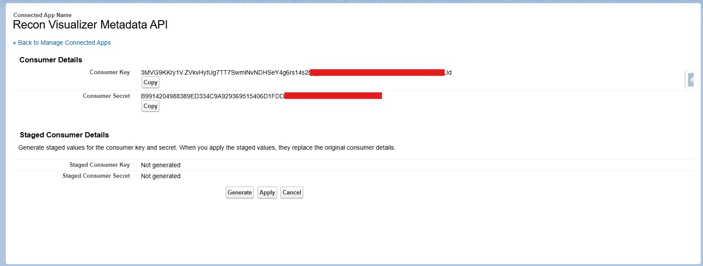

## Auth Provider Setup

1. Navigate to Setup > Auth Providers
2. Create new provider with the following specifications:

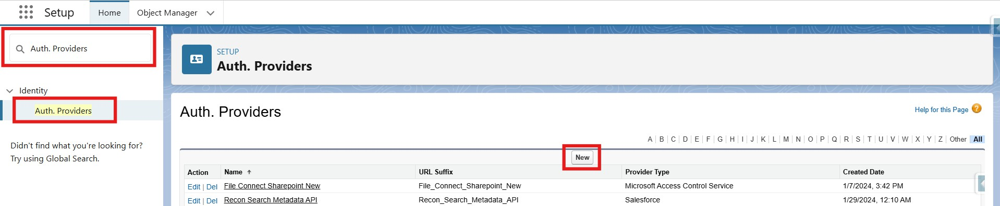
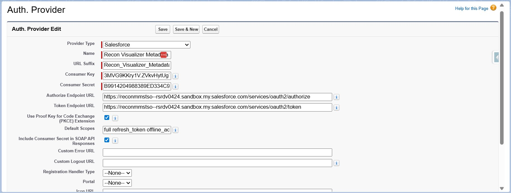

- **Provider Type**: Salesforce
- **Name**: Recon Visualizer Metadata API
- **URL Suffix**: Recon_Visualizer_Metadata_API
- **Consumer Key/Secret**: From previous step
- **Authorize Endpoint URL**: `https://[Instance].my.salesforce.com/services/oauth2/authorize`
- **Token Endpoint URL**: `https://[Instance].my.salesforce.com/services/oauth2/token`
- **Use PKCE Extension**: Enabled
- **Default Scopes**: full refresh_token offline_access
- **Include Consumer Secret in SOAP API Responses**: Enabled

## Named Credentials Setup

1. Navigate to Setup > Named Credentials
2. Select "New Legacy"
3. Configure with the following parameters:

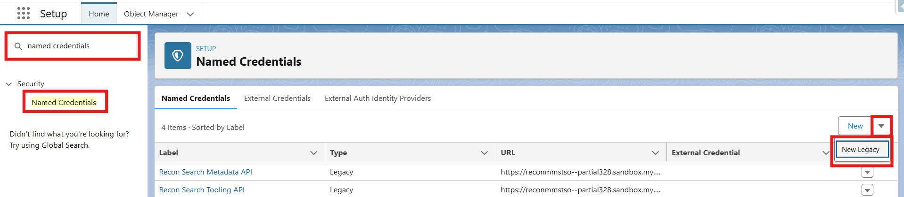
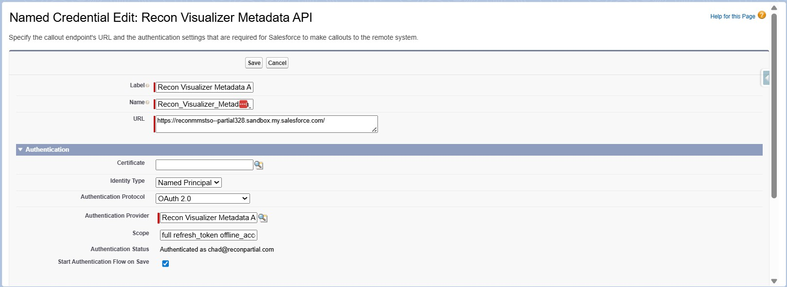

- **Label/Name**: Recon Visualizer Metadata API / Recon_Visualizer_Metadata_API
- **URL**: `https://[instance].my.salesforce.com/`
- **Identity Type**: Named Principal
- **Authentication Protocol**: OAuth 2.0
- **Authentication Provider**: Select previously created provider
- **Scope**: full refresh_token offline_access
- **Start Authentication Flow on Save**: Enabled
- **Generate Authorization Header**: Enabled
- **Allow Merge Fields**: Enabled for both HTTP Header and Body

Complete the authentication flow with administrator credentials.

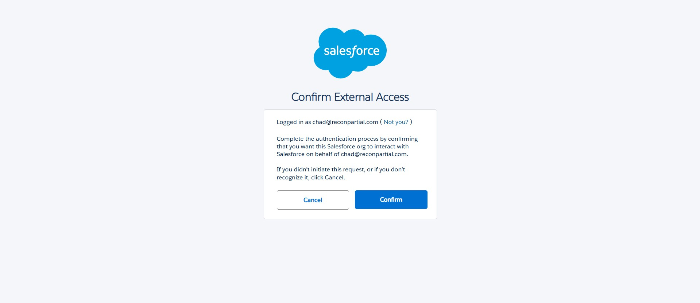

# Advanced Configuration Options

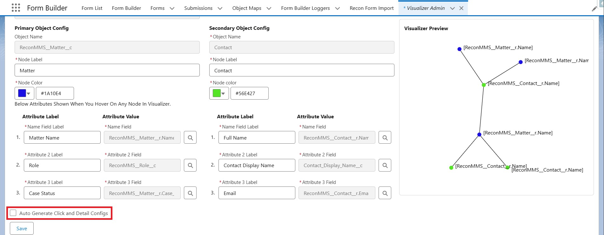

If auto-generation was not selected during initial setup, manual configuration remains available for custom requirements.

## Manual Detail Configuration

1. Navigate to Visualizer Configuration tab
2. Select the target object
3. Expand the section and click "Add Detail Config"

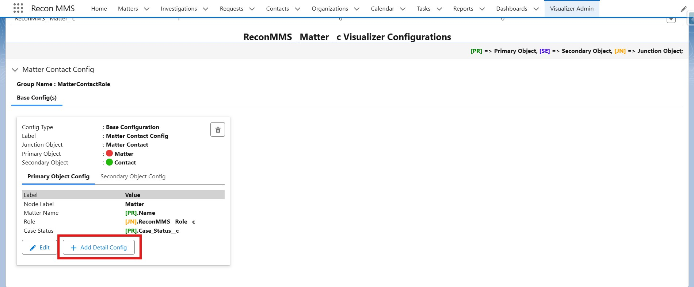
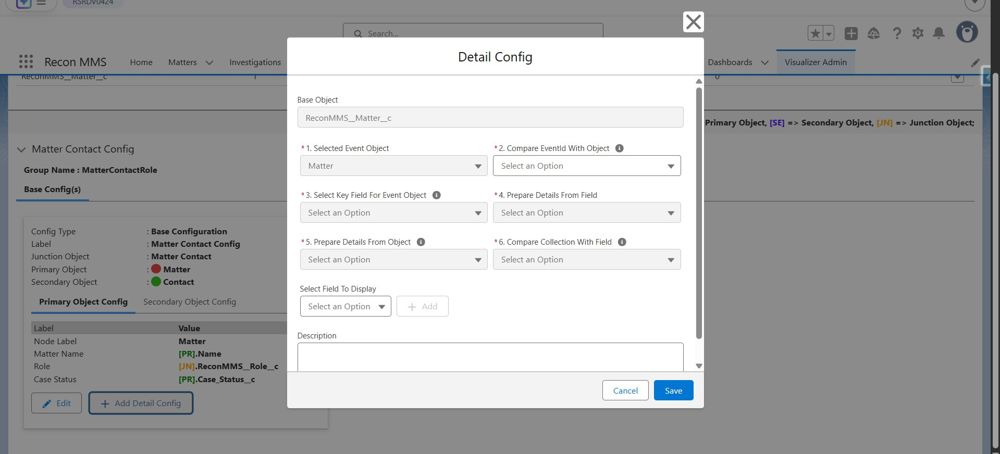

### Configuration Parameters

- **Base Object**: Target object for configuration
- **Event Object**: Node triggering the event
- **Compare EventId With Object**: Primary or junction object for node ID comparison
- **Select Key field for Event Object**: Field related to the event object
- **Prepare details from the Field**: Field for detail preparation
- **Prepare Details From Object**: Object containing related data
- **Compare collection with field**: Field containing related values
- **Select Name Field**: Display field for detail card titles
- **Description**: Configuration documentation

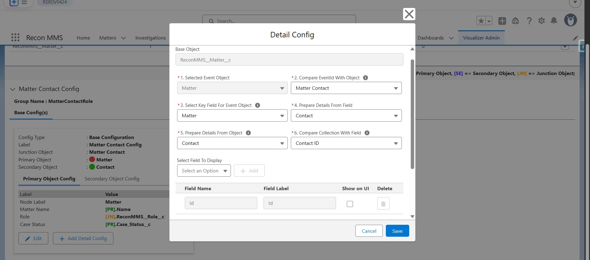
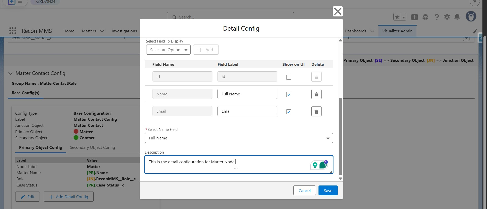

Add fields using "Select field to display" and the "Add" button. Control field visibility through the "Show on UI" settings.

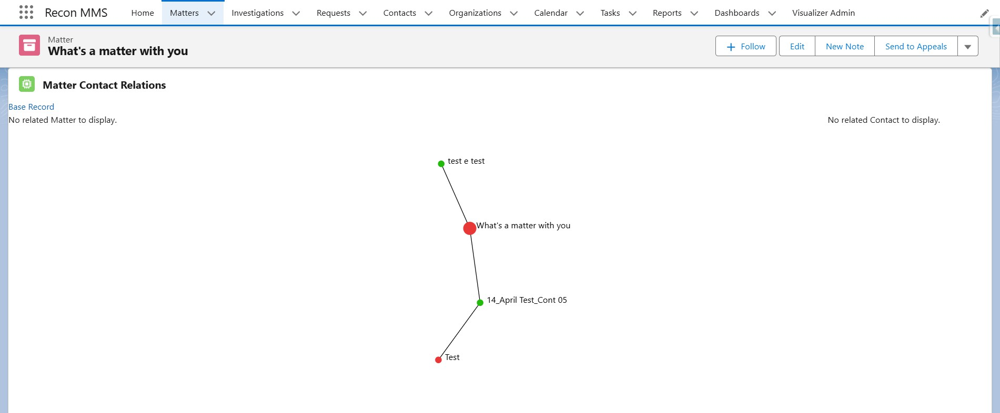
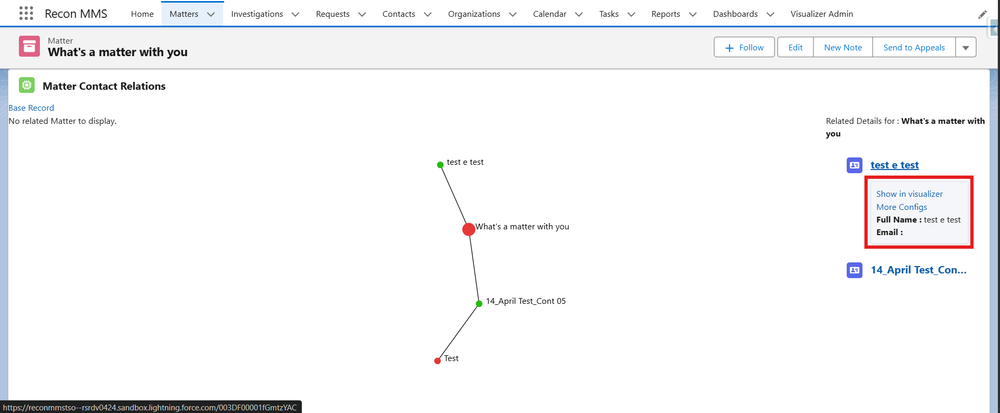

## Click Configuration Setup

Prerequisites: Detail Configuration must be established prior to Click Configuration.

1. Navigate to Visualizer Configuration tab
2. Select target object
3. Access Detail Config tab
4. Click "Show in visualizer config"

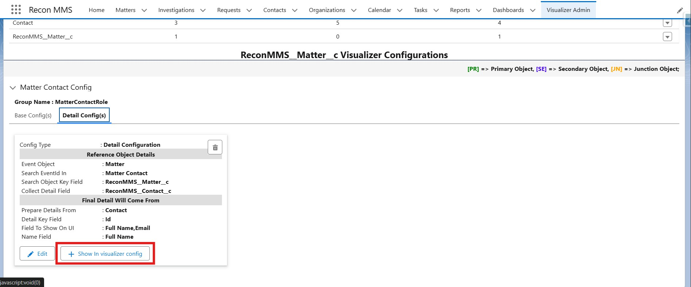
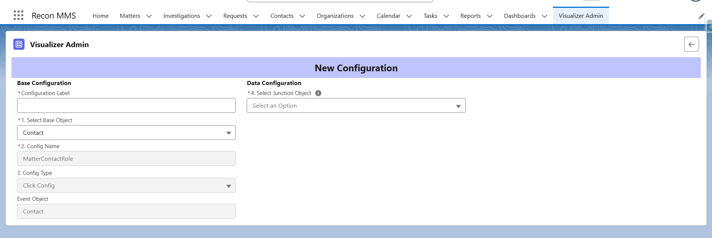

Configure junction objects and node relationships as required.

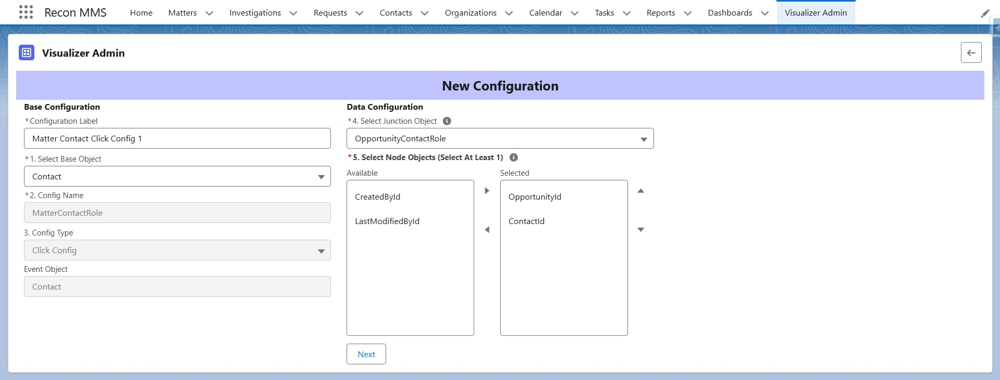
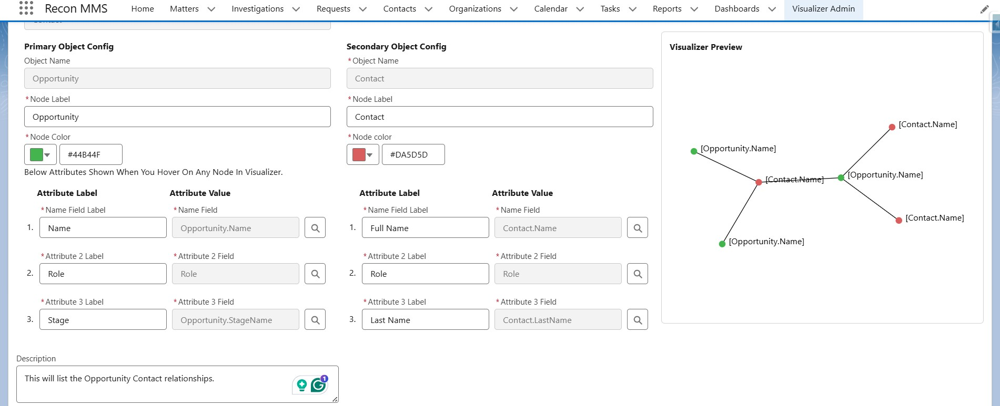

The configuration activates through the "Show in visualizer" link in the detail panel.

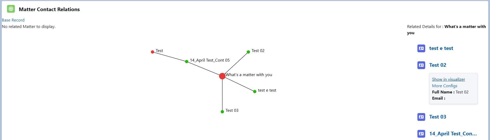
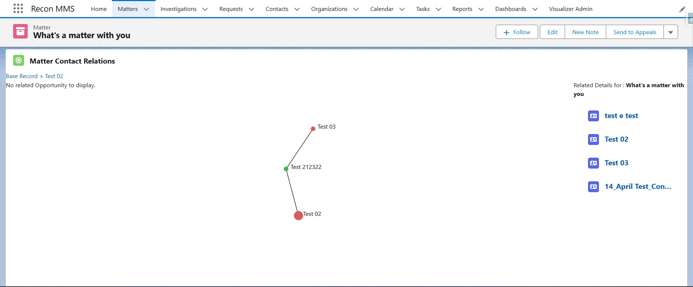

## Additional Configuration Management

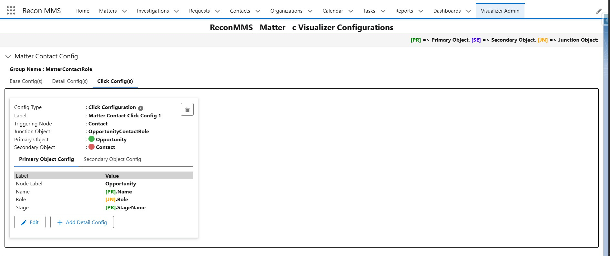

Active "Add..." buttons indicate available configuration options for selected nodes.

### Multiple Configuration Support

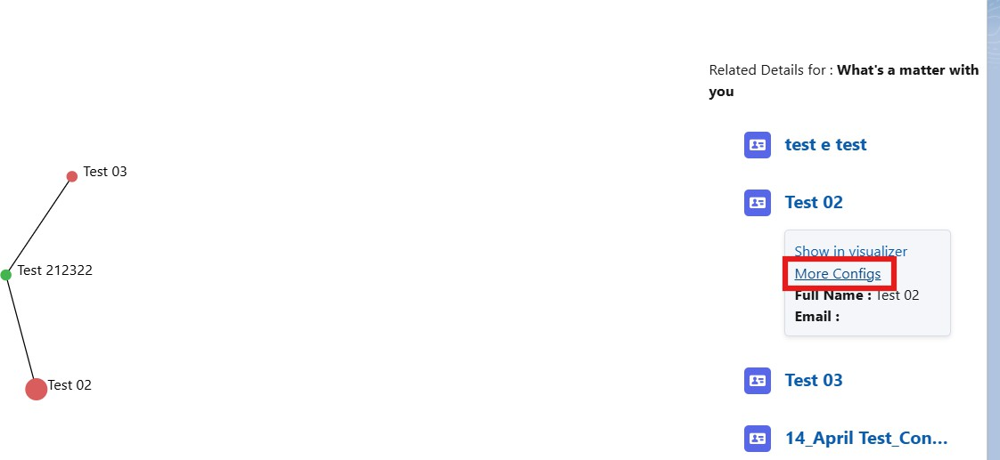

The "More Configs" feature enables switching between applicable configurations for the current node type.

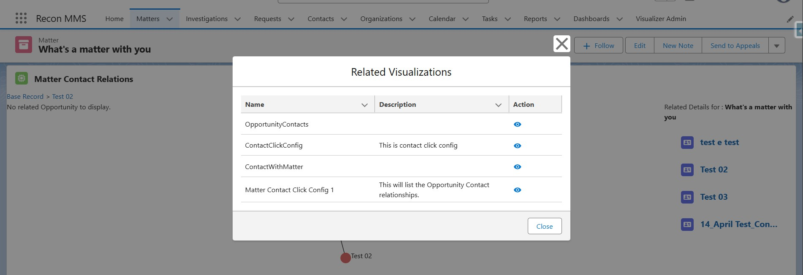

Select the eye icon to activate alternative visualizations based on different configurations.