ReconDMS

# Azure and SharePoint setup user guide

(Follow this guide if your organization chooses to use SharePoint)

> **Audience**  
> Microsoft 365 and SharePoint administrators who register Azure AD apps, assign permissions, and expose endpoints to Salesforce.

Note: To set up Azure and SharePoint, you need a Microsoft 365 account with the appropriate subscription. The minimum subscription required is Microsoft 365 Basic.

# Table of contents

SharePoint

## Azure and SharePoint set up user guide

## Azure Set Up

## - Log in to Azure Portal:

- Open your web browser and navigate to the [Azure Portal](https://portal.azure.com/).

- Sign in using your Azure credentials (email and password). Ensure you have the appropriate administrative permissions to create and manage Azure applications.

## - Navigate to Azure Active Directory:

- Once logged in, find the left-hand navigation menu.

- Click on Microsoft Entra ID (formerly Azure Active Directory) from the options. This is where you manage users, apps, and directory-related services.

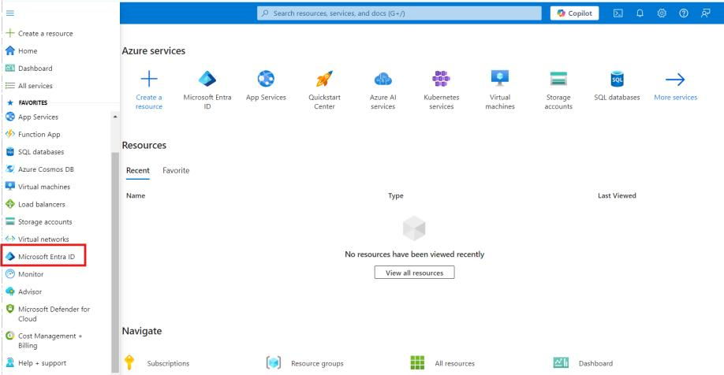

## - Access App Registrations:

In the Manage section on the left-hand side, locate and click on App registrations. This is where all applications in your directory are listed and managed.

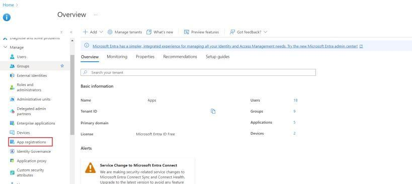

- Click on New Registration at the top of the page to create a new app for DMS integration.

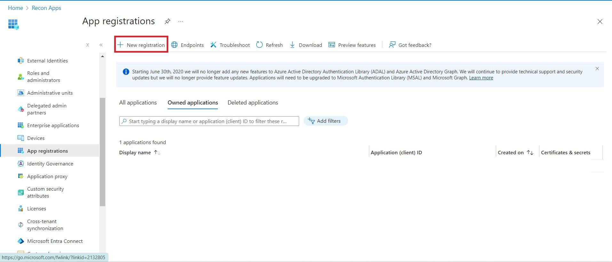

## - Configure New App Registration:

- Fill in the following attributes:

- Name: Enter a descriptive name for your app (e.g., "DMS Demo Application").

- Supported Account Types: Choose the account types your app can access:

- Select Accounts in this organizational directory only if you want the app to work within your Azure tenant.

- Redirect URI: This is optional at this stage, but you can leave it blank or configure it later. It’s required if your app uses the OAuth 2.0 authentication flow.

- After filling in the required fields, click Register to complete the app creation.

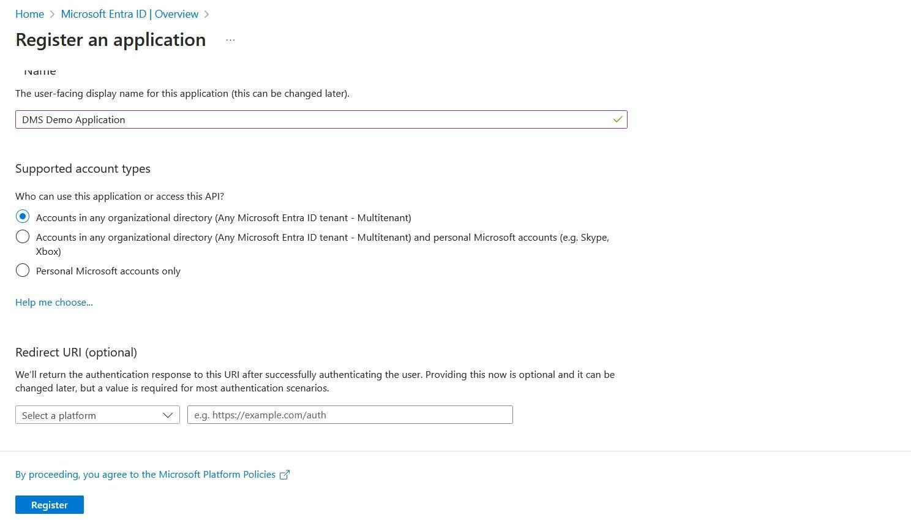

## - App Overview:

- After registration, you will be redirected to the App Overview page, where details of your newly created app will be displayed.

- On this page, make a note of the following critical identifiers, as they will be needed later during DMS setup:

- Directory (Tenant) ID: This is the unique identifier for your Azure tenant.

- Application (Client) ID: This is the unique ID of the app you created. It will authenticate and identify the app when interacting with the Microsoft Graph API and Salesforce.

Essential: These two IDs (Tenant ID and Client ID) will be required when configuring DMS integration in Salesforce for SharePoint file editing.

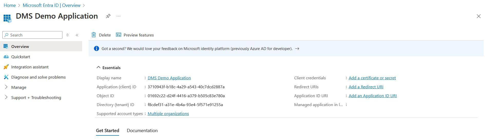

## - Configure Certificates & Secrets:

- Now, navigate to the Certificates & Secrets section to set up your app’s credentials:

- In the Manage section (on the left-hand menu), click on

## Certificates & Secrets.

- This is where you'll generate a client secret, which will be used to authenticate API requests.

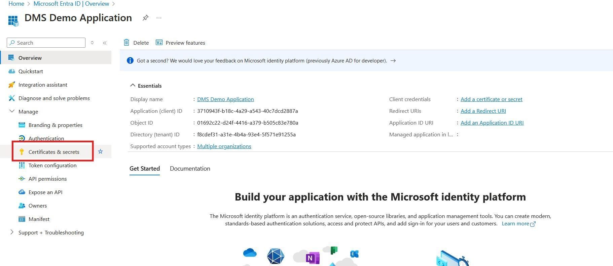

## - Create a Client Secret:

- In the Certificates & Secrets section, click on New Client Secret to generate a secret key used by your app for authentication.

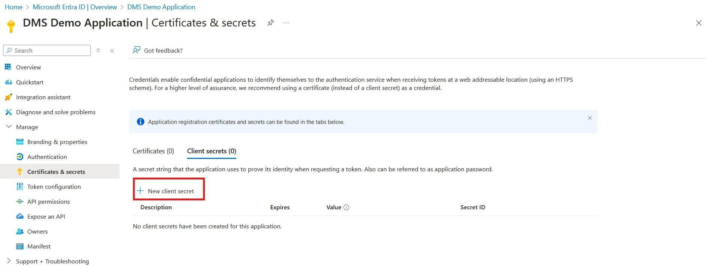

- Add Description: Provide a descriptive name for the client secret (e.g., "DMS Integration Secret") so you can quickly identify it later.

- Set Expiry: You can choose the secret's expiration period based on your organization's security policy. You can select from various options, such as 6 months, 12 months, or 24 months.

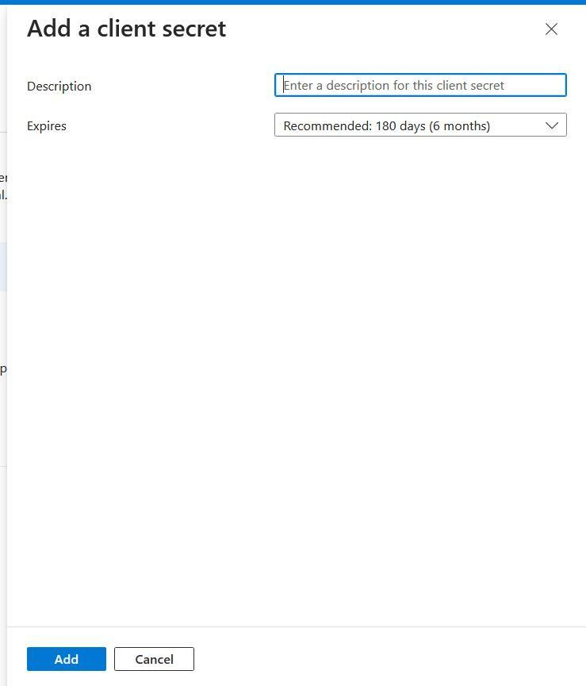

After configuring the details, click Add to generate the secret key.

## - Retrieve the Client Secret:

- Once you’ve added the client secret, you will be provided with two critical pieces of information:

- Value: This is the client secret you must use when configuring DMS in Salesforce.

- Secret ID: This serves as a reference to the secret, but it's the Value you will use for authentication.

Important: Copy the Client Secret Value immediately; it is only displayed once. Also, store the value somewhere to refer to it for later steps. You will need this value when setting up the Azure integration in Salesforce's DMS configuration.

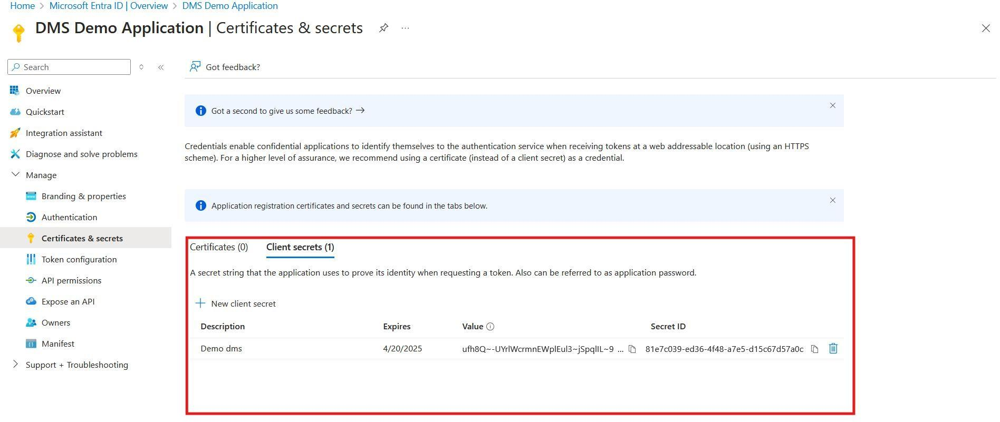

## - Configure API Permissions:

- In the Manage section, click on API Permissions.

- Then, click Add permission to begin granting access to your app.

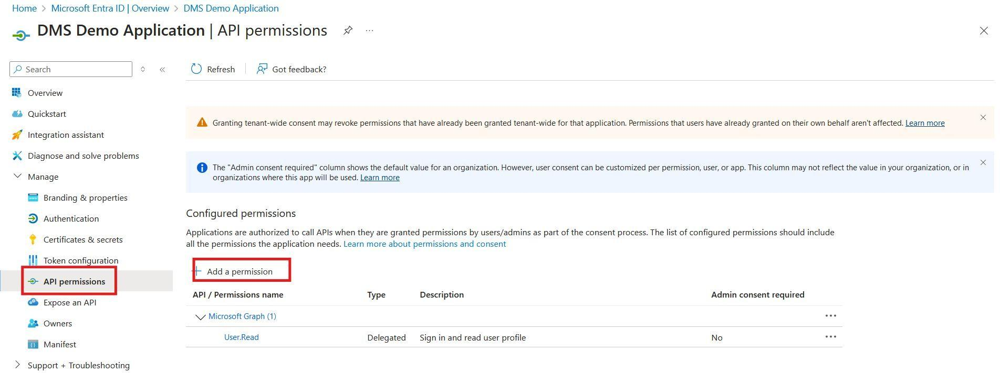

## Select Microsoft Graph:

- From the available APIs, choose Microsoft Graph, which your app will use to interact with file management and editing.

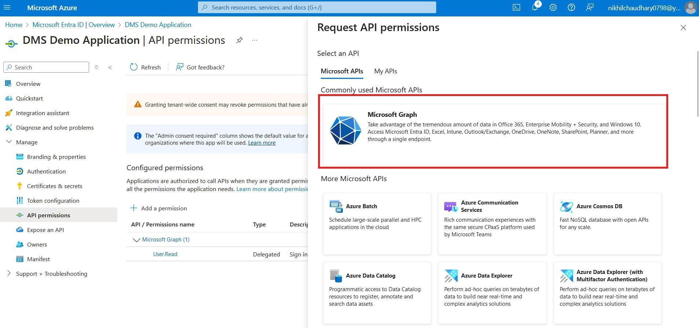

Select the permission type Application/Delegated by taking reference from the screenshot below of the permissions list type.

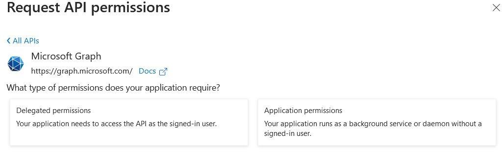

NOTE: This can be checked in the screenshot below in the type column.

You can search for your desired API permissions in the highlighted panel below.

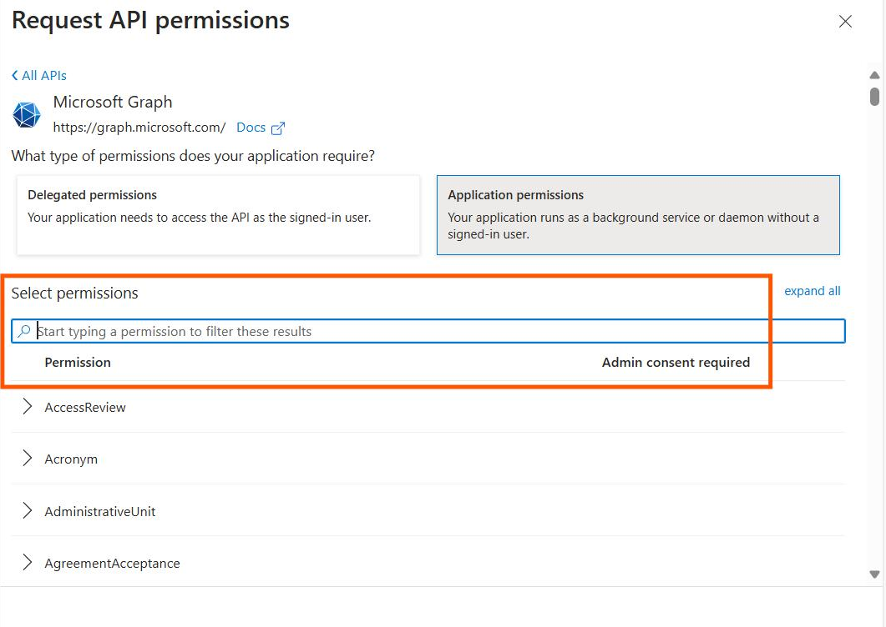

## Add Required Microsoft Graph API Permissions:

- Add the necessary (highlighted below) Microsoft Graph API permissions to allow the app to upload, retrieve file metadata, and generate preview URLs.

- From SharePointTenantSettings (2), select the following permissions: ‘SharePointTenantSettings.Read.All Read SharePoint and OneDrive tenant settings’ and ‘SharePointTenantSettings.ReadWrite.All Read and change SharePoint and OneDrive tenant settings.

- From Sites, select the following permissions:

‘Sites.FullControl.All’, ‘Sites.Manage.All’, ‘Sites.Read.All’, ‘Sites.ReadWrite.All’, ‘Sites.Selected’. Also, select UserRead permission as shown in the image.

Note: Select all ‘Application’ permissions only, and UseRead would be a ‘Delegated’ one.

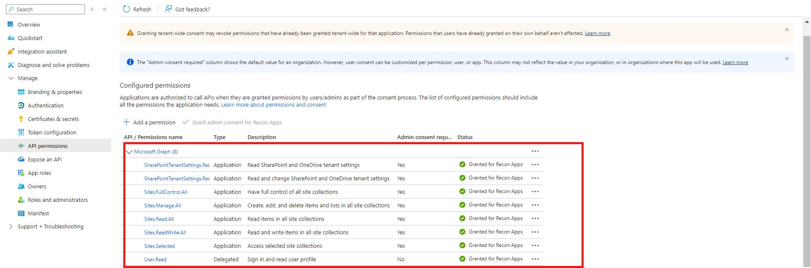

To grant Admin consent for the permissions, click the highlighted button below.

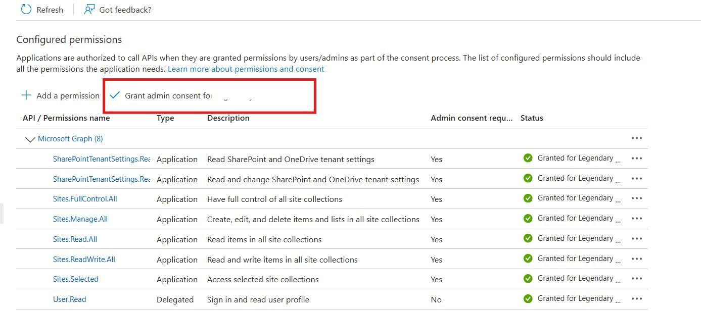

## SharePoint Set Up

Now that the Azure configuration is complete, it’s time to set up SharePoint.

## - Visit the Office Portal:

- Go to [https://m365.cloud.microsoft/apps/?auth=2](https://m365.cloud.microsoft/apps/?auth=2) .

- Sign in with your credentials (ensure you are an authorized user in the Azure portal).

## Access SharePoint:

- Select SharePoint from the App Launcher (the grid icon in the upper-left corner) to navigate to the SharePoint dashboard.

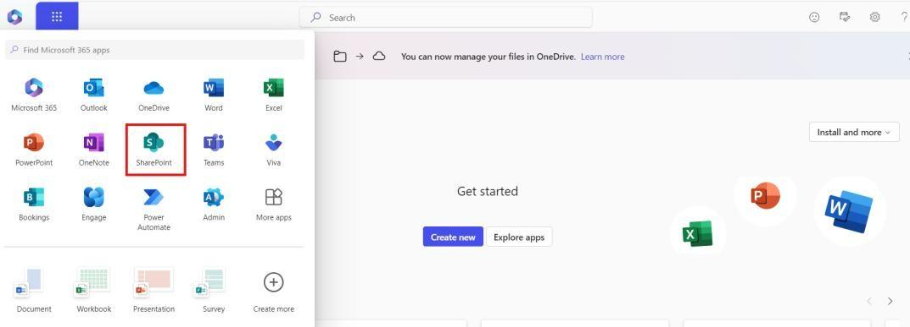

Also note that this domain highlighted below will be used in remote site settings, cors, and csp in Salesforce and below in the document to access the SharePoint admin portal.

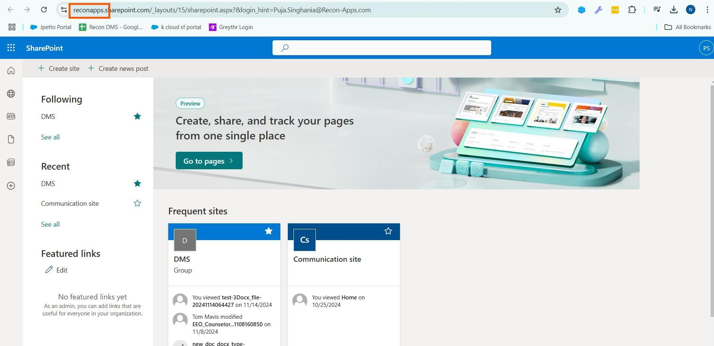

## - Create a New Site:

- Click on Create a Site to begin the site creation process.

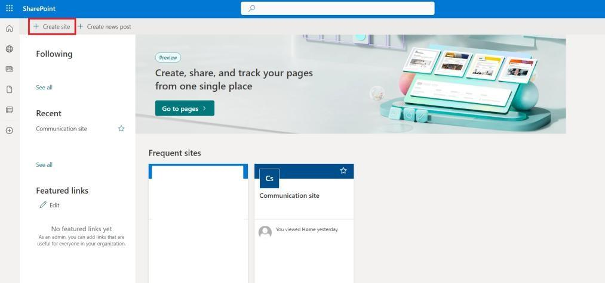

## - Choose Site Type:

- Select Team Site to enable collaboration and file sharing among team members.

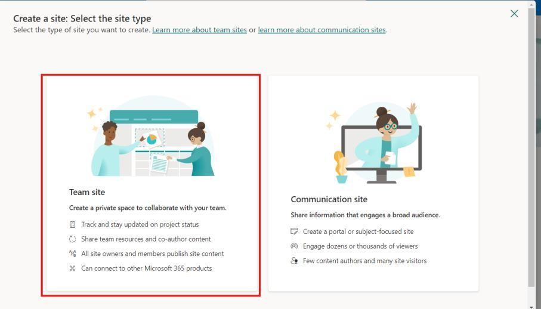

## - Select a Template:

- Choose a template that best suits your team’s needs. You can opt for a default or custom template based on your requirements.

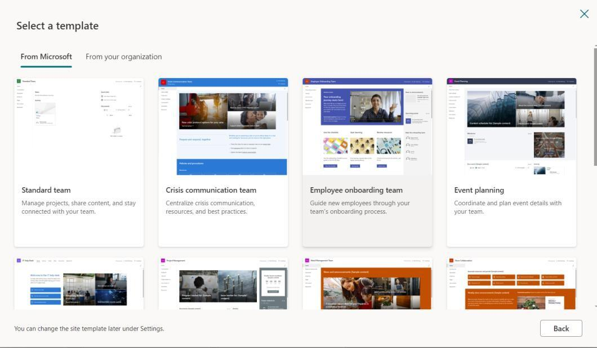

- After selecting the template, click Use Template to proceed.

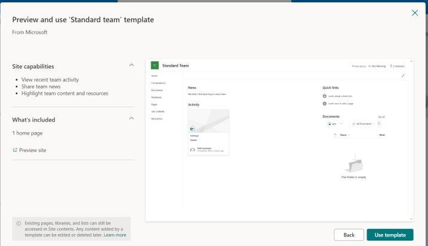

## - Enter Site Details:

- Provide a Site Name (e.g., "DMS Team Site"). Other fields, such as site URL and group email, will be auto-populated based on the name you enter.

- Click Next to continue.

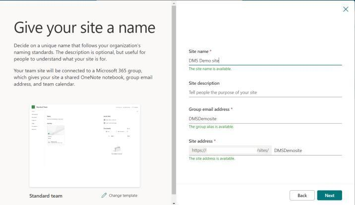

## - Configure Additional Settings:

- Add essential details such as privacy settings (public or private) and the site's default language.

- Once you’ve filled in the necessary information, click Create Site to finalize the setup.

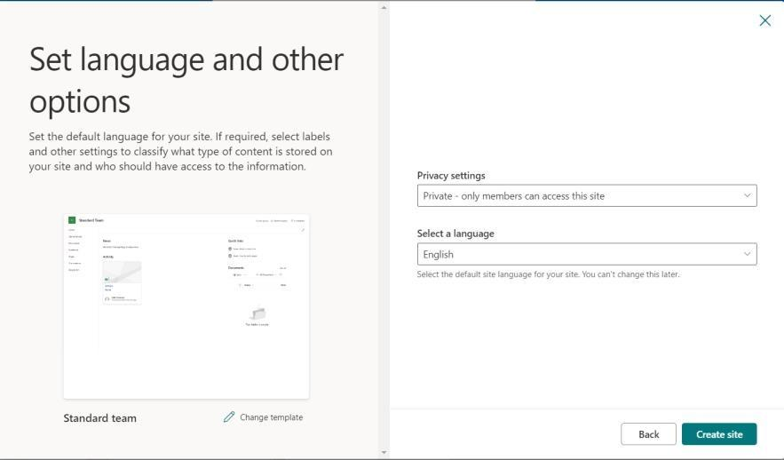

## - Add Members:

- After creating the site, you can add members. This allows designated users to access and collaborate within the site.

## - Access Your Site:

- You will be redirected to the site homepage once the site is successfully created. Here, you can select the default document library (Documents) for storing files or create a new library if needed.

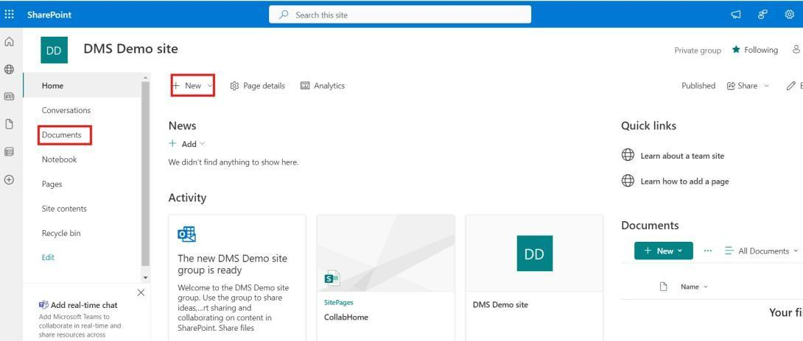

## - Create a New Folder:

- Inside the document library, click New and select Folder to organize your documents.

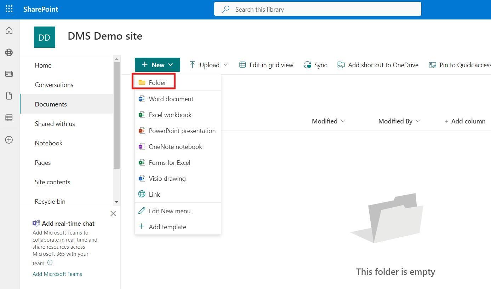

- Provide a name for your folder and click Create.

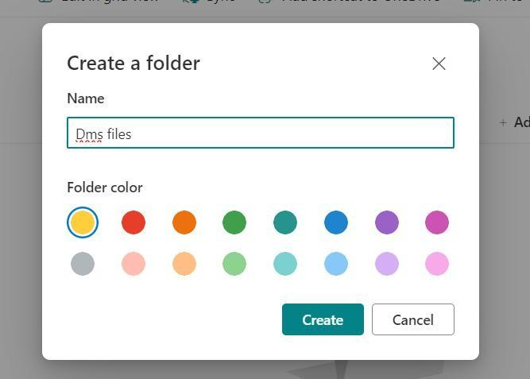

Your SharePoint site, document library, and folder structure are now set up. You can create additional drives and folders based on your team’s needs.

## - Retrieve the Site ID for Configuration

To complete the SharePoint setup, you will need to retrieve the Site ID for configuration purposes:

## Access Admin Center:

- Go to your SharePoint admin center by visiting https://your_domain_name-admin.sharepoint.com.

NOTE: Replace your domain name with “your_domain_name” in the above URL. e.g : https://dms- admin.sharepoint.com .

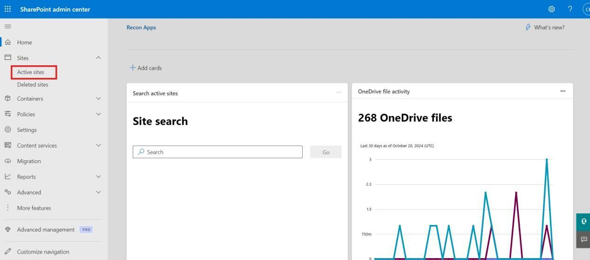

## View Active Sites:

- Click on Active Sites in the left-hand navigation panel to display a list of all active sites within your organization.

- Find and select the site you created earlier. After clicking on the site name, you will be taken to the site details interface.

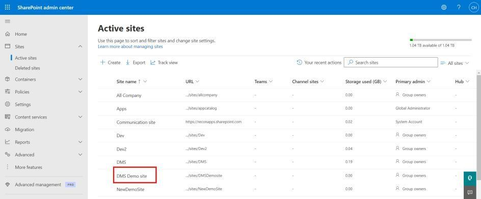

## Locate the Site ID:

- The site ID will appear at the end of the URL of the site details page. Copy this ID and store it in a secure location for future reference.

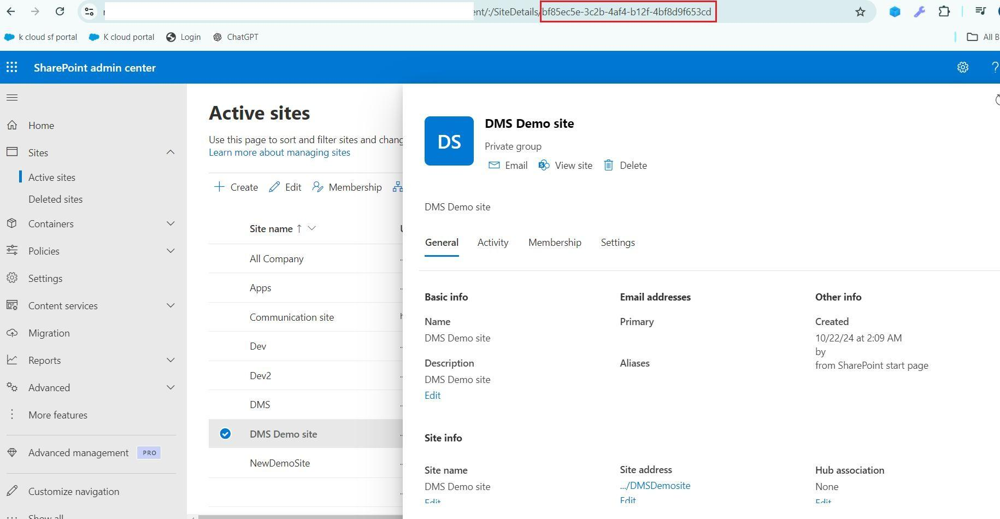

## - Next Steps

With the Azure and SharePoint configurations complete, you are now ready to proceed to the DMS configuration side.

## Next Steps

Continue with the [Salesforce Installation](salesforce-installation) guide once Azure and SharePoint configuration is complete.
