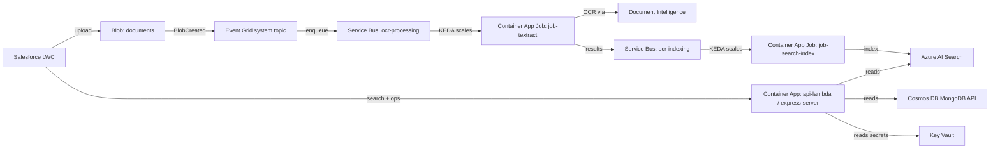

# Azure Deployment Overview

Recon DMS can be deployed entirely within a customer-controlled Microsoft Azure subscription. The vendor delivers prebuilt container images and a Terraform-based setup package; you run a sequence of ten shell scripts that wrap Terraform and the Azure CLI to provision the full stack — Container Apps, Cosmos DB (MongoDB API), Azure AI Search, Blob Storage, Service Bus, Event Grid, Document Intelligence, and Key Vault — in one Resource Group.

End to end, expect about 45 minutes. Most of that time is Azure provisioning Cosmos DB and AI Search in the background.

> **Audience**  
> Azure administrators, DevOps engineers, and solution architects who provision cloud infrastructure for Recon DMS. You do not need Docker, Kubernetes knowledge, or direct Terraform experience — each script wraps the hard parts for you.

## Before You Begin

- Confirm you have an Azure subscription with **Owner** rights, or **Contributor + User Access Administrator**. The deployment creates role assignments, which plain Contributor cannot do.
- Install **Azure CLI 2.50+**, **Terraform 1.9+**, **jq**, **openssl**, and **bash 4+** on your workstation.
- Receive the vendor's out-of-band credentials package containing `VENDOR_ACR_LOGIN_SERVER`, `VENDOR_IMAGE_TAG`, `VENDOR_ACR_TOKEN_NAME`, `VENDOR_ACR_TOKEN_PASSWORD`, and `ACCESS_KEY`.
- Decide on `PROJECT_NAME` (≤11 characters), `ENVIRONMENT` (`dev`, `qa`, `uat`, or `prod`), and target Azure region.

Docker is **not** required. Container images are copied server-to-server inside Azure via `az acr import`.

Windows users: use Git Bash or WSL. PowerShell / Command Prompt are not supported.

## Module Sequence

1. **[Prerequisites & .env Setup](prerequisites)**  
   Install tools, confirm Azure permissions, collect vendor credentials, populate `.env`, and log in to Azure.
2. **[Identity & Container Images](identity-and-images)**  
   Run the preflight check, create the Resource Group + managed identity, verify vendor ACR credentials, create your customer ACR, and import the eight Recon DMS container images.
3. **[Core Infrastructure (Terraform)](infrastructure)**  
   Deploy the full Azure resource stack via Terraform — Key Vault + secrets, Cosmos DB, Storage Account + blob containers, Service Bus + queues, Event Grid, AI Search, Document Intelligence, Container Apps Environment, all Container Apps and Jobs, diagnostics, alerts, and budget.
4. **[Search Index & Application Env Vars](search-and-app-config)**  
   Create the AI Search index from the supplied schema, then apply non-secret environment variables to every Container App and Job (secrets live in Key Vault).
5. **[Authentication & Job Scaling](auth-and-scaling)**  
   Create the root administrator user that Salesforce uses to call the API, then ensure KEDA scaler secrets on event-triggered jobs are populated correctly.
6. **[Verification](verification)**  
   Run the post-deploy sanity checks against Container Apps, jobs, Key Vault, AI Search, Service Bus, and Blob containers.
7. **[Multiple Environments](multi-environment)**  
   Deploy parallel isolated stacks — one per Salesforce sandbox (Dev/QA/UAT/Prod).
8. **[Troubleshooting & Support](troubleshooting)**  
   Common symptoms, causes, and fixes; plus support and live-log guidance.

Each module includes:

- **Setup Steps** – Condensed instructions aligned with the canonical `AZURE_SETUP_GUIDE.md` delivered in the setup package.
- **Verification Checklist** – Quick tests to confirm the infrastructure behaves as expected.
- **Troubleshooting Tips** – Common configuration issues and where to look for diagnostic logs.

## How the Pipeline Works at Runtime

Three cron jobs run as safety nets: `job-sync-batch` (daily re-sync), `job-delete-batch` (cleanup every 2 hours), `job-result-sweeper` (republishes undelivered OCR results every 25 minutes), and `job-status-sync` (reconciles in-flight Doc Intelligence jobs every 20 minutes).

## What This Package Deploys

A complete Recon DMS environment in one Azure Resource Group, production-grade by default. Example resource names assume `PROJECT_NAME=recondms` and `ENVIRONMENT=dev`:

| Category | What you get | Example name |
|---|---|---|
| Resource Group | 1 | `rg-recondms-dev` |
| Managed Identity | 1 user-assigned (shared by all workloads) | `id-recondms-aca-dev` |
| Container Registry | 1 (Standard SKU) | `crrecondmsdev` |
| Storage Account | 1 (GRS, 90-day soft delete) + 4 blob containers | `strecondmsdev` · `documents`, `temp`, `ocr-results`, `profile-data` |
| Cosmos DB (MongoDB API) | 1 account, 1 database, 7-day PITR | `cosmos-recondms-dev` |
| Key Vault | 1 (Standard, purge protection ON) + 14 secrets | `kv-recondms-dev` |
| Document Intelligence | 1 (S0) | `cog-recondms-dev` |
| AI Search | 1 (S2, 2 replicas × 1 partition, 99.9% read SLA) | `srch-recondms-dev` |
| Service Bus | 1 namespace + 3 queues | `sb-recondms-dev` · `ocr-processing`, `ocr-indexing`, `sb-recondms-result` |
| Event Grid | System topic on storage, routes `BlobCreated` → `ocr-processing` | — |
| Container Apps Environment | 1 (Dedicated D4 workload profile for OCR) | `cae-recondms-dev` |
| Always-on Container Apps | `api-lambda` + `express-server` (min 2 replicas each) | `ca-api-dev` (port 3000), `ca-express-dev` (port 8080) |
| Container App Jobs | 6 (OCR, indexing, batch re-sync, cleanup, sweeper, status-sync) | `job-textract-dev`, `job-search-index-dev`, etc. |
| Observability | Log Analytics + Application Insights + diagnostics on every data-plane resource | `log-recondms-dev`, `appi-recondms-dev` |
| Alerts + budget | Action group + metric alerts (queue depth, dead-letter, Cosmos 429s, API 5xx) + monthly budget | (requires `OWNER_EMAIL` in `.env`) |

## Deliverables Checklist

| Module | Key Outputs |
|---|---|
| Prerequisites & `.env` | Workstation tooling installed, vendor credentials confirmed, `.env` populated with secrets generated |
| Identity & Container Images | Resource Group, managed identity, customer ACR, 8 Recon DMS images imported |
| Core Infrastructure (Terraform) | All ~40 Azure resources provisioned, `.env.derived` populated with runtime endpoints |
| Search Index & App Env Vars | AI Search index created from schema; every Container App and Job has non-secret env vars applied |
| Authentication & Job Scaling | Root admin `UserId` + `Token` issued; KEDA scaler secrets refreshed on event-triggered jobs |
| Verification | All sanity checks pass; ready for Salesforce-side configuration |

## Next Steps

Start with [Prerequisites & .env Setup](prerequisites) and work through each module in order. After finishing Module 8, hand the `UserId`, `Token`, **API URL**, and **Storage URL** to whoever configures the Salesforce DMS package — all four values are required for Salesforce-side configuration. Then continue with [Salesforce Installation](../salesforce-installation).
