# Core Infrastructure (Terraform)

This module is the largest single step in the deployment. One Terraform apply creates approximately 40 Azure resources that together form the Recon DMS runtime.

> **Audience**  
> Azure administrators and DevOps engineers executing Step 6 of the setup package.

## 1. Choose Production or Smoke-Test Configuration

By default the package deploys **production SKUs**: GRS storage, S2 AI Search with 2 replicas, dedicated D4 workload profile for OCR, purge protection on Key Vault, monthly budget alert, and metric alerts on queue depth / dead-letter / Cosmos 429s / API 5xx.

For a throwaway test environment with scale-to-zero apps and Basic-tier services, activate the smoke-test overlay **before** running the deploy script:

```bash
cp infrastructure/terraform/test.tfvars.example infrastructure/terraform/test.auto.tfvars
```

Terraform auto-loads `*.auto.tfvars`, so the overrides take effect on the next apply. The overlay also sets `keyvault_purge_protection = false`, which lets you redeploy under the same name immediately after destroy.

Leave the file as `.example` (the default) to deploy production.

> **Warning**  
> Never enable the smoke-test overlay in a production environment. It disables purge protection on Key Vault and drops AI Search to Basic SKU.

## 2. Run the Terraform Deploy (`deploy_terraform.sh`)

```bash
./azure-setup/deploy_terraform.sh .env
```

The script runs a full `terraform plan` + `apply`, prints the plan, and prompts:

```
[CONFIRM] apply this plan? (yes/no):
```

Type `yes` + Enter.

**Time:** 15–25 minutes. Cosmos DB and AI Search are the slowest resources.

### What gets created

```mermaid
flowchart TB
    subgraph "Networking & Identity"
        RG[Resource Group]
        MI[User-assigned Managed Identity]
    end
    subgraph "Data Plane"
        KV[Key Vault + 14 secrets]
        COSMOS[Cosmos DB MongoDB API + 7-day PITR]
        ST[Storage Account + 4 blob containers]
        SB[Service Bus namespace + 3 queues + keda-listen auth rule]
        EG[Event Grid system topic on Storage]
        SRCH[Azure AI Search S2 2x1]
        DOCINT[Document Intelligence S0]
    end
    subgraph "Compute"
        CAE[Container Apps Environment + D4 workload profile]
        APIAPP[ca-api-lambda :3000]
        EXPAPP[ca-express-server :8080]
        J1[job-textract]
        J2[job-search-index]
        J3[job-sync-batch]
        J4[job-delete-batch]
        J5[job-result-sweeper]
        J6[job-status-sync]
    end
    subgraph "Observability"
        LAW[Log Analytics Workspace]
        APPI[Application Insights]
        ALERTS[Action Group + metric alerts + monthly budget]
    end
    RG --> MI & KV & COSMOS & ST & SB & EG & SRCH & DOCINT & CAE & LAW & APPI & ALERTS
    CAE --> APIAPP & EXPAPP & J1 & J2 & J3 & J4 & J5 & J6
    MI -.AcrPull, KV reader, data-plane RBAC.-> APIAPP & EXPAPP & J1 & J2 & J3 & J4 & J5 & J6
```



### Verification

The script prints `[DONE] terraform apply complete` on success. Detailed verification of every resource happens in the [Verification](verification) module after KEDA is configured.

### Runtime endpoints written to `.env.derived`

When apply completes, key endpoints are written to `.env.derived` for the remaining scripts to consume:

```bash
API_LAMBDA_URL=https://ca-api-<env>.<random>.<region>.azurecontainerapps.io
EXPRESS_SERVER_FQDN=ca-express-<env>.<random>.<region>.azurecontainerapps.io
KEY_VAULT_URI=https://kv-<project>-<env>.vault.azure.net/
SEARCH_ENDPOINT=https://srch-<project>-<env>.search.windows.net
DOCINT_ENDPOINT=https://cog-<project>-<env>.cognitiveservices.azure.com/
SERVICEBUS_NAMESPACE=sb-<project>-<env>
…
```

> **Tip**  
> Note the `API_LAMBDA_URL` — you will need it (and the Storage URL derived from `STORAGE_ACCOUNT_NAME`) when handing off to whoever configures the Salesforce DMS package. See the [Authentication & Job Scaling](auth-and-scaling) module for the full handoff list.

## Troubleshooting

| Issue | Resolution |
|---|---|
| `already exists — needs to be imported` for the Resource Group or managed identity | Step 2 created them via `az` and Terraform now wants to manage them. Import them into state (Git Bash users: prefix with `MSYS_NO_PATHCONV=1`): <br/>`terraform -chdir=infrastructure/terraform import azurerm_resource_group.main "/subscriptions/<sub>/resourceGroups/rg-<project>-<env>"` <br/>`terraform -chdir=infrastructure/terraform import azurerm_user_assigned_identity.aca "/subscriptions/<sub>/resourceGroups/rg-<project>-<env>/providers/Microsoft.ManagedIdentity/userAssignedIdentities/id-<project>-aca-<env>"` <br/>Then re-run `bootstrap_acr.sh .env` and `deploy_terraform.sh .env`. |
| Container App stuck in `ProvisioningState: Failed` | Image pull or probe failure on first creation. Delete the failed shell and re-apply: <br/>`az containerapp delete -g rg-<project>-<env> -n ca-api-<env> --yes` <br/>`./azure-setup/deploy_terraform.sh .env` |
| `quota exceeded` during apply | Single subscription has caps on Container Apps environments, Cosmos accounts, AI Search services, etc. Request an increase via the Azure Portal — usually approved within hours. |
| Apply times out at "Still creating cosmosdb" | Cosmos DB occasionally takes 20+ minutes in busy regions. Wait and let it complete; re-running the script is idempotent if it ultimately fails. |

## Next Steps

Proceed to [Search Index & Application Env Vars](search-and-app-config) to create the AI Search index and apply environment variables to every Container App and Job.
