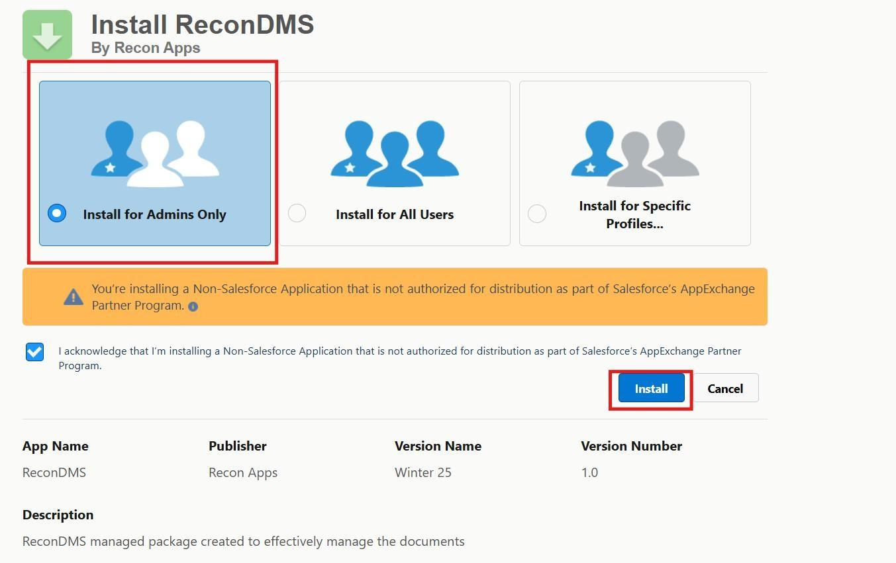
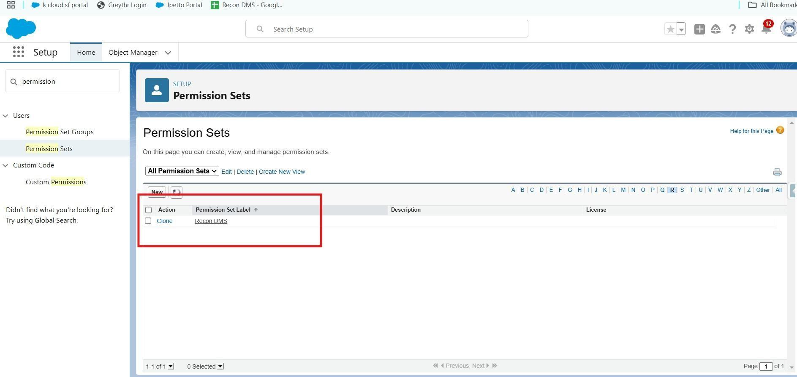
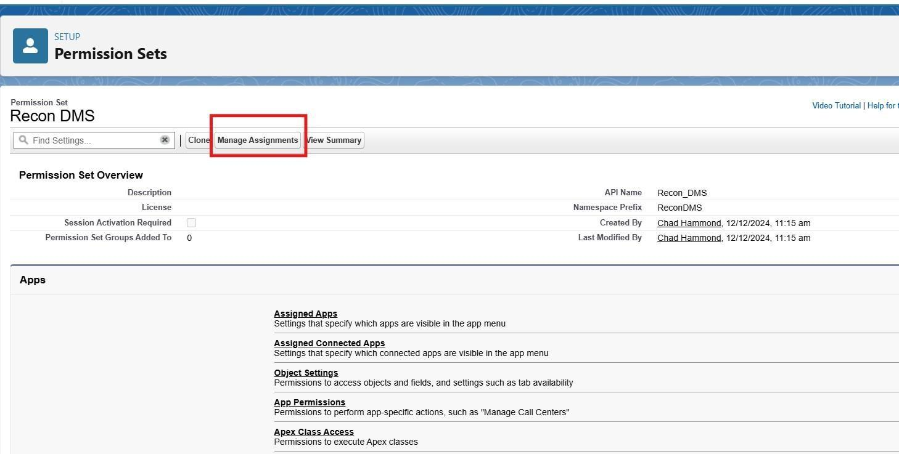
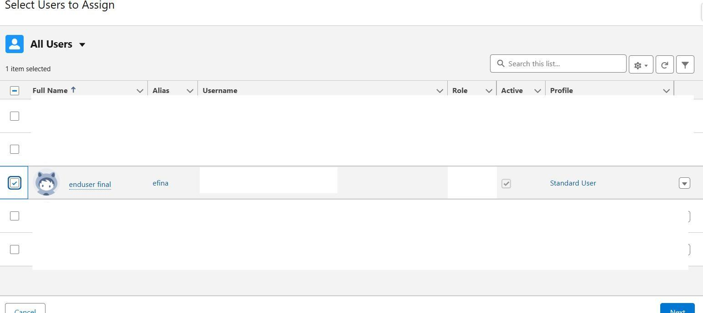
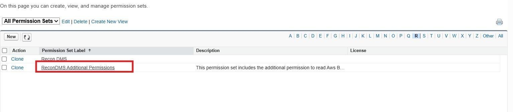

> **Audience**  
> Salesforce administrators and release engineers responsible for installing the Recon DMS managed package.

Table of Contents

# ReconDMS installation guide

Choose Access Level:

- Go to your package installation link.

- Select the “Install for Admins Only” option to restrict access to administrators initially. This option should be chosen to ensure that the configuration section is

accessible only to admins, while the necessary permissions for end users are managed through permission sets.

Proceed with Installation:

- Click on the Install button and proceed.

These permission sets are designed to give non-admin profile users access to the DMS features.

# Assign Permission Sets:

## Base Permissions :

- Go to Setup > Permission Sets in Salesforce.

- Locate the permission set named ReconDMS.

### Manage Assignments:

- Open the ReconDMS permission set and click on Manage Assignments.

- Select the users who need access to ReconDMS features, then click Save.

This permission set would allow the end user to use the DMS features.

## Additional Permissions :

These additional permissions include access to the AWS batch job and AWS sync object so that users can see when the file was last synced with SharePoint and AWS.

To give access to the additional permissions sets, locate the permissions set named Recon DMS Additional Permissions and follow the same steps to assign permissions to the desired users.

## Next Steps

After installation, follow the [Salesforce Post-Installation](salesforce-post-install) checklist to configure settings and permissions.
