> **Audience**  
> Salesforce administrators who manage Recon DMS configuration settings and Lightning page assignments.

ReconDMS

# Post Installation Set Up Guide

Note: Before setting up ReconDMS, ensure you have the AWS user credentials and the Azure credentials, including the Tenant ID and Secret, as they are required to configure the integration. SharePoint Site ID is also required. (You can refer to the Azure and SharePoint Setup guide for the Azure app and SharePoint.)

Table of Contents

- Parent Object

# Scheduling Batch Processes

### Batches to Schedule:

#### - SecuredUrlBatch (Apex Class)

- Description: This batch class refreshes AWS URLs associated with files to ensure they remain updated and accessible. URLs are set to refresh every 6 days, just before expiration on the 7th day.

- Schedule Time: 11:00 PM (EST), Daily

#### - CreateAwsBatchForFileSync (Apex Class) (Only if SharePoint is enabled)

- Description: This batch initiates a job on AWS to sync changes for edited files from SharePoint, using the Document Management System (DMS). After synchronization, it deletes the files from SharePoint and updates AWS Batch, AWS Sync, Document Profile, and version records accordingly.

This batch also automatically schedules another batch called GetBatchJobDataFromAwsBatch to retrieve job data related to the sync process after 1 hour.

- Schedule Time: 12:00 AM(est), Daily

#### - RefreshJwtTokenBatch (Apex Class)

- Description: This batch job refreshes the AWS token, which expires every 15 days, to ensure continuous access.

- Schedule Time: 1:00 AM(est), Daily

To schedule any batch class in Salesforce, follow these generic steps:

- Go to Setup in Salesforce.

- In the Quick Find box, type Apex Classes and select it.

- Locate the desired batch class and click Schedule Apex.

- In the Job Name field, enter a name for the scheduled job (e.g., "BatchJobScheduler").

- Select Frequency as Daily (or another frequency if applicable) and set the desired Start Time.

- Set the End Date if needed, or leave it blank for indefinite scheduling.

- Click Save to schedule the batch.

This process can be repeated for each batch class with the appropriate scheduling details.

# Setting Up Integration

Since our application integrates with two primary platforms, AWS and Microsoft (Azure and SharePoint), we must configure several settings to enable smooth communication. This includes adding Named Credentials for authentication, setting up CORS to allow cross-origin requests, defining Trusted URLs for secure connections, and configuring Remote Site Settings to enable API access. These configurations ensure the application can interact with external services while maintaining security.

### Set up Named Credentials

- Navigate to Setup:

In Salesforce, click the gear icon in the top-right corner to go to Setup.

- Search for Named Credentials:

In the Quick Find box, type "Named Credentials" and select Named Credentials under the Security section.

- Click New Legacy:

From the drop-down menu, click New Legacy to create a new Named Credential with legacy authentication.

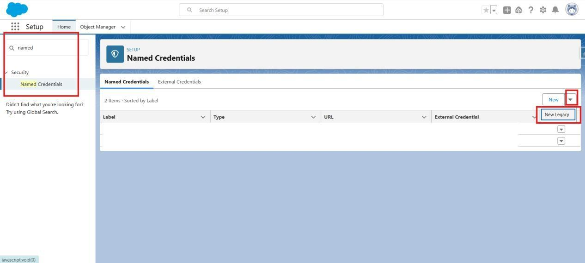

- Fill in the Required Information:

- Label: Enter Recon Microsoft.

- Name: Enter Recon_Microsoft.

- URL: Enter https://login.microsoftonline.com (for Microsoft authentication).

- Save the Named Credential:

Once you’ve filled in the required fields, click Save to create the Named Credential. (Check all the checkboxes given below.)

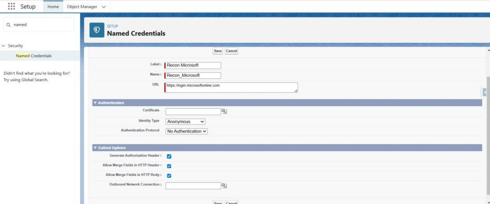

### Setup Remote Site Settings :

#### Remote Site Settings to configure post-installation:

- AwsBaseUrl – Base URL for AWS API, used for all callouts.

- CloudFront – CloudFront URL to secure the URL. s3Bucket – AWS server URL where files are stored.

- sharepointSite -- URL for your configured SharePoint site. (e.g URL : https://yourdomainname.sharepoint.com)

Add these two URLs to the Remote Site Settings if you use SharePoint functionality.

- GraphAPI - `https://graph.microsoft.com`

- Microsoft - https://login.microsoftonline.com`

#### Here are the steps to create Remote Site Settings in Salesforce:

- Go to Setup in Salesforce.

- In the Quick Find box, type Remote Site Settings and select it from the results.

- Click "New Remote Site" to add a new setting.

- Enter the details for the remote site:

- Remote Site Name: Provide a unique name for the remote site, such as AwsBaseUrl, CloudFront, s3Bucket, or sharepointSite.

- Remote Site URL: Enter the corresponding URL for the remote site.

- Description: Optionally, add a description to clarify the purpose of the remote site.

- Ensure that the Active checkbox is selected, then click Save.

- Repeat steps 3–5 for each additional remote site required post-installation (AwsBaseUrl, CloudFront, s3Bucket, and sharepointSite).

- Once complete, verify that each remote site is active in the Remote Site Settings list.

ThiswillensurethatallrequiredRemoteSiteSettingsare configured and active for your package.

Below is the screenshot for the referral :

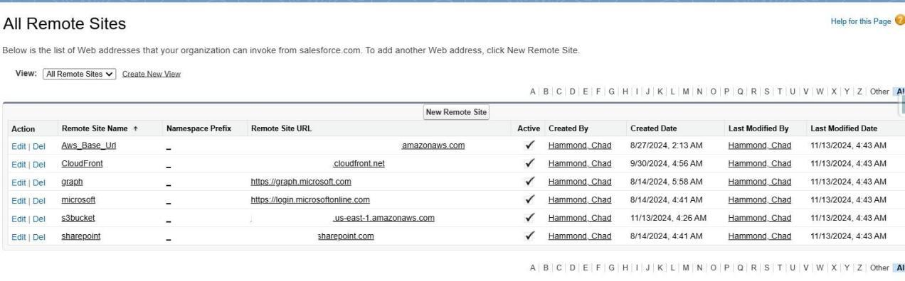

### Setup CORS :

#### CORS to configure Post Installation :

AwsBaseUrl – Base URL for AWS API, used for all callouts.

- CloudFront – CloudFront URL to secure the URL.

- s3Bucket – AWS server URL where files are stored.

- sharepointSite -- URL for your configured SharePoint site. (e.g URL : [https://yourdomainname.sharepoint.com](https://yourdomainname.sharepoint.com))

#### Here are the steps to configure CORS (Cross-Origin Resource Sharing) in Salesforce:

- Go to Setup in Salesforce.

- In the Quick Find box, type CORS and select CORS from the results.

- Click "New" to add a new CORS setting.

- In the "Origin URL" field, enter the URL that needs access to your Salesforce data. This should be the base URL of the external domain making requests (e.g., your AWS API URL, CloudFront URL, or SharePoint site).

- Optionally, enter a description to clarify the purpose of the CORS setting.

- Click Save to activate the CORS setting.

Repeat these steps for each external URL that requires CORS configuration. This setup will allow specific external sites to access Salesforce resources as needed.

Below is the Screenshot for the referral :

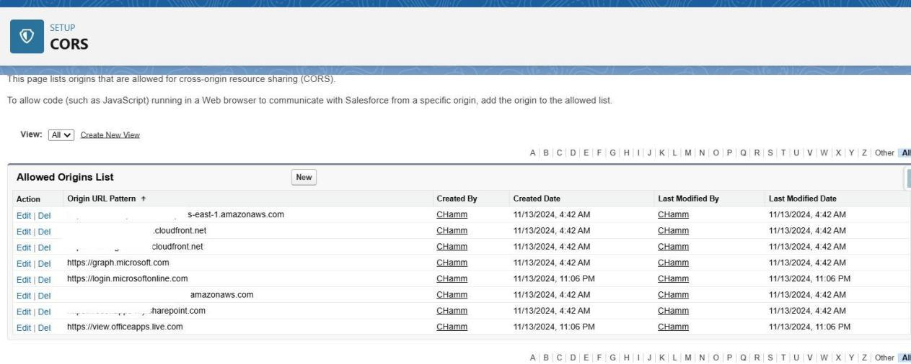

### Setup Trusted Urls (Csp) :

#### Trusted URLs to configure Post Installation :

AwsBaseUrl – Base URL for AWS API, used for all callouts.

- CloudFront – CloudFront URL to secure the URL.

- sharepointSite -- URL for your configured SharePoint site. (e.g URL: [https://yourdomainname.sharepoint.com](https://yourdomainname.sharepoint.com))

- Office Apps - ‘https://view.officeapps.live.com’

Add these two URLs to the Remote Site Settings if you use SharePoint functionality.

- GraphAPI - ‘https://graph.microsoft.com’

- Microsoft - ‘https://login.microsoftonline.com’

Here are the steps to create CSP (Content Security Policy) Trusted URL in Salesforce:

- Go to Setup in Salesforce.

- In the Quick Find box, type Trusted Urls and select Trusted Urls from the results.

- Click New Trusted URL to add a new CSP trusted URL.

- Enter the details for the trusted site:

- Api Name: Provide a name for the site, such as AwsBaseUrl, CloudFront, or SharePoint Site.

- URL: Enter the URL of the site you want to trust, such as your AWS API URL, CloudFront URL, or SharePoint site.

- Context: Select the context as ALL.

- Optionally, add a description to specify the purpose of the trusted site.

- Ensure that Active is checked.

- Click Save to create the trusted URL.

#### NOTE :

While creating the trusted URLs check all the below permissions

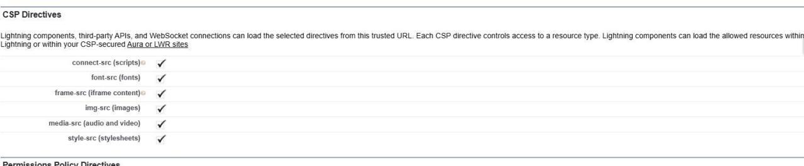

Repeat these steps for each site that requires a CSP Trusted Site entry. This setup ensures that only authorized external resources can load in Salesforce, enhancing security.

# DMS Configuration

This section guides admins in setting up the integrations/ file configurations and lookup configurations.

### - Create a Relationship Between the Document Profile and the Parent Object

To effectively store files related to a specific object (such as Account), you must establish a relationship field on the Document Profile object

(ReconDMS Document_Profile c). This field will link to the designated parent object.

Steps:

- Navigate to Setup in Salesforce.

- Go to Object Manager and select ReconDMS Document_Profile c.

- Click on Fields & Relationships

- Select New and choose Lookup Relationship.

- Follow the prompts to create a lookup field that links to the parent object (e.g., Account).

### - Set Up AWS Integration:

Setting up the AWS integration is crucial for enabling DMS to store files securely in S3.

Steps:

- Navigate to the DMS Configuration Tab via the App Launcher.

- Click Configure to enter the required details for AWS integration:

- AWS Base URL: Input your AWS endpoint.

- User ID: Enter the User ID provided to you.

- User Token: Enter the User Token supplied to you.

- Click Test and Setup Integration to validate your inputs and establish the integration with AWS.

Note: Please ensure that the credentials provided for AWS are accurate.

### - Azure and SharePoint Configurations:

The DMS configuration uses SharePoint for the inline editing feature, so these integrations must be configured to enable it.

Steps:

- Navigate to the SharePoint Integration Tab on the DMS configuration page.Select whether to enable SharePoint or not. If disabled, move to the next tab; if enabled, follow these steps :

- Click Configure and enter the necessary details:

- Azure Client ID: Your Azure application’s client ID.

- Azure Client Secret: The client secret for your Azure application (Use the value you have copied in the Azure setup, ensure that it is a Value and not a secret ID).

- Azure Tenant ID: The ID of your Azure tenant.

- Azure Scope: Specify the permissions required for your application: (https://graph.microsoft.com/.default).

- Azure Base Token URL: This is set by default, but verify it matches your requirements.

- Click Test and Setup Integration

Note: Please ensure that your credentials from the Azure app are accurate.

Once the Azure integration is set up, you will see the SharePoint Integration tab. Click the "Configure" button, then enter the SharePoint site ID you retrieved from Azure and SharePoint Setup. Afterward, click "Next," select your SharePoint drive and folder, and click "Save."

### - Define Chunk Size AND Notification Threshold:

Set the Chunk Size to define the maximum file size allowed per upload to AWS. This represents the data size of each single chunk of a file.Set the Notification Threshold value in MB. This determines the minimum file size for which a bell notification will be sent.

### - Related List Configuration:

The related list setup is essential for linking files to the correct parent object in DMS. Steps:

- Select the appropriate parent object (e.g., Account) from the dropdown menu in the configuration settings.

- Select the lookup field you created to link the Document Profile with the parent object.

- Save the configuration to enable the related list, displaying all associated documents for the specified parent object.

### - Search Configuration :

The search configuration is essential to send the parameters to AWS while searching for files.

- Max Document Count (_c): Maximum number of documents to count before limiting results. Default: 500, Max: 500.

- Top Result Count (_r): The number of top results to return if matches exceed the count. The default is 50; this should not exceed the Max Document Count (_c).

- Batch Size (_b): Number of documents to fetch per batch. Default: 1,000, Min: 100, Max: 2000.

- Sort Order (_o): Sort order based on createdDate. Options: asc or desc. Default: desc.

# Buttons

This section outlines configuring user interface elements, including buttons and related lists.

### Create Parent Buttons :

After successfully setting up the DMS configurations, navigate to the parent object.

e.g., Account.

- Navigate to Setup

- Go to Object Manager

- Select Account

- Click on Buttons, Links, and Actions

- Click on New Action

Fill in this information, and this button will invoke the file upload functionality.

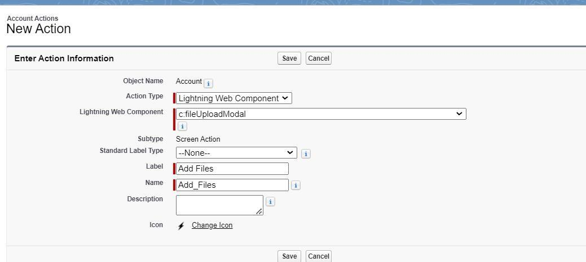

Click Save.

Again, create a new action and fill in this information. This button will invoke the file search functionality

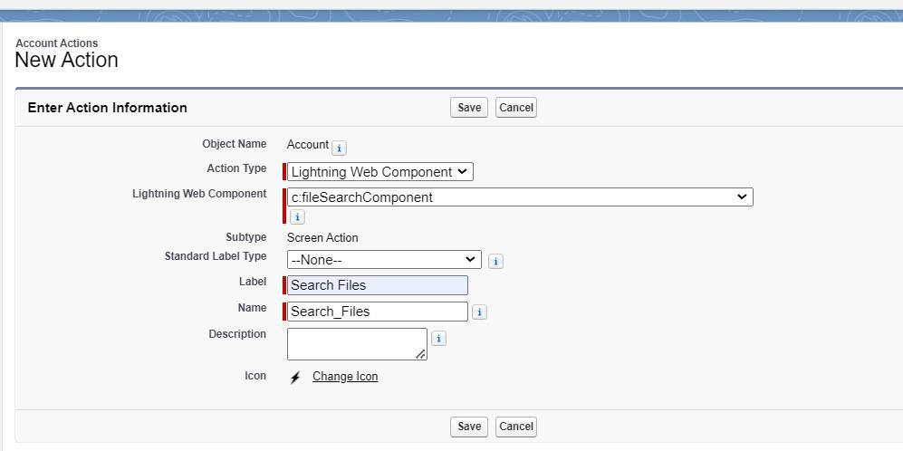

Click Save.

Note: To avoid confusion when adding buttons to page layouts, include the parent and button names. For example, for Account, you can use "Add Account Files."

### Create Document Profile Buttons :

Navigate to the document profile object after creating both buttons on the parent object.

- Navigate to Setup

- Go to Object Manager

- Select Document Profile

- Click on Buttons, Links, and Actions

- Click on New Button or Link

Fill in these attributes :

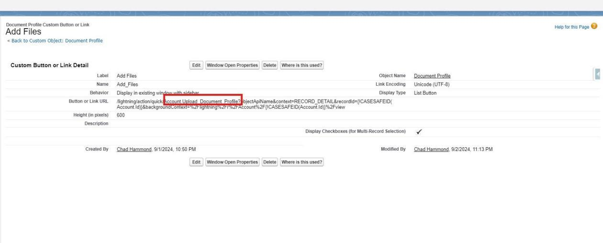

Example URL:

/lightning/action/quick/Account.Add_files_button_api_name?objectApiName&cont ext=RECORD_DETAIL&recordId={!CASESAFEID( Account.Id)}&backgroundContext=%2 Flightning%2Fr%2FAccount%2F{!CASESAFEID(Account.Id)}%2Fview

Note: Use your Parent API name wherever we have used the account in the above example URL. Also, ensure that there are no extra spaces in the URL.

Note: In this Button or Link URL, in the highlighted section, the API name of the button of the parent for Add Files will be embedded

Again, create a new button on the Document Profile for Search Functionality by following the same steps.

- Navigate to Setup

- Go to Object Manager

- Select Document Profile

- Click on Buttons, Links, and Actions

- Click on New Button or Link

Fill these attributes

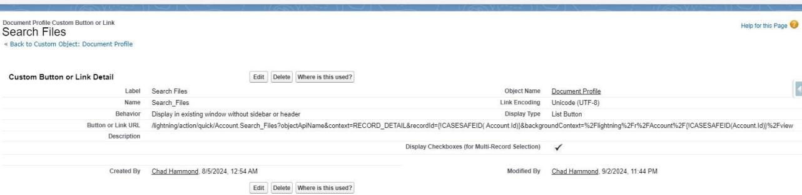

Example URL:

/lightning/action/quick/Account.Search_Files_api name?objectApiName&context=RECORD_DETAIL&recordId={!CASESAFEID( Account. Id)}&backgroundContext=%2Flightning%2Fr%2FAccount%2F{!CASESAFEID(Account.I d)}%2Fview

Note: Use your Parent API name wherever we have used the account in the above example URL. Also, ensure that there are no extra spaces in the URL.

Note: In this Button or Link URL, in the highlighted section, the API name of the parent button for Search Files will be embedded.

## Related List on Page Layout

Now add the Document Profile Related List on the parent object, e.g., Account

- Navigate to Setup

- Go to Object Manager

- Select Account

- Click on Page Layouts

- Select the desired layout

- Navigate to Related Lists

- Drag and drop the Document Profile related list

After adding the list, click the settings icon as highlighted below :

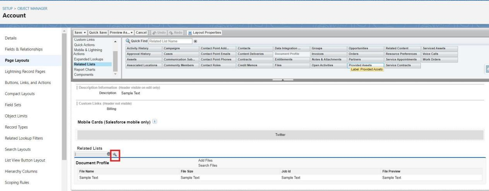

Select the fields you want to display on the related list. Specifically, if you're going to preview the document from the related list, you have to add this field highlighted below :

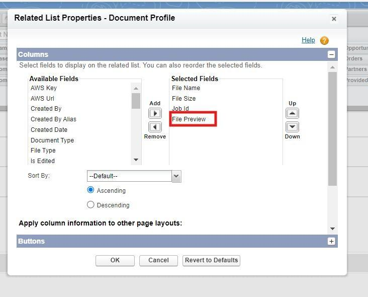

Then, from the button, select the buttons we have created on the document profile to achieve file upload and search functionality.

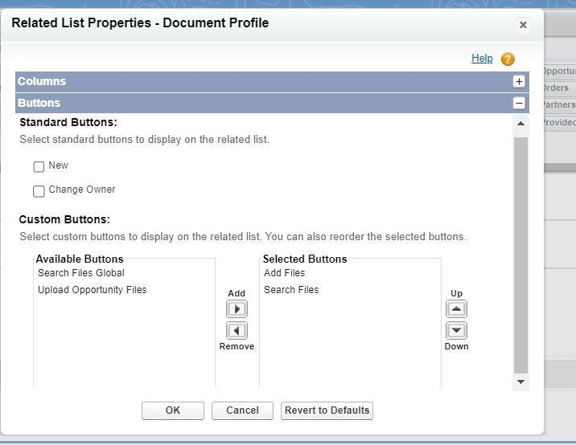

Click Ok, Click Save.

All configurations are now complete. You can begin uploading files and proceed with your operations. For assistance with navigation, please refer to the ReconDMS Navigation Guide.

## Next Steps

Introduce end users to the new experience using the [User Navigation Guide](user-guide).
