> **Audience**  
> Trainers, support teams, and power users who need to understand Recon DMS user-facing experiences.

# User Navigation Guide

## Table of Contents

Upload Folder…4

Browse local file4

Select existing file5

## DMS Navigation Guide

#### Overview

The Document Management System (DMS), built on Salesforce, offers a streamlined document storage and retrieval solution. Instead of directly using Salesforce storage, DMS utilizes Amazon Web Services (AWS) S3 for secure, scalable, and cost-efficient storage, optimizing Salesforce data usage while safeguarding your files off-platform.

Note: Use the Document Profile Version (Document_profile_version c) object to create new fields or attributes

### Navigating through DMS

Now that the Document Management System (DMS) is fully configured, you can begin efficiently uploading, managing, and retrieving documents. With the setup complete, DMS is integrated with your selected Salesforce objects (in this case, Account, but it can be any object you've configured). You can now seamlessly store and manage files related to these objects.

#### Accessing the Document Profile Related List

To start using DMS:

- Navigate to the Account (or the configured parent object) for which you want to manage documents.

- On the Account page, you will see the Document Profile related list, which displays all associated files.

This related list acts as a central hub for document management, allowing you to view, upload, and manage files linked to that specific object.

#### Uploading Files

To upload files:

In the Document Profile Related List, click on the Add Files button. This button will be highlighted for easy access.

Upon clicking Add Files, a file upload modal will appear. This modal allows you to upload files:

Note: To add file fields like ‘Document Type’ and ‘Who is Uploading?’, refer to ReconDMS File Upload with Field Sets and Record Types.

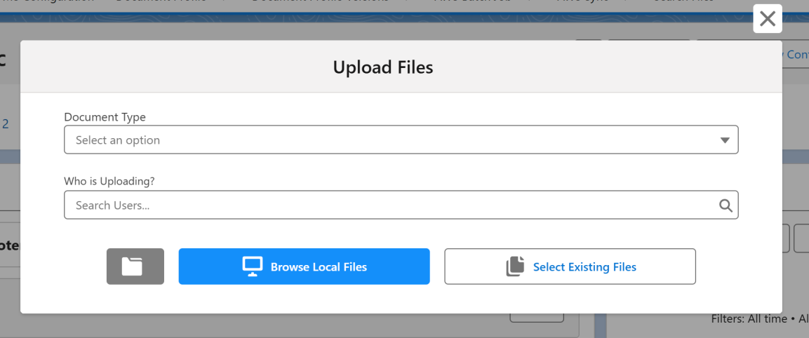

###### - Upload Folder

Select an entire folder from your system to upload multiple files at once.

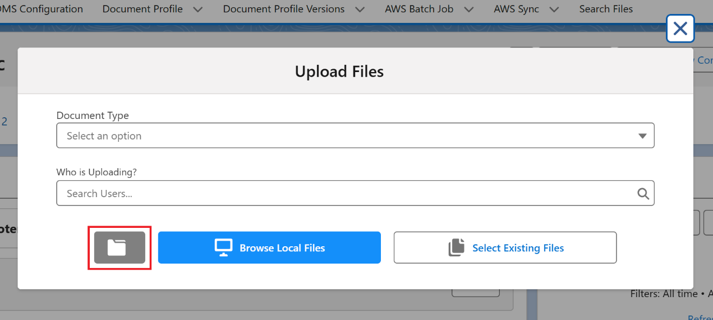

###### - Browse Local Files

Click to browse and select one or more files from your local computer.

###### - Select Existing Files.

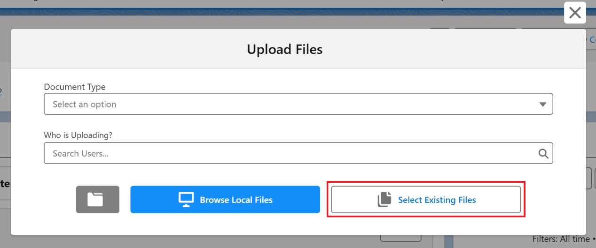

Choose from Existing File, a modal will open, and select any file.

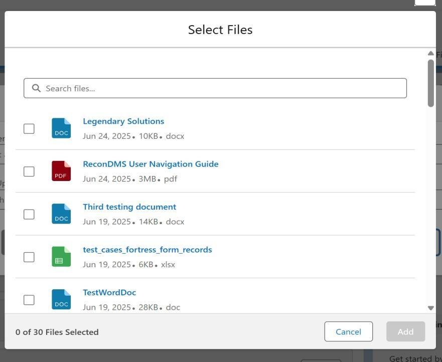

###### After,

Once you select the file, click the "Add" button in the bottom-right corner.

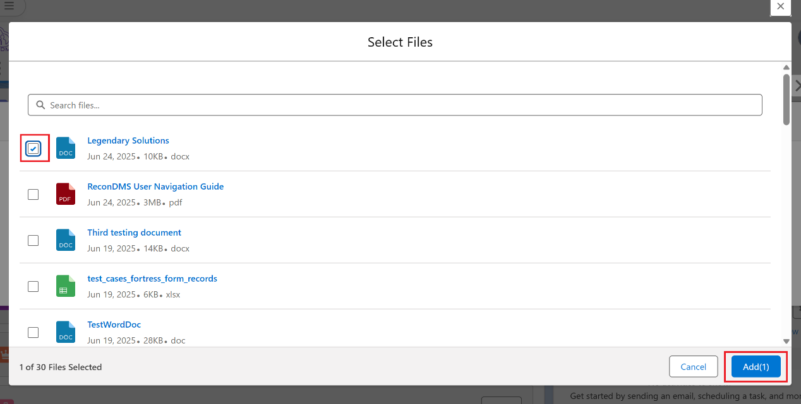

After adding, confirm & Upload the file.

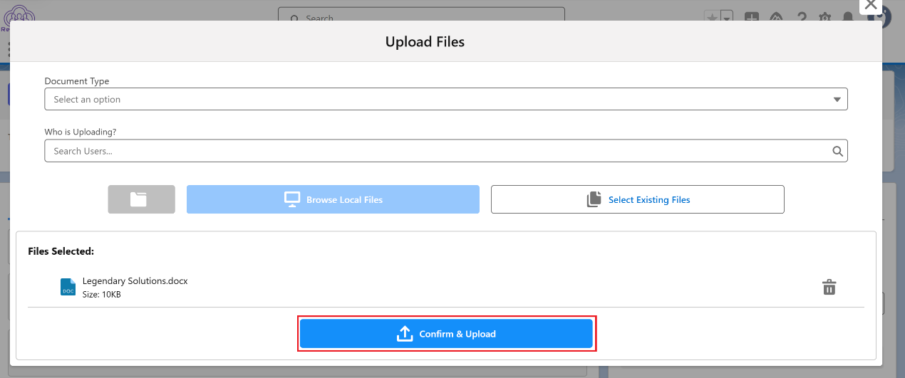

#### File Upload Confirmation and Previewing Files in DMS

Once your files are uploaded successfully, you will receive a notification in the notification bar confirming the upload. This ensures you’re informed of the file's status in real-time.

Note : Notifications are triggered only for files that exceed the notification threshold value set in the DMS Config tab.

Note : If you try to reload/close the window before the file upload process is completed you will see the alert shown below
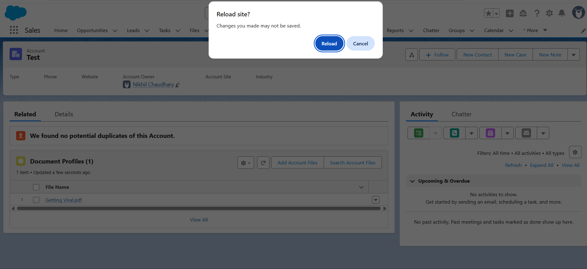

#### Verifying Uploaded Files

After the upload is complete:

1. Refresh the window to see the updated file records in the Document Profile Related List. The uploaded files will now be visible alongside other documents associated with the selected parent object (e.g., Account)

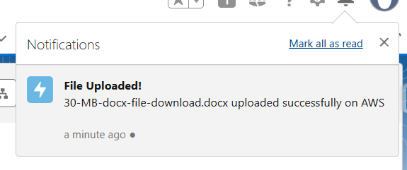

#### Previewing Files in Salesforce

Note: To preview files (Docx, Doc, and text), you must log in to SharePoint using the same user account configured during the setup process.

DMS provides multiple ways to preview files directly within Salesforce:

##### From the Related List:

In the Document Profile Related List, click the eye icon next to the document you wish to preview. This offers a quick and easy way to view files without leaving the current page.

##### From the Document Profile Record:

Alternatively, you can navigate to the Document Profile record and click the Preview button. This will allow you to view more detailed information about the document

before previewing.

This preview modal will be displayed once you preview the file from anywhere.

##### Navigating through the preview modal features

The DMS preview modal offers several powerful features that enhance file management. Two key buttons available within the modal are:

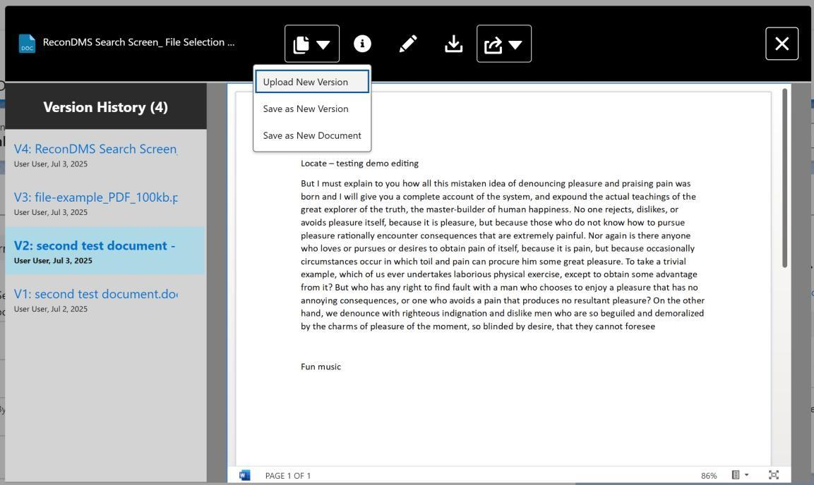

###### Upload New Version

The Upload New Version button allows users to update an existing file by uploading a newer version. This feature is handy for version control, ensuring that the most recent version of a document is always available without replacing the document's metadata or its associations with the parent object.

- Click Upload New Version within the preview modal.

- Select the updated file from your computer/existing document profiles.

- The system will automatically replace the old version while preserving document links and metadata.

Note: We can upload a new version of the file from the document profile record. Upload a New Version similarly.

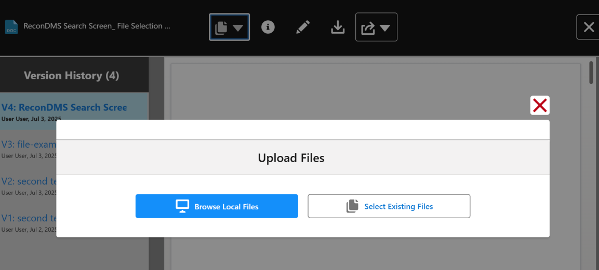

###### Save as New Version

The Save as New Version button allows users to upload a modified version of an existing file without overwriting the current version.

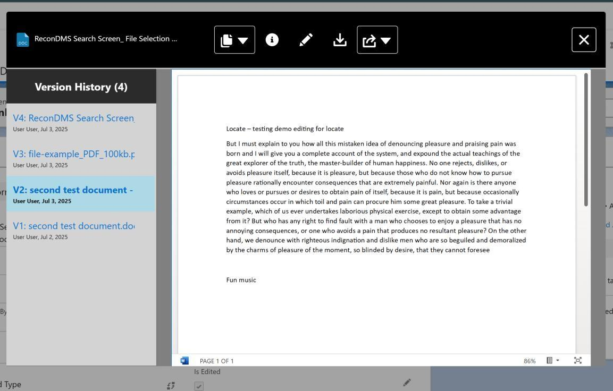

Click on Edit

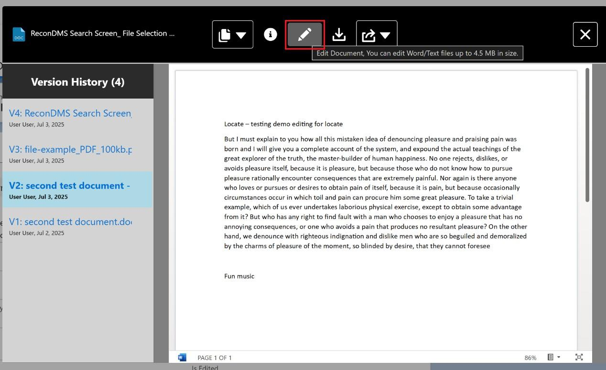

When you click on the file, it will open in Word, where you can edit and save it. After saving your changes locally, return to the system and click Preview on the same file.

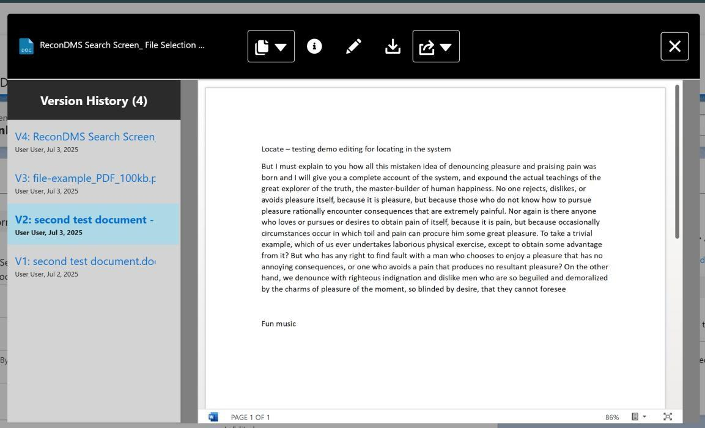

Then click on Save as new version from the dropdown Enter,

- File name

- What’s New in this Version: Click on Save Version
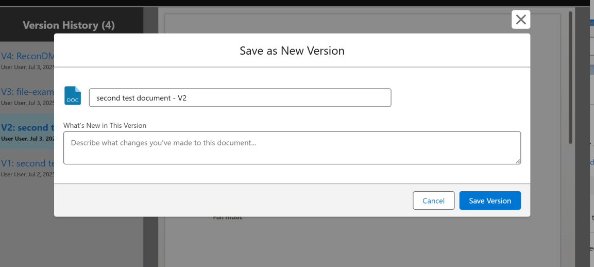

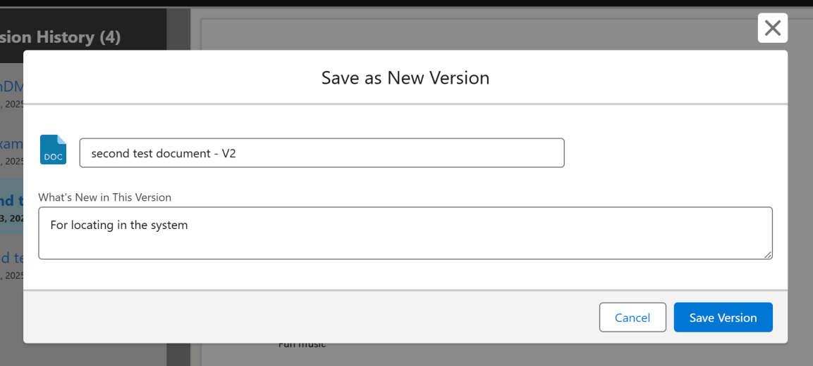

Then it will save as a New Version.

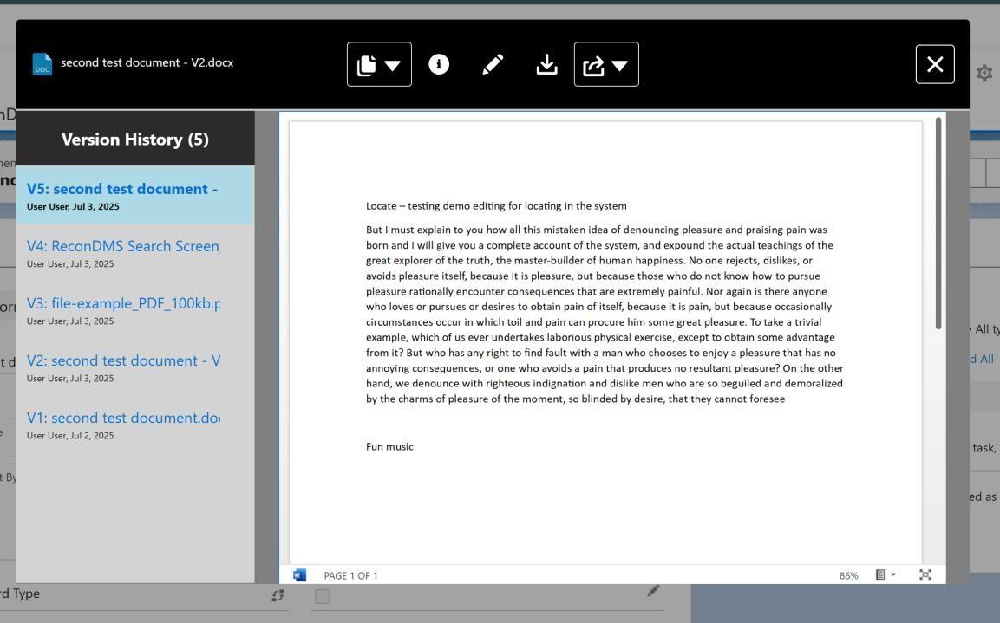

###### Save as New Document

The Save as New Document button allows users to create a copy of the current file as a separate document. This is ideal when you need to reuse a document in another context but want to keep it as a distinct record in DMS.

Steps to save as a new document:

- Click Save as New Document within the preview modal.

- Click Save.

###### View File Details

The View File Details button provides quick access to the full Document Profile record for the file you are previewing. This is useful when you need to see or update metadata, relationships, or any additional details associated with the document.

Steps to view file details:

- Click View File Details within the preview modal.

- You will be navigated to the document’s Document Profile record in Salesforce, where you can see all related data.

###### Editing the File

DMS allows editing documents online directly from Salesforce for supported file types such as doc, docx, and text files that are under 5 MB in size. This allows for real-time updates without needing to download and re-upload files, streamlining document revision workflows.

Key points about file editing:

- It only supports certain file types (doc, docx, text).

- File size must be less than 5 MB.

Steps to edit a file:

- Click the Edit icon in the preview modal.

- An editing modal will pop up, allowing you to change the document's content.

Important: You must be signed in to your SharePoint account to use the online editing feature. DMS integrates with SharePoint to provide secure inline editing capabilities, so ensure you have the credentials and access permissions before editing.

###### Download

The Download button lets users download the latest file version directly to their local device. This ensures that you always have access to the most up-to-date version of the document.

Steps to download:

- Click the Download button.

- The file will be saved to your local device for offline access or further use.

###### Copy the Link and Create a Public Link

The following two buttons in the preview modal are:

Copy Link

The Copy Link button allows users to copy a link to the Document Profile record in Salesforce. This is useful for sharing access to the document within your internal team, ensuring recipients are directed to the document’s profile page, where they can view or interact with it based on their permissions.

Steps to copy the link:

- Click the Copy Link button.

- The link to the Document Profile record will be copied to your clipboard, ready for sharing.

Create Public Link

The Create Public Link button generates a shareable link to the file stored in the DMS (on AWS). This public link can be shared with external users or collaborators who may need access to the file.

Important Notes:

- The public link provides direct access to the latest version of the file.

- If the file is edited, there may be a slight delay before the new version is synced and reflected in the public link, as it takes time to update the file on AWS.

Steps to create a public link:

- Click the Create Public Link button.

- This modal pops up. Select the expiration date and click the generate link. Then, you can copy the link from there.

#### Searching Text in DMS

DMS offers a robust text-based search feature, allowing users to efficiently locate specific terms or phrases within their stored documents. This capability is beneficial when quickly finding relevant files without manually reviewing multiple documents.

###### How Text-Based Search Works

The text search function scans the content of your files stored in DMS, identifying which documents contain the search terms you’ve entered. It provides two types of searches:

- Parent-Specific Search: Search files related to a specific parent object (e.g., Account).

- Global Search: Search across all document profiles, regardless of the parent object.

Note: It may take some time for AWS to process and prepare the results after extracting text from the files, so that search results won't be immediately available after file uploads.

###### Steps to Use Text Search:

You can initiate a text-based search in DMS from two different locations:

###### From the Parent Object's Related List:

Navigate to the Parent Object (e.g., Account): Open the parent record where you have set up DMS (such as Account, Opportunity, etc.).

Click the Search Files Button: Click the Search Files button in the Document Profile Related List. This will initiate a parent-specific search, meaning the system will only

scan files linked to that particular parent object (e.g., files related to the specific Account).

Enter Search Term: Type the term or phrase you are searching for within the related documents.

###### View Results: The search results will display documents linked to that parent object that contain the search term.

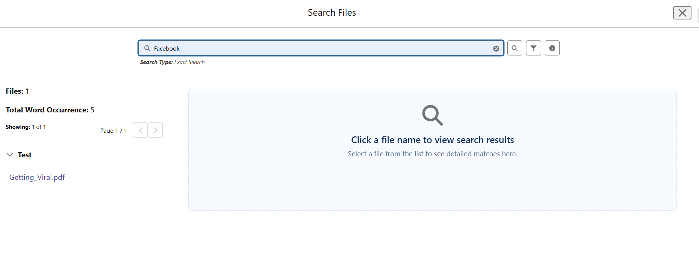

Click the file name to see the results :

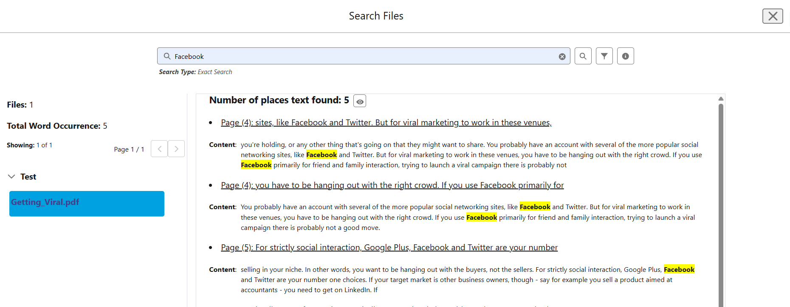

Click the Preview Icon to preview the file from here :

The file will be previewed :

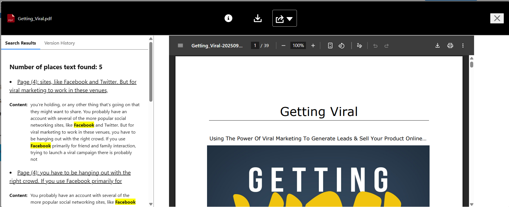

Applying Advanced Filters in search results :

This modal will pop up and allow the user to apply a filter based on the fields in the results

###### From the Document Profile List View:

Navigate to the Document Profile Tab: Go to the Document Profile list view in DMS. Click the Search Files Button. In this view, you can perform a global search, which will scan through all document profiles, regardless of which parent object they are linked to.

Enter Search Term: Type the term or phrase to find documents containing it. View Results: The system will display results from the entire document repository. Further steps here are the same as those that are object-specific.

# File Syncing Process

##### Introduction

The Document Management System (DMS) includes an automated file syncing process that ensures any files edited online through SharePoint are synchronized with the storage on AWS. This process guarantees that the latest version of a file is always available in AWS after changes are made via the inline editing feature in DMS.

##### How the File Syncing Process Works

Whenever a document is edited online using the DMS interface (via the SharePoint integration), the system flags that document for syncing with AWS. This ensures that any modifications made in SharePoint are reflected in the AWS storage.

##### Sync Process Overview:

The file syncing process involves the following steps:

##### Edit Tracking:

- When a user clicks the Edit File button from the preview modal and changes a document, a system-generated "Is Edited" checkbox is marked as True in the associated Document Profile. This flag signals that the document has been modified and needs to be synced with AWS.

##### Batch Process for Syncing:

- A scheduled batch process runs daily at 12 AM midnight to handle file syncing. This batch automatically checks all documents where the "Is Edited" flag is set to true.

##### Sync Job Creation:

- The batch job retrieves the SharePoint File ID of the edited documents and initiates a sync job on AWS. This job pushes the latest edited version of the file from SharePoint to AWS, ensuring AWS stores the most up-to-date version.

- The system also creates a record in Salesforce called "AWS Batch" with a status of Pending. A corresponding "AWS Sync" child record is created for each synced file, also marked as Pending.

##### Completion of Salesforce Batch:

- Once the Salesforce batch is complete, another process will be initiated that fetches the results of the AWS sync job.

##### Handling Sync Results:

- For files that are successfully synced, the system resets fields like Is Edited, File ID, and

SharePoint URL. The sync records are also updated as completed with their completed time.

- For files still marked as Pending or In Progress, the batch process is rescheduled to fetch their status again at the next interval.

- Files with an Error status are queued for the next sync batch at 12 AM, ensuring they are retried for syncing in the following batch cycle.

- If all the files are completed successfully, we update the AWS Batch record as completed.

After successful syncing

# Standard Files to DMS Files Automation

We've introduced a new feature to automate the upload of files from standard files to Recon DMS files for any object. Users simply need to add the object name to our custom setting, and that's it. All standard file types (except TEXT) for the configured object will be automatically uploaded to AWS, and DMS records will be created accordingly.

Note: The object must be configured with DMS for this functionality to work.

**To Set Up the Configuration:**

- Navigate to Setup and search for Custom Settings.

- Locate the custom setting named File Automation Config.

- Click Manage, as shown in the screenshot.

- Click New to create a new configuration.

- Enter the Object API Name in the Name field for which you want to automate this functionality.

- Check Send Notification to receive a notification after the file upload.

# Dynamic Fields on File Upload Modal

To enable dynamic addition and removal of fields in the File Upload Modal, ReconDMS leverages Record Types, Field Sets, and a configuration stored in the custom setting Dynamic_Fieldset_Config__c.

To get started,

Go to Setup.

Navigate to the Document Profile object.

Open the Field Sets section.

Click New.

Fill in the required fields and note the Field Set Name (as shown in the screenshot).

Then, go to Custom Settings.

Navigate to Dynamic Field Set Config and click Manage.

Click New.

Enter the required values, and ensure that the Field Set Name matches precisely with the one created in the Field Set.The Record Type API Name must match the fields you want to display exactly.

If you prefer not to use a specific Record Type and keep the fields as default, enter “Master” in the Record Type Name.

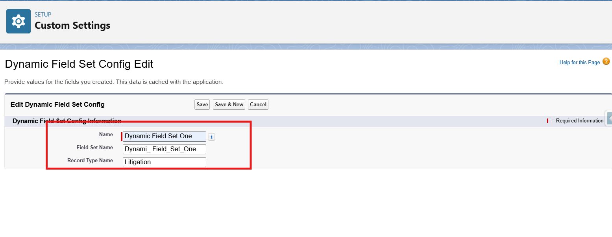

Now, you can start adding the fields to the field set and set their values before uploading the files.

You can select the record type, and you will see the fields mapped with the record type.
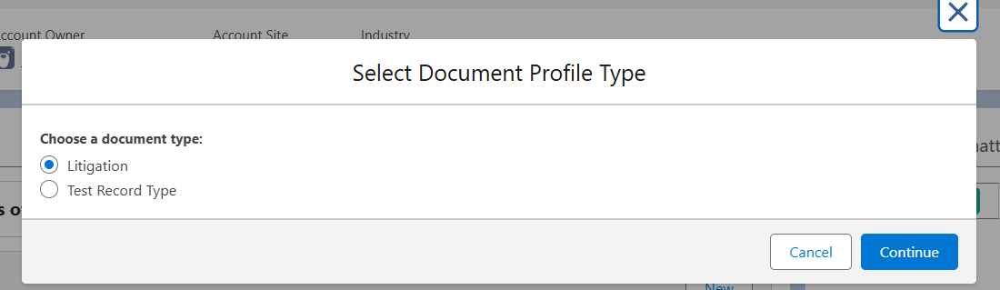

The fields added to the field set and mapped with the record type are on the Upload File Modal.

# Deletion & Recovery (AWS/SharePoint) - Jobs, Undelete Rules, and Status Checks

## What this feature does (at a glance)

- When you delete a Document Profile or a Version, DMS creates File Delete jobs that clean up the file(s) from AWS S3 and, if applicable, SharePoint.

- If you undelete:

- DMS validates whether a restore is allowed based on related job statuses.

- Non-completed jobs are cleaned up; completed ones protect permanent deletes and prevent accidental restore.

- Background batches:

- A creator batch aggregates pending deletions into an AWS Delete Batch Job (callout).

- A status batch polls AWS and updates each file’s per-system status (AWS, SharePoint) plus a unified Job Status.

This complements the existing upload/preview/edit/sync capabilities you already use in DMS, which store files in AWS with SharePoint-powered editing and preview

## Deleting a Document (end-users)

When you delete a Document Profile, DMS automatically creates one File Delete job per Version under that profile. Each job tracks:

- Which version is being deleted,

- Where it lives (AWS only, or AWS & SharePoint),

- Who initiated the delete,

- Per-system delete statuses (AWS / SharePoint),

- A unified Job Status (Pending, In Progress, Partially Completed, Completed, Failed).

No extra steps from you are required: jobs are created automatically on delete.

Reminder: As with other DMS operations, files are ultimately stored off-platform in AWS S3; SharePoint is used for inline editing and preview for supported types

## Undelete Behavior (safety rules)

You can restore (undelete) from the Salesforce Recycle Bin, subject to these rules:

### When restoring a Document Profile

- Blocked: If all related File Delete jobs are Completed, the profile cannot be restored. You’ll see: “Cannot restore this file because this file has been deleted from the server (AWS/SharePoint).”

- Allowed: If any related job is not Completed:

- DMS deletes all non-completed jobs for that profile (they’re no longer valid after an undelete), and

- For versions whose delete jobs are Completed, DMS appends “ – Deleted” to that version’s Name (once) so users understand that version can’t be recovered server-side.

### When restoring a Version

- Blocked: If any job for that version is Completed, the version cannot be restored. If available, DMS includes the completion date in the error for clarity.

- Allowed: If no job is Completed, DMS deletes all non-completed jobs for that version.

Why this matters: once a cloud delete is completed, the object is gone from AWS (and SharePoint if applicable). Blocking the restore prevents a misleading “restored” record that no longer has a file behind it.

## How File Delete jobs are processed (admins & power users)

Two background processes coordinate deletion:

### 1) File Delete Job Creator (Batch + Schedulable)

- Scans File Delete jobs older than your retention window (defaults to 10 days) that:

- Need AWS deletion (Pending/Error, < 3 retries, and not already linked to a batch), and/or

- Need SharePoint deletion (Pending/Error/In Progress, < 3 retries).

- Builds a payload of eligible items (S3 Key, optional SharePoint Item ID + Drive ID).

- Calls AWS to create an AWS Delete Batch Job:

- On success: links child jobs to that batch and flips statuses to In Progress.

- On failure: doesn’t change statuses; appends a reason to each job’s Note so you can retry on the next run.

### 2) File Delete Job Status Monitor (Batch + Schedulable)

- Picks at most one pending AWS Delete Batch Job at a time.

- Calls AWS for per-file results (supports the newer structure with logs and booleans like isDeleted, isDeletedSharePoint).

- Updates each child job:

- AWS_Delete_Status: Pending / In Progress / Error / Failed / Success (+ retry counts & unlinking from the batch if re-tryable).

- Sharepoint_Delete_Status: same states if the file had a SharePoint file ID.

- Job_Status (unified):

- Completed (AWS success and, if applicable, SharePoint success),

- Partially Completed (one system succeeded, the other failed),

- Failed (final failure on all applicable systems),

- In Progress (anything still retriable or pending).

- If any job remains pending/retriable, the batch re-schedules itself to check again in ~30 minutes.

Tip: You can surface the per-job statuses in a list view or related list on the Document Profile to give users clear visibility during the deletion lifecycle.

## Retries, Limits, and Notes

- Retries:

- AWS and SharePoint each allow up to 3 attempts per job (the 3rd marks a Failed final state).

- Notes:

- Job Note is automatically filled with the latest message from AWS (or a local reason if batch creation failed).

- Timing:

- Job creation respects a retention window (default 10 days) before picking items up for batching, aligning with your data retention and operational windows.

## Permissions & Security

All automation enforces CRUD/FLS checks before querying or updating records, and SOQL uses WITH SECURITY_ENFORCED where applicable. If the running user doesn’t have the required access, that segment of work is safely skipped.

## What users will see

- On undelete denial for a fully completed delete, a clear error message.

- On undelete when some jobs completed and some didn’t:

- The restore proceeds,

- Any needing-rename versions get a “ – Deleted” suffix,

- Stale, non-completed jobs are quietly cleaned up.

## Next Steps

See the [Troubleshooting Guide](troubleshooting) for common questions and support escalation tips.
