# Recon Search User Guide

**Salesforce Installation & User Guide - Version 2.0**

## Application Details

| Attribute | Details |
|-----------|---------|
| Version Name | ver 1.0 |
| First Release | July 3, 2024 |
| Latest Release | July 3, 2024 |

## Package Contents

| Component Type | Count |
|----------------|-------|
| Custom Objects | 2 |
| Custom Tabs | 2 |
| Custom Apps | 0 |
| Connected Apps | 2 |

## Lightning Components

| Deployment Target | Count |
|-------------------|-------|
| Global | 0 |
| App Builder | 1 |
| Community Builder | 0 |

## Supported Languages

- English

# Getting Started

Recon Search is an enterprise Salesforce solution that dynamically renders user interfaces through Lightning Web Components (LWC) while delivering advanced search capabilities. The solution integrates multiple technical components, including Apex controllers and Lightning Web Components, to provide a comprehensive, interactive search experience within the Salesforce platform.

# Product Overview

Recon Search is an advanced search application developed natively within the Salesforce platform. This application enables users to execute comprehensive searches across both standard and custom objects, including their related lists, with options for global organization-wide searches or targeted record-specific queries based on user-defined criteria.

## Key Features

- **Persistent Search Criteria**: Save and retrieve search parameters for efficient reuse
- **Integrated Results Viewing**: Access all search results directly within the component interface  
- **Flexible Field Configuration**: Dynamically add custom fields to enhance search capabilities

## Accessing Recon Search

### Initial Setup Process

1. **Package Installation**: Install the Recon Search managed package in your Salesforce organization.

2. **License Assignment**: Assign appropriate package licenses to users who will utilize the search functionality.

3. **Component Verification**: Navigate to the desired standard or custom object record via the App Launcher and verify the presence of the Recon Search component on the page.
   
   > **Note**: Task and Case objects are not currently supported but may be included in future releases.

4. **Component Addition** (if required): If the component is not present on the page, proceed with the following configuration steps. Otherwise, advance to step 8.

### Page Configuration

5. **Access Page Editor**: Click the gear icon and select "Edit Page" from the menu.

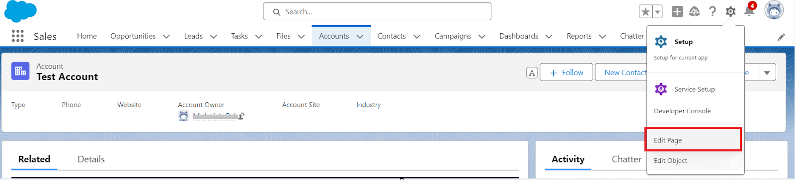

6. **Component Placement**: Locate the reconSearch custom component in the components library and drag it to the desired position on the record page.

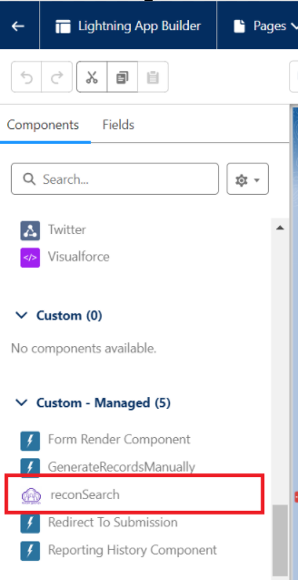

7. **Page Configuration**: Configure the Lightning page name parameter to enable component reuse across different page layouts with distinct configurations.

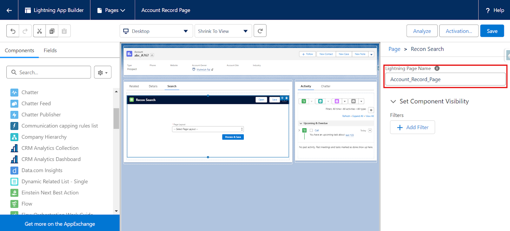

8. **Save and Activate**: Save all changes and return to the record page. Lightning Page activation may be required if not previously completed. Follow the system prompts to activate the page. If the component does not appear immediately, clear your browser cache and refresh the page, as changes may take several minutes to propagate.

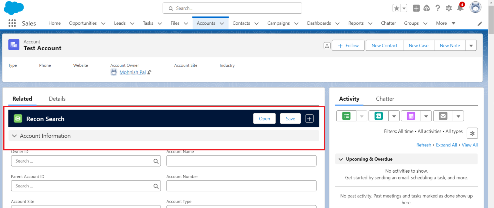

Configuring Search Component for the home page.

The reconSearch component can be placed on the home page or any app page. Here we are providing the steps that should be followed to place the component on the home page.

- Go to any home page or app page where you want to place the search component. In this example, we have opened our default home page.

- Click on the Gear icon and click the “Edit Page” action.
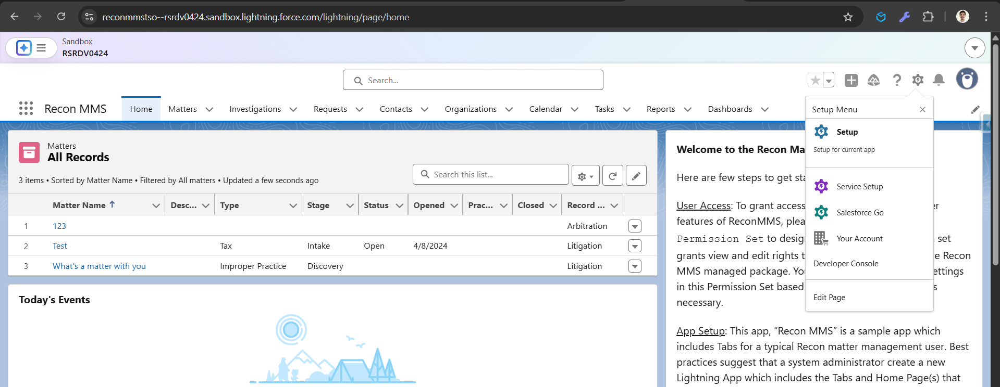

- Here you need to search the “Recon Search” component on the left side panel.
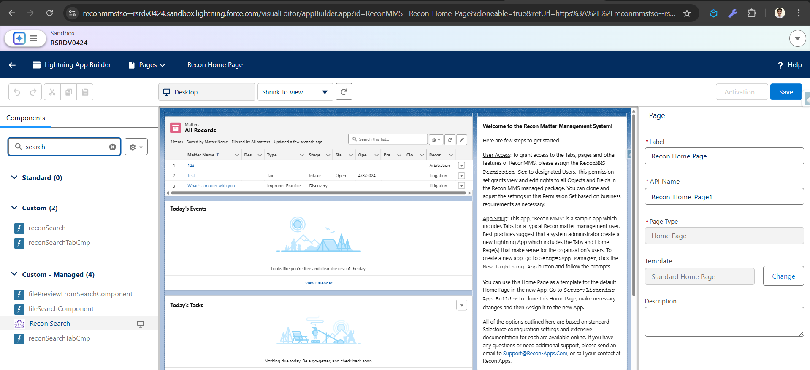

- Drag that component to the page.

- As we dropped the component on the page, you can see it is showing the error, as we need to pass some details to the component. Here, we need to provide the following details
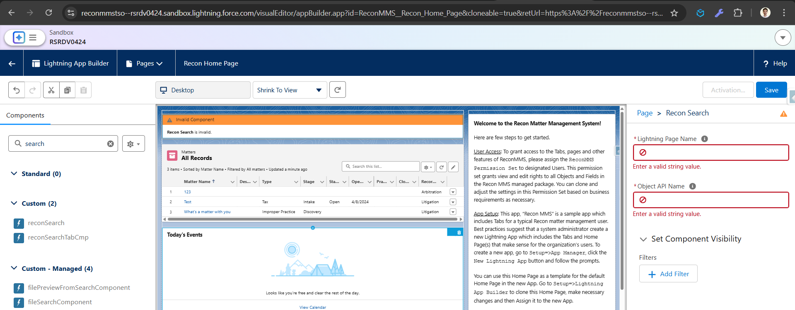

- Lightning Page Name: You can use the same lightning page name or any other name.

- Object API Name: Qualified object API name on which you want to perform the search action.

- As you can see, I want to configure the search component for the “Contact” Object, so I have provided the required details.
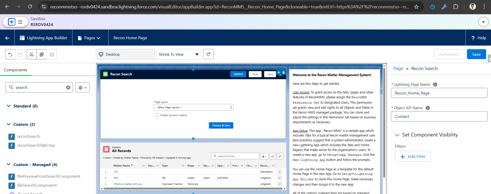

- After providing the details, component will be activated and error will be cleared. Now you should save the changes to access this on home page. Please follow the remaining steps that is required to save the changes.

- As you can see, the component is ready for use. The remaining steps are the same.
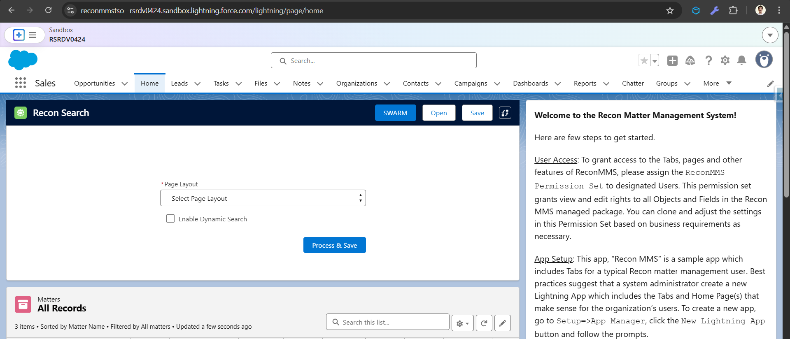

### Permission Configuration

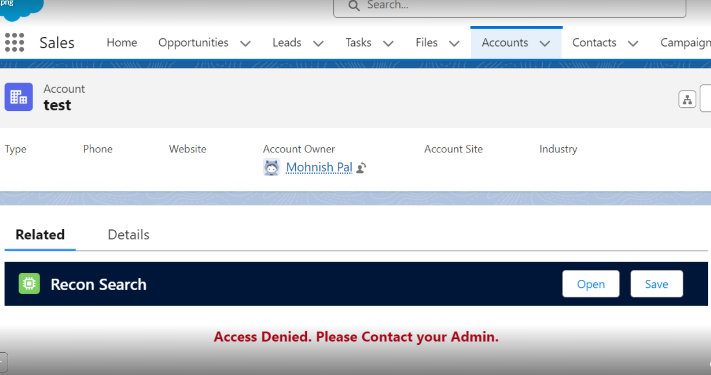

If you encounter the message shown above, permission assignment is required to access component functionality.

#### Permission Set Assignment Process

1. **Access Setup**: Navigate to Salesforce Setup
2. **Locate Permission Sets**: Search for "Permission Set" in the Setup menu
3. **Select Target Permission Set**: Locate and open "Recon Search Admin" from the available permission sets
4. **Manage Assignments**: Click "Manage Assignment" 
5. **Add Assignment**: Select "Add Assignment"
6. **User Selection**: Search for and select the target user from the directory
7. **Proceed**: Click "Next" to continue
8. **Complete Assignment**: Click "Assign" to finalize the permission grant
9. **Confirmation**: Click "Done" to complete the process

Navigate to your component and refresh the page to apply the changes.

### Authorization Troubleshooting

If you encounter issues during page layout modification or become stuck during the configuration process, authorization credentials may have expired and require renewal.

#### Credential Renewal Process

1. **Access Named Credentials**: Search for "Named Credentials" in Setup
2. **Select Metadata API Credential**: Open "Recon Search Metadata API"
3. **Edit Configuration**: Click "Edit"
4. **Reauthorize**: Save the configuration and complete the authorization workflow

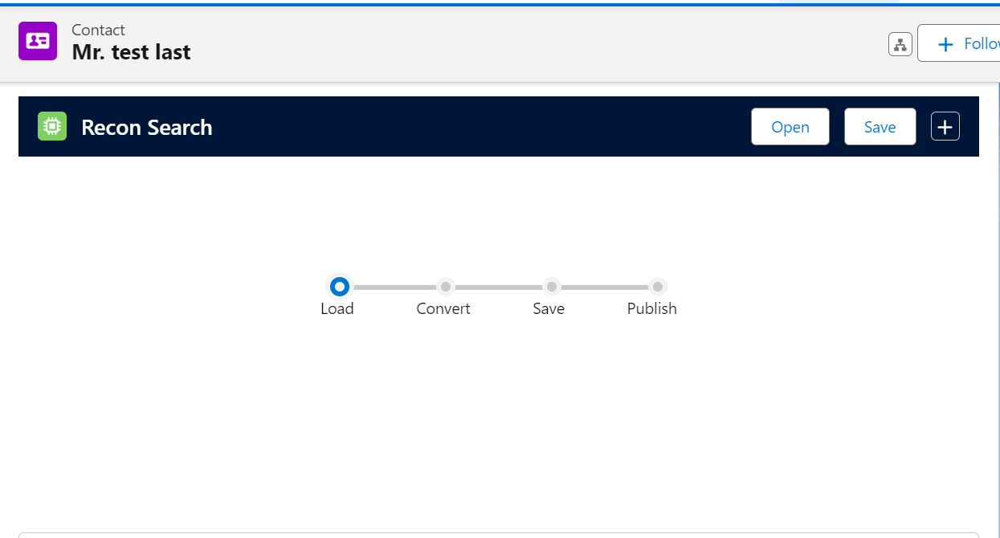

Select the desired layout from the available options and proceed. If the process does not advance, credential reauthorization is required.

## Prerequisites for Recon Search Implementation

Complete the following prerequisite configurations to ensure optimal Recon Search functionality.

> **Note**: This is a one-time configuration process that should be completed by a system administrator or user with appropriate administrative permissions.

## Section 1: Metadata API Configuration

### 1. Connected App Creation for Metadata API

1. **Access App Manager**: In Setup, search for "App Manager" and select it from the results.

2. **Create New Connected App**: Click the "New Connected App" button.

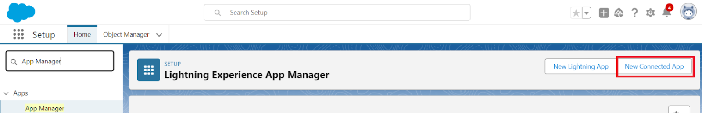

Step 3: For the App Name, enter Recon Search Metadata API and the API name as Recon_Search_Metadata_API.

Step 4: In the Callback URL field, add the callback URL copied from Step 10 of the Auth. Provider Creation for the Metadata API section below.

Step 5: Enable the Enable OAuth Settings checkbox.

Step 6: Choose the “full” and “refresh_token, offline_access” OAuth Scopes, as shown in the figure below.

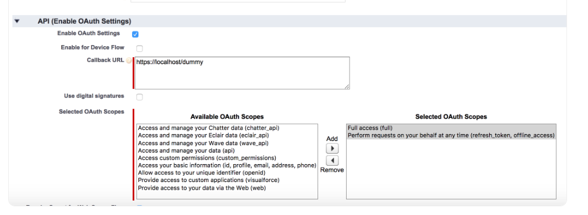

Step 7: Enable the Require Secret for Refresh Token Flow checkbox.

Step 8: Enable the Enable Refresh Token Rotation checkbox.

Step 9: Save the connected app and make a note of the Consumer Key and Consumer Secret that are generated; You will need to use these in the next step..

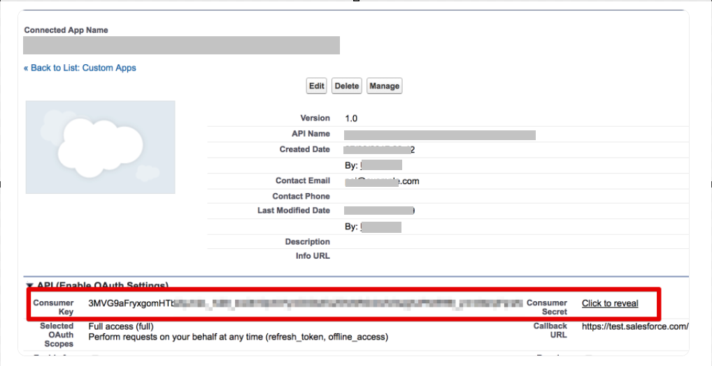

## 2. Auth. Provider Creation for Metadata API

Step 1: From the Setup, in the search box, type “Auth.” and then select the Auth. Providers from the list below the search box.

Step 2: Click the New button.

Step 3: Select the Salesforce option in the “Provider Type” dropdown field.

Step 4: For your Auth. Provide a name, enter Recon Search Metadata API, and set the URL Suffix as Recon_Search_Metadata_API.

Step 5: Paste the Consumer Key and Consumer Secret generated in Step 9 of the “Creating a Connected App for Metadata API” section above.

Step 6: Enable the Use Proof Key for Code Exchange (PKCE) Extension checkbox.

Step 7: Add the Default Scopes as refresh_toke,n full offline_access API

Step 8: Enable the Include Consumer Secret in SOAP API Responses checkbox.

Step 9: Save the Auth. Provider.

Step 10: Copy the Callback URL from the “Salesforce Configuration” section.

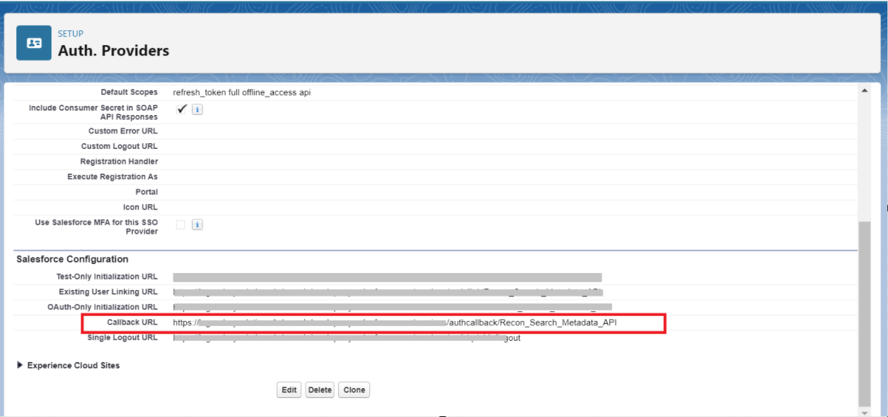

### 3. Named Credentials Creation for Metadata API

1. **Access Named Credentials**: In Setup, search for "Named Credential" and select "Named Credentials" from the results.

Step 2: Click on the New Legacy button from the dropdown of the Named Credentials section, as shown below.

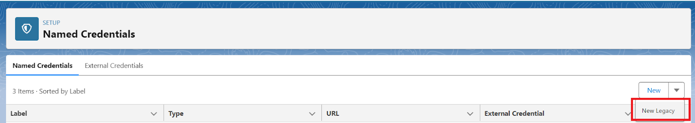

Step 3: Input the Name as Recon_Search_Metadata_API and Label as Recon Search Metadata API.

Step 4: In the URL field, enter your org’s instance URL – this will be the URL for your instance (e.g., na1.salesforce.com), or if you are using My Domain, your fully qualified My Domain domain (e.g., mycompany.my.salesforce.com).

Step 5: Under the Identity Type field, choose Named Principal from the drop-down list.

Step 6: Choose OAuth 2.0 in the drop-down list of Authentication Protocol.

Step 7: In the Authentication Provider field, choose the Recon Search Metadata API Auth. Provider created above.

Step 8: Add the Scope as: refresh_token full offline_access

Step 9: Enable the Start Authentication Flow on Save checkbox.

Step 10: Enable the Generate Authorization Header checkbox.

Step 11: Enable the Allow Merge Fields in HTTP Body checkbox.

Step 12: You will be prompted to log in to your org. After you log in, you will see the connected app authorization screen.

Step 13: Allow access to this app (your app). Once complete, you should be redirected to the Named Credential screen and see that the status is now “Authenticated as….”

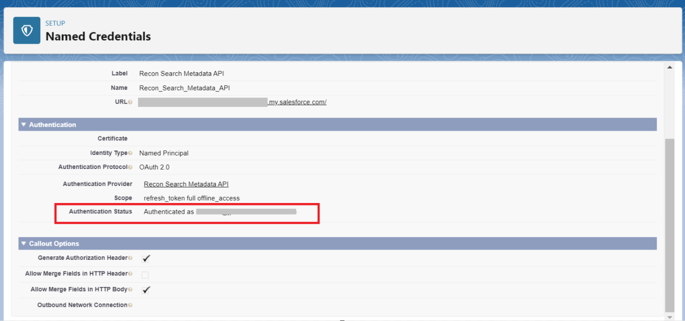

## Section 2: Configuring the Tooling API

## 1. Creating a Connected App for Tooling API

Step 1: From the Setup, type App Manager in the search box and select the App Manager from the list below the search box.

Step 2: Click the New Connected App button.

Step 3: Input the app a name as Recon Search Tooling API with an API Name of Recon_Search_Tooling_API.

Step 4: In the Callback URL field, add the callback URL copied from Step 10 of Auth. Provider Creation for Tooling API section below.

Step 5: Enable the Enable OAuth Settings checkbox.

Step 6: Choose the “full” and “refresh_token, offline_access” OAuth Scopes as shown in the below fig.

Step 7: Enable the Require Secret for Refresh Token Flow checkbox.

Step 8: Enable the Enable Refresh Token Rotation checkbox.

Step 9: Save the connected app and make a note of the Consumer Key and Consumer Secret that are generated; we’ll need to update them in Auth. Providers next..

## 2. Auth. Provider Creation for Tooling API

Step 1: From the Setup, in the search box, type “Auth.” and then select the Auth. Providers from the list below the search box.

Step 2: Click the New button.

Step 3: Select the Salesforce option in the “Provider Type” dropdown field.

Step 4: Give your Auth. Provider a name as Recon Search Tooling API and URL Suffix as Recon_Search_Tooling_API.

Step 5: Paste the Consumer Key and Consumer Secret generated & saved in Step 9 of the “Creating a Connected App for Tooling API” section above.

Step 6: Enable the Use Proof Key for Code Exchange (PKCE) Extension checkbox.

Step 7: Add the Default Scopes as: refresh_token, full offline_access

Step 8: Enable the Include Consumer Secret in SOAP API Responses checkbox.

Step 9: Save the Auth. Provider.

Step 10: Copy the Callback URL from the “Salesforce Configuration” section.

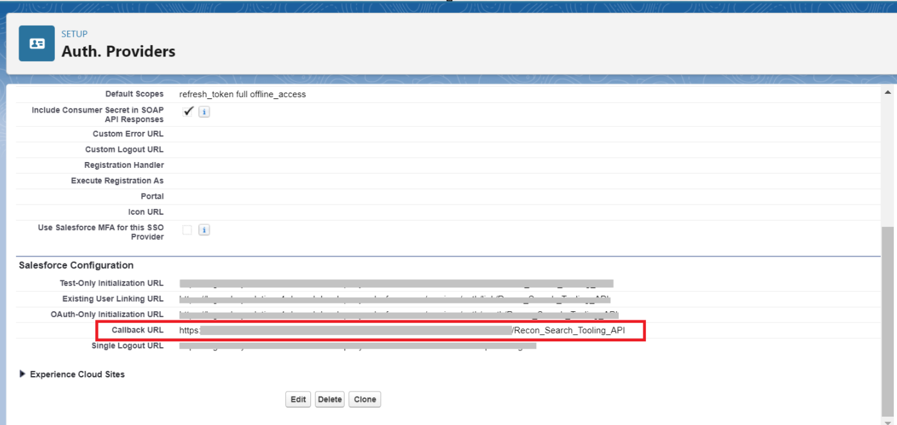

## 3. Create Named Credentials for Tooling API

Step 1: From the Setup, in the search box, type named credential and then select the Named Credentials from the list below the search box.

Step 2: Click on the New Legacy button from the dropdown of the Named Credentials section, as shown below.

Step 3: Input the Name as Recon_Search_Tooling_API and Label as Recon Search Tooling API.

Step 4: In the URL field, enter your org’s instance URL – this will be the URL for your instance (e.g., na1.salesforce.com), or if you are using My Domain, your fully qualified My Domain domain (e.g., mycompany.my.salesforce.com).

Step 5: Under the Identity Type field, choose Named Principal from the drop-down list.

Step 6: Choose OAuth 2.0 in the drop-down list of Authentication Protocol.

Step 7: In the Authentication Provider field, choose the Recon Search Tooling API Auth. Provider created above.

Step 8: Add the Scope as: refresh_token full offline_access

Step 9: Enable the Start Authentication Flow on Save checkbox.

Step 10: Enable the Generate Authorization Header checkbox.

Step 11: Enable the Allow Merge Fields in HTTP Body checkbox.

Step 12: You will be prompted to log in to your org. After you log in, you will see the connected app authorization screen.

Step 13: Allow access to this app (your app). Once complete, you should be redirected to the Named Credential screen and see that the status is now “Authenticated as….”

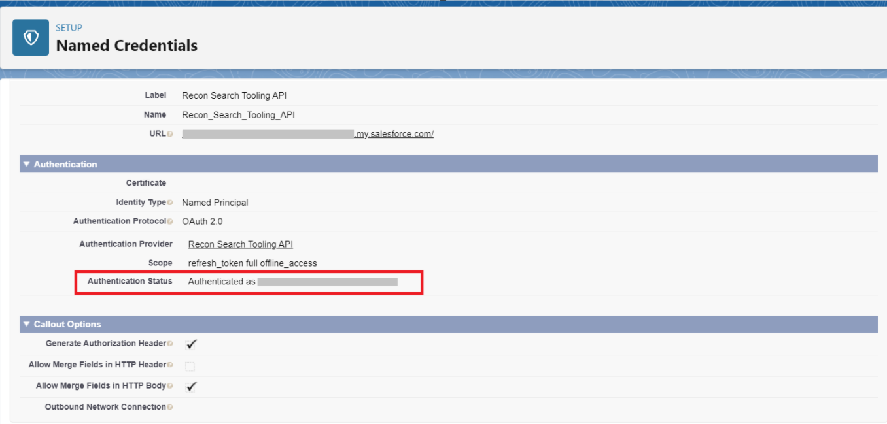

## What is Recon Search?

Recon Search is a custom component created within the salesforce application that helps to get a list of records that matches the search criteria added by the user in the custom or standard object fields available in the component.

How to Use Recon Search:

- The Recon Search component consists of two parts:

1. Record - Details

2. Related Lists

- Recon Search uses a page layout to display fields in the Record Details section and related objects in Related Lists.

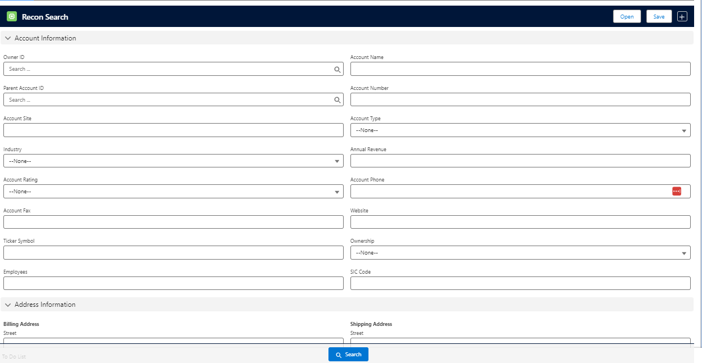

Step 1: Open the object record where the Recon Search component is already added.

Step 2: Click on ‘+’ symbol to get the page layout selection window.

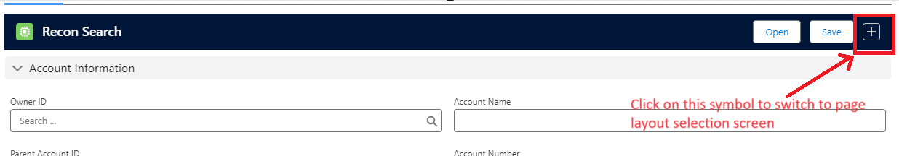

Step 3: Select the required page layout of the object from the drop-down menu.

Note: The Recon Search component only accesses fields and Related lists added to the page layout. To add or remove fields as search inputs, edit the selected page layout. Be mindful that your changes may impact users if the selected page layout is assigned for use at the record level. For this reason, we suggest creating page layouts specifically for use in Recon Search.

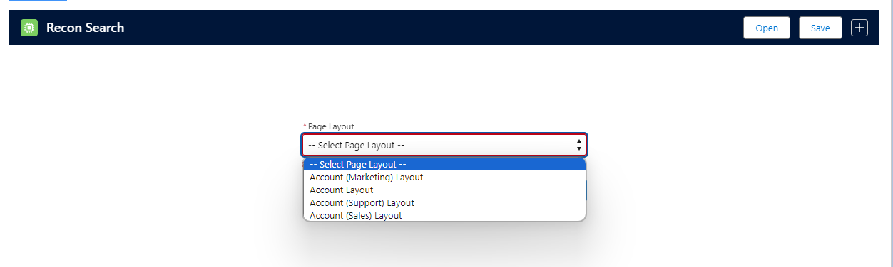

Step 4: Click on the Process & Save button.

Step 5: Now, you can add your search keyword to the respective fields of the object (e.g., Account) and click on the Search button to get a list of records matching your search criteria.

Ex: User wants to see how many account records are available in the org with the Account Name as Test.

Solution: In the Recon Search component, add the test keyword in the Account Name field and click on the Search button.

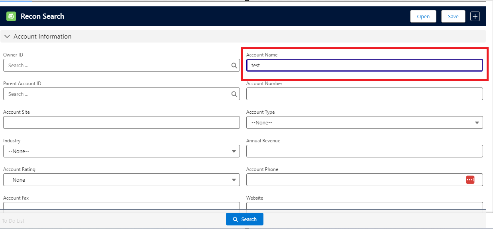

You’ll see a list of account records that start with “test” on top of the component, as shown below:

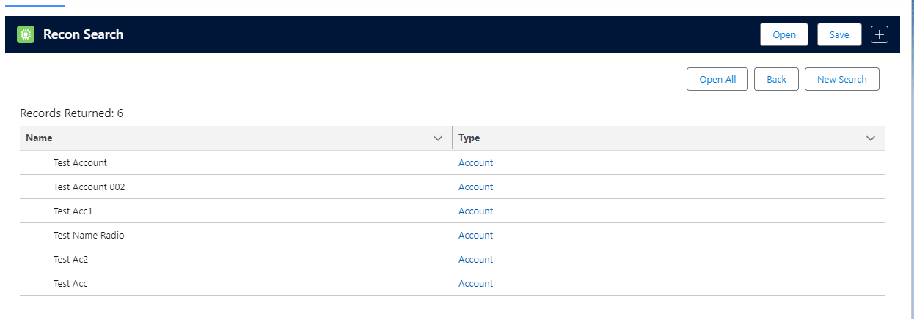

Step 6: Not only can users search the object(e.g, Account) records, but they can also search related objects(e.g, contacts, opportunities) records added in the page layout selected in Step 3 from the same page by adding the search keywords in the related list fields as below:

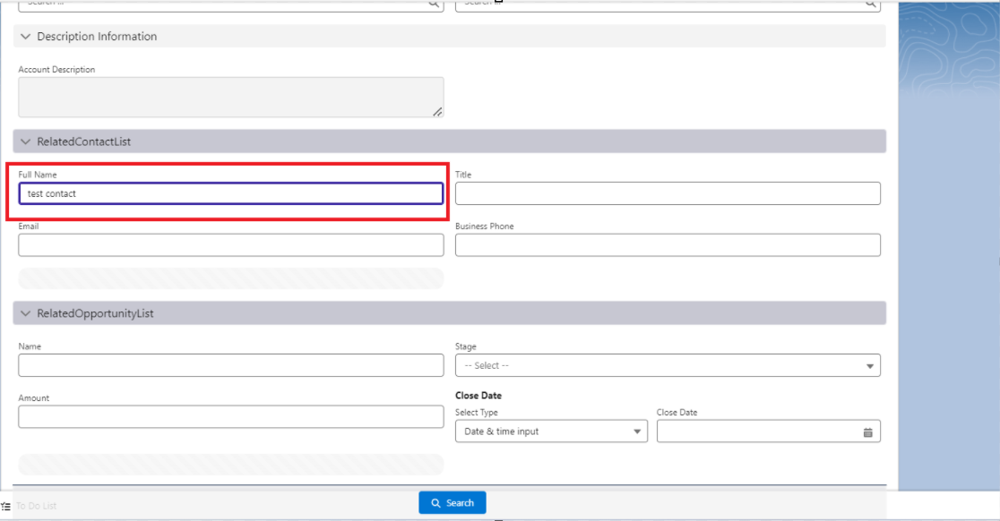

Result:

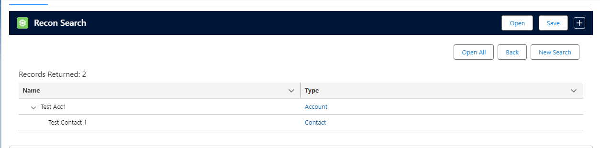

How Recon Search Works:

Recon Search works on a logical ‘AND’ operation while searching the records. Future iterations may enhance this to include ‘OR’ and combined ‘AND/OR’ logic, but is not currently supported.

Scenario 1: If users enter multiple search conditions in the record detail section of the Recon Search component, then Recon Search runs in logical “AND” on the conditions (search criteria) added in the detail section while performing the search operation.

Scenario 2: The user added multiple search conditions in the record detail section and search condition/s in related lists. Then, the user reconfigured the search results for the records by running a logical ‘AND’ on the conditions added in the detail section, which further performed the logical ‘AND’ on the condition/s added in the related lists section.

Use Case 1: The user wants to find all the Account records whose Account names start with Test, the Industry is Other, and the Account Type is Prospect.

Solutions: Go to the Recons Search component added to the account record page, and add the search keywords in the respective fields; as Recon Search uses the ‘AND’ operation while searching, you will get the list of account records that start with test Account Name and its Industry is Other and Account Type is Prospect.

Use Case 2: The user wants to find the Contact (Related list object) records with a Full Name as Test Contact under the Account record with an Account name starting with Test, Industry is Other, and Account Type is Prospect.

Solutions: Go to the Recons Search component added in the account record page, add the search keywords of the account in the respective fields under the detail section, add the keyword Test Contact in the Full name field of the Contact Related list, click on search results the list of account record start with test Account Name and its Industry is Other and Account Type is Prospect along with the contact record with Full Name Test Contact that belongs to the above account.

## Additional Features in Recon Search:

In addition to the search functionality, Recon Search provides the ability to save the search criteria added in the component for future use. Users can also open all the search result records in different tabs with a single click instead of finding and opening them from the list of records in the org.

### - Save :

With this feature, users can save the search criteria added in the component for quick access.

Step 1: Go to the Recons Search component added to the object (e.g., Account) record page, and add the search keywords in the respective fields under the detail section and in the related list fields.

Step 2: Click the Save button. A pop-up window will appear with all the conditions added to the component.

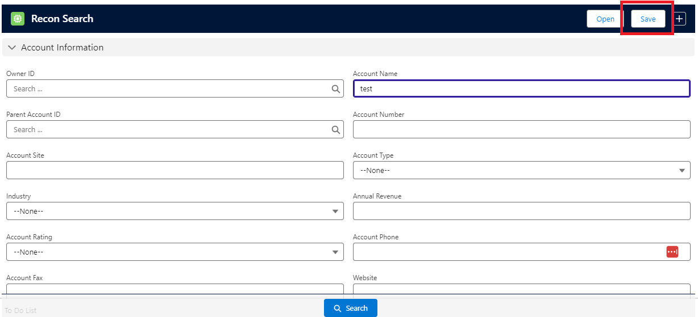

Step 3: Add the relevant name to the criteria and click on the Save button.

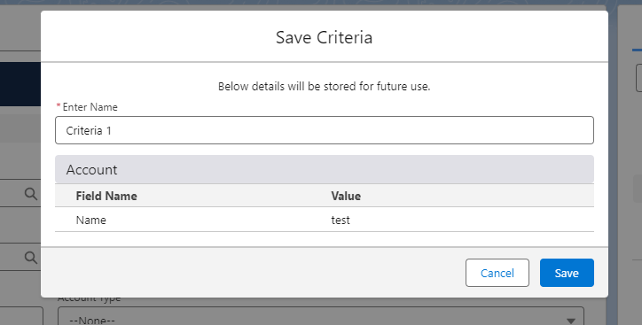

Step 4: To open the saved criteria records, click the Open button.

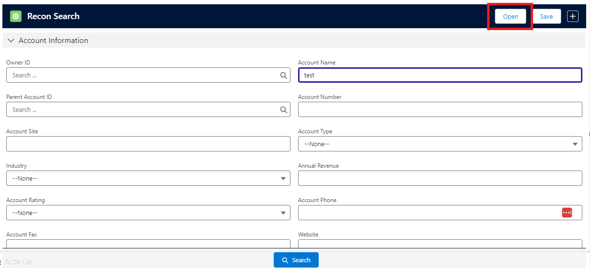

Step 5: Select the saved record from the list.

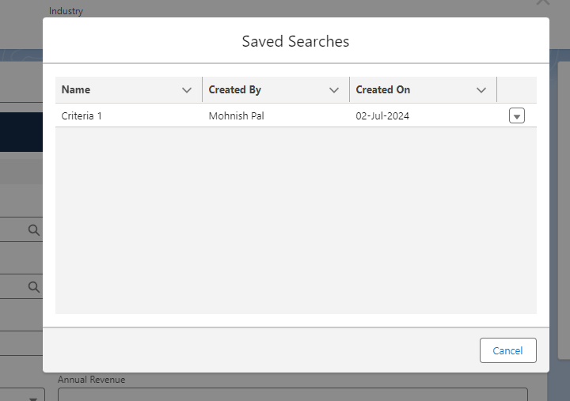

Step 6: Click on the Open button from the drop-down list to load the data for search.

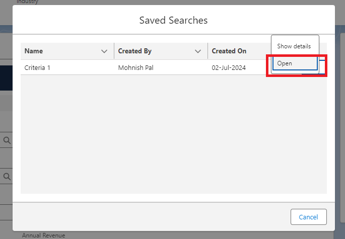

### - Open All :

With this feature, users can open all the search result records in different tabs with a single click instead of finding and opening them from the list of records in the org.

Step 1: Click on the Open All button.

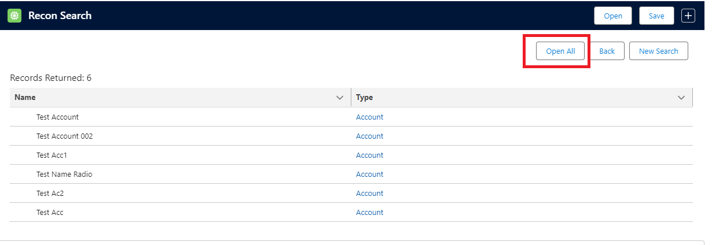

Step 2: A pop-up window will appear with the list of records returned from the search operation.

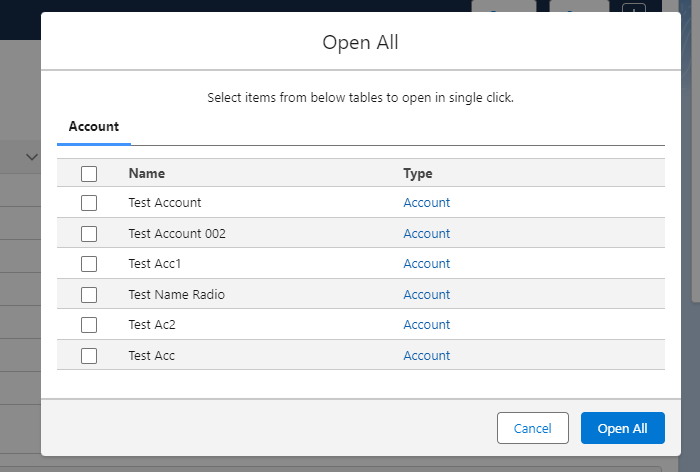

Step 3: Select the checkbox beside the records in the list to open and click on the Open All button. All selected records will open in a new window for each.
