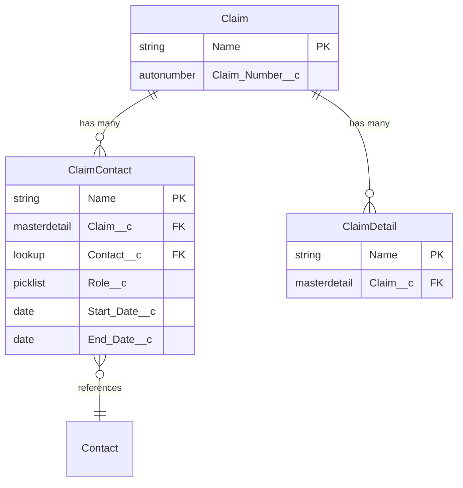

# Claim Relationships

## Overview

The Claim object models the primary record for legal or administrative claims in ReconMMS. The related objects below capture the people and data points required to evaluate, negotiate, and resolve each claim.

## Entity Relationship Diagram
{: .text-delta }

### Diagram Legend
- **||--o{** : One-to-many (master-detail) relationship
- **}o--||** : Many-to-one (lookup) relationship
- **PK**: Primary Key
- **FK**: Foreign Key

## Master-Detail Relationships

### Claim Contact (Claim_Contact__c)
{: .text-delta }

**Purpose**: Tracks every participant connected to a claim
- **Field on Claim Contact**: Claim__c
- **Relationship Type**: Master-Detail
- **Deletion Behavior**: Cascade delete when the parent claim is removed
- **Sharing**: Inherits security from the parent claim
- **Key Fields**:
  - Contact__c (Lookup to Contact for the person involved)
  - Role__c (Picklist describing the participant role such as Claimant or Beneficiary)
  - Start_Date__c / End_Date__c (Participation timeframe)

### Claim Detail (Claim_Detail__c)
{: .text-delta }

**Purpose**: Stores supporting detail tied to a claim (e.g., damages, evidence references, financial breakdowns)
- **Field on Claim Detail**: Claim__c
- **Relationship Type**: Master-Detail
- **Deletion Behavior**: Cascade delete with the parent claim
- **Sharing**: Inherits from Claim__c
- **Key Fields**:
  - Custom fields defined by your org for amounts, categories, notes, or references

## Lookup Relationships

### Contact (Contact)
{: .text-delta }

**Purpose**: Associates each Claim Contact with an existing Salesforce Contact
- **Field on Claim Contact**: Contact__c
- **Relationship Type**: Lookup
- **Deletion Behavior**: `Set Null` on delete (the lookup clears if the contact is removed)
- **Key Considerations**:
  - Use contact merges to prevent duplicates before linking to new claims
  - Field-level security on the Contact record governs which users can access participant details

## Implementation Considerations

1. **Role Governance**
   - Standardize Role__c picklist values so downstream automation and reporting remain consistent.
   - Use validation rules to ensure required participants (e.g., primary claimant) exist before closing a claim.

2. **Data Hygiene**
   - Schedule periodic reviews for inactive Claim Contacts and stale Claim Details.
   - Align naming and categorization conventions across managed package fields and org-specific custom fields.

3. **Security**
   - Confirm the Claim object’s private external sharing model meets confidentiality requirements.
   - Leverage parent sharing for Claim Contact and Claim Detail to keep supporting data restricted to claim owners.
