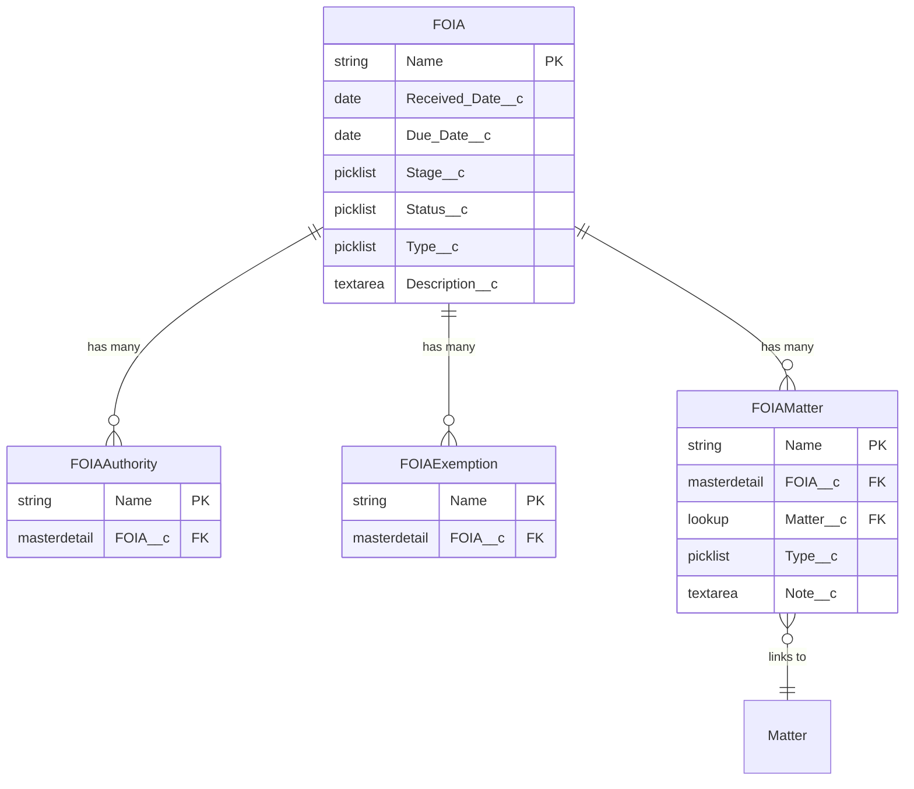

# FOIA Relationships

## Overview

The FOIA object represents Freedom of Information Act requests managed within ReconMMS. Related objects capture legal authorities, exemptions, and connections to active matters so teams can coordinate reviews and disclosures.

## Entity Relationship Diagram
{: .text-delta }

### Diagram Legend
- **||--o{** : One-to-many (master-detail) relationship
- **}o--||** : Many-to-one (lookup) relationship
- **PK**: Primary Key
- **FK**: Foreign Key

## Master-Detail Relationships

### FOIA Authority (FOIA_Authority__c)
{: .text-delta }

**Purpose**: Records statutes, regulations, or policies applied when evaluating a FOIA request.
- **Field on FOIA Authority**: FOIA__c
- **Relationship Type**: Master-Detail
- **Deletion Behavior**: Cascade delete (authorities removed when their FOIA is deleted)
- **Sharing**: Inherits security from the parent FOIA
- **Key Fields**: Additional descriptive fields may be added in your org for citations or notes.

### FOIA Exemption (FOIA_Exemption__c)
{: .text-delta }

**Purpose**: Tracks exemptions invoked to withhold information from release.
- **Field on FOIA Exemption**: FOIA__c
- **Relationship Type**: Master-Detail
- **Deletion Behavior**: Cascade delete with the parent FOIA
- **Sharing**: Controlled by the parent FOIA record
- **Key Fields**: Extend with fields like Category, Justification, or Document Reference as needed.

### FOIA Matter (FOIA_Matter__c)
{: .text-delta }

**Purpose**: Junction object connecting FOIA requests to Matter records for coordinated case management.
- **Field on FOIA Matter**: FOIA__c
- **Relationship Type**: Master-Detail (FOIA controls visibility and ownership)
- **Deletion Behavior**: Cascade delete when the parent FOIA is removed
- **Key Fields**:
  - Matter__c (Lookup to Matter__c)
  - Type__c (Picklist for the kind of linkage)
  - Note__c (Narrative context)

## Lookup Relationships

### Matter (Matter__c)
{: .text-delta }

**Purpose**: Associates FOIA requests to legal matters for cross-functional visibility.
- **Field on FOIA Matter**: Matter__c
- **Relationship Type**: Lookup (Set Null on delete)
- **Key Considerations**:
  - Allows a FOIA request to relate to multiple matters through separate FOIA Matter records.
  - Use automation to keep Matter references in sync with investigative or legal workflows.

## Implementation Considerations

1. **Authority & Exemption Libraries**
   - Maintain consistent naming for statutes and exemptions to aid auditing.
   - Build reports to monitor which authorities and exemptions are used most frequently.

2. **Matter Alignment**
   - Coordinate with matter owners when linking FOIA requests via FOIA Matter records.
   - Use the Note__c field to summarize how FOIA content relates to the matter.

3. **Security & Compliance**
   - FOIA data often contains sensitive content; ensure sharing rules on FOIA__c meet agency requirements.
   - Review field-level security on supporting objects to prevent unauthorized disclosure of exemption rationales.
