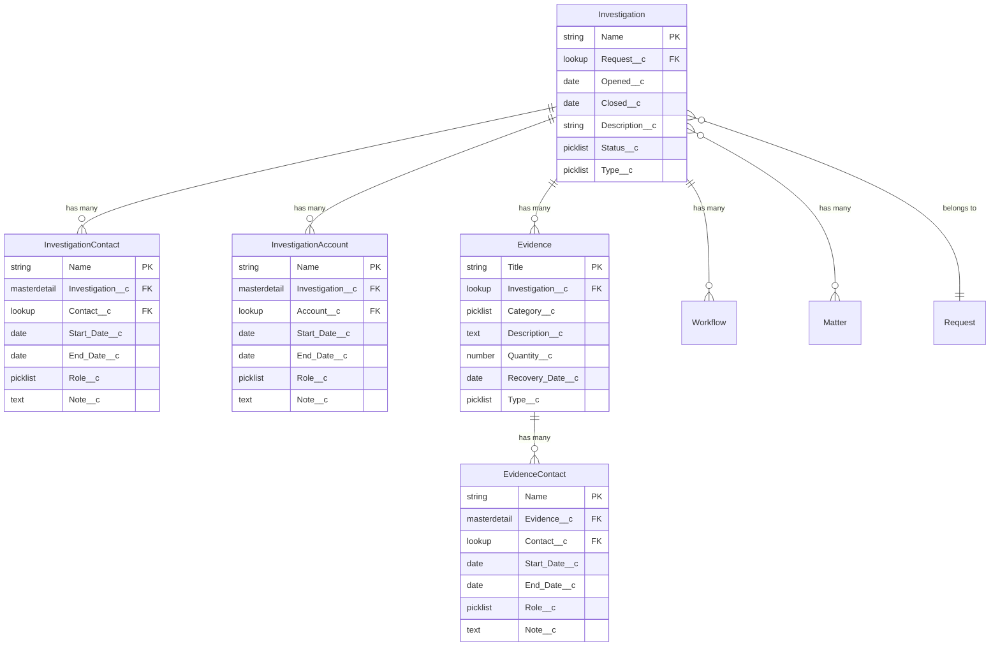

# Investigation Relationships

## Overview

The Investigation object serves as a central point for managing investigative cases, connecting various elements such as evidence, contacts, accounts, and related matters. This document outlines all objects and fields that connect to the Investigation (Investigation__c) object.

Key related objects include:
- [Matter](matter-relationships) for legal proceedings
- [Request](request-relationships) for case origination

## Entity Relationship Diagram
{: .text-delta }

### Diagram Legend
- **||--o{** : One-to-many (master-detail) relationship
- **}o--||** : Many-to-one (lookup) relationship
- **}o--o{** : Many-to-many relationship
- **PK**: Primary Key
- **FK**: Foreign Key

## Key Relationships

### Direct Child Objects (Master-Detail)

#### Investigation Contact (Investigation_Contact__c)
{: .text-delta }

**Purpose**: Tracks all individuals associated with an investigation
- **Field**: Investigation__c
- **Relationship Type**: Master-Detail
- **Deletion Behavior**: Cascade delete
- **Sharing**: Inherits from Investigation
- **Key Fields**:
  - Contact__c (Lookup to Contact)
  - Start_Date__c (When involvement began)
  - End_Date__c (When involvement ended)
  - Role__c (Contact's role in investigation)
  - Note__c (Additional comments)

#### Investigation Account (Investigation_Account__c)
{: .text-delta }

**Purpose**: Tracks organizations involved in the investigation
- **Field**: Investigation__c
- **Relationship Type**: Master-Detail
- **Deletion Behavior**: Cascade delete
- **Sharing**: Inherits from Investigation
- **Key Fields**:
  - Account__c (Lookup to Account)
  - Start_Date__c (Start of involvement)
  - End_Date__c (End of involvement)
  - Note__c (Additional details)
  - Role__c (Organization's role)

#### Evidence (Evidence__c)
{: .text-delta }

**Purpose**: Manages physical and electronic evidence
- **Field**: Investigation__c
- **Relationship Type**: Lookup
- **Key Fields**:
  - Title (Primary identifier)
  - Category__c (Evidence type)
  - Description__c (Detailed description)
  - Quantity__c (Amount of evidence)
  - Recovery_Date__c (When evidence was recovered)
  - Type__c (Physical/Electronic/Other)

### Related Child Objects

#### Evidence Contact (Evidence_Contact__c)
{: .text-delta }

**Purpose**: Tracks individuals associated with specific evidence
- **Relationship Path**: Through Evidence__c
- **Key Fields**:
  - Contact__c (Link to Contact)
  - Role__c (Custodian/Owner/Source/Recovered By)
  - Start_Date__c/End_Date__c (Period of responsibility)
  - Note__c (Additional information)

### Parent Objects

#### Matter (Matter__c)
{: .text-delta }

**Purpose**: Links investigation to related legal matters
- **Field on Matter**: Investigation__c
- **Relationship Type**: Lookup
- **Multiple Matters**: One investigation can be linked to multiple matters
- See [Matter Relationships](matter-relationships) for more details

#### Request (Request__c)
{: .text-delta }

**Purpose**: Links to originating request
- **Field on Request**: Investigation__c
- **Relationship Type**: Lookup
- **Notes**: Investigation may be initiated from a request
- See [Request Relationships](request-relationships) for more details

## Common Use Cases

### 1. Evidence Management
- Tracking physical and electronic evidence
- Managing chain of custody
- Documenting evidence details and recovery
- Recording evidence handlers and custodians

### 2. Participant Tracking
- Managing investigation contacts
- Tracking organizational involvement
- Recording roles and responsibilities
- Maintaining involvement timelines

### 3. Case Management
- Linking to legal matters
- Managing investigation requests
- Tracking investigation progress
- Documenting findings and outcomes

## Best Practices

### Relationship Management
1. **Contact and Account Association**
   - Clear role definition
   - Accurate timeline recording
   - Complete relationship documentation

2. **Evidence Tracking**
   - Detailed evidence records
   - Proper custody chain
   - Complete handler documentation

3. **Matter Integration**
   - Proper matter linkage
   - Clear relationship documentation
   - Regular status updates

### Data Quality
1. **Timeline Accuracy**
   - Precise start/end dates
   - Regular timeline verification
   - Complete date tracking

2. **Role Management**
   - Clear role definitions
   - Regular role updates
   - Proper documentation

3. **Documentation Standards**
   - Detailed notes
   - Consistent formatting
   - Complete information

## Implementation Guidelines

### 1. Security Configuration
- **Sharing Rules**
  - Investigation record sharing
  - Related record access
  - Role-based security

- **Field-Level Security**
  - Sensitive field protection
  - Role-based field access
  - Proper permission sets

### 2. Data Migration
- **Required Fields**
  - Mandatory relationship fields
  - Required dates and roles
  - Essential documentation

- **Dependencies**
  - Proper record creation order
  - Relationship validation
  - Data integrity checks

### 3. Automation Considerations
- **Workflow Rules**
  - Status updates
  - Notification rules
  - Timeline tracking

- **Process Builders/Flows**
  - Relationship automation
  - Record creation
  - Data validation

## Impact Analysis

### Deletion Considerations
- Master-detail cascade effects
- Evidence record implications
- Historical data preservation

### Access Patterns
- Investigation team access
- Evidence handler permissions
- Matter team integration

### Reporting Requirements
- Relationship reporting
- Timeline tracking
- Evidence management
- Contact/Account involvement

## Technical Specifications

### Required Fields
1. **Investigation Records**
   - [List key required fields]

2. **Related Records**
   - Investigation Contact requirements
   - Investigation Account requirements
   - Evidence record requirements

### Validation Rules
- Timeline validation
- Role requirements
- Relationship rules

### Automation Logic
- Workflow triggers
- Process automation
- System integration points