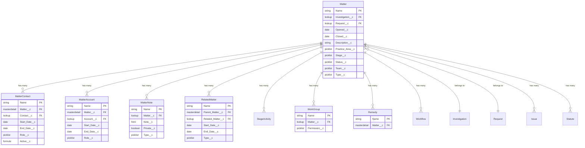

# Matter Relationships

## Overview

The Matter object serves as a central point in ReconMMS, connecting various aspects of legal case management. This document outlines all objects and fields that connect to the Matter (Matter__c) object.

## Entity Relationship Diagram
{: .text-delta }

### Diagram Legend
- **||--o{** : One-to-many (master-detail) relationship
- **}o--||** : Many-to-one (lookup) relationship
- **PK**: Primary Key
- **FK**: Foreign Key

## Master-Detail Relationships

### Matter Contact (Matter_Contact__c)
{: .text-delta }

**Purpose**: Tracks all individuals associated with a matter
- **Field on Matter Contact**: Matter__c
- **Relationship Type**: Master-Detail
- **Deletion Behavior**: Cascade delete
- **Sharing**: Inherits from Matter
- **Key Fields**:
  - Contact__c (Lookup to Contact)
  - Role__c (Contact's role in matter)
  - Start_Date__c/End_Date__c (Involvement period)
  - Active__c (Current status)

### Matter Account (Matter_Account__c)
{: .text-delta }

**Purpose**: Tracks all organizations associated with a matter
- **Field on Matter Account**: Matter__c
- **Relationship Type**: Master-Detail
- **Deletion Behavior**: Cascade delete
- **Sharing**: Inherits from Matter
- **Key Fields**:
  - Account__c (Lookup to Account)
  - Role__c (Organization's role)
  - Start_Date__c/End_Date__c (Involvement period)

### Related Matter (Related_Matter__c)
{: .text-delta }

**Purpose**: Links related legal matters together
- **Field on Related Matter**: Parent_Matter__c
- **Relationship Type**: Master-Detail
- **Key Fields**:
  - Related_Matter__c (Lookup to Matter)
  - Type__c (Relationship type)
  - Start_Date__c/End_Date__c (Relationship period)

### Remedy (Remedy__c)
{: .text-delta }

**Purpose**: Tracks remedies associated with the matter
- **Field on Remedy**: Matter__c
- **Relationship Type**: Master-Detail
- **Deletion Behavior**: Cascade delete

### Stage Activity (Stage_Activity__c)
{: .text-delta }

**Purpose**: Tracks matter stages and milestones
- **Field on Stage Activity**: Matter__c
- **Relationship Type**: Master-Detail
- **Deletion Behavior**: Cascade delete

## Lookup Relationships

### Matter Note (Matter_Note__c)
{: .text-delta }

**Purpose**: Stores matter-related notes with privacy controls
- **Field on Matter Note**: Matter__c
- **Relationship Type**: Lookup
- **Key Fields**:
  - Note__c (Rich text content)
  - Private__c (Privacy flag)
  - Type__c (Note categorization)

### Work Group (Work_Group__c)
{: .text-delta }

**Purpose**: Associates work groups with matters
- **Field on Work Group**: Matter__c
- **Relationship Type**: Lookup
- **Key Fields**:
  - Permission__c (Access level)

### Related Records ON Matter
{: .text-delta }

- **Investigation__c**: Links to related investigation
- **Request__c**: Links to originating request

## Junction Objects

### Matter-Issue Relationship
{: .text-delta }

**Purpose**: Links issues to matters
- **Object**: Issue__c
- **Relationship Type**: Configurable
- **Key Considerations**: 
  - Flexible relationship type
  - Supports multiple issues per matter

### Matter-Statute Relationship
{: .text-delta }

**Purpose**: Associates relevant statutes
- **Object**: Statute__c
- **Relationship Type**: Configurable
- **Key Considerations**:
  - Flexible relationship type
  - Supports multiple statutes per matter

## Common Use Cases

1. **Team Management**
   - Assigning team members via Matter Contact
   - Setting up work groups
   - Managing roles and permissions

2. **Relationship Tracking**
   - Recording organization involvement
   - Managing contact relationships
   - Tracking related matters

3. **Documentation**
   - Creating private and public notes
   - Recording remedies
   - Tracking stage progression

## Best Practices

### Relationship Management

1. **Record Creation**
   - Establish clear roles
   - Set accurate dates
   - Maintain relationship types

2. **Data Maintenance**
   - Regular status updates
   - Timeline accuracy
   - Relationship verification

3. **Access Control**
   - Appropriate sharing rules
   - Work group configuration
   - Note privacy settings

## Implementation Guidelines

1. **Setup Requirements**
   - Field-level security
   - Page layouts
   - Record types
   - Sharing rules

2. **Automation Considerations**
   - Workflow rules
   - Process builders
   - Validation rules
   - Triggers

3. **Security Configuration**
   - Object permissions
   - Field permissions
   - Sharing rules
   - Record access

4. **Data Migration Planning**
   - Required fields
   - Relationship validation
   - Data cleanup
   - Import order