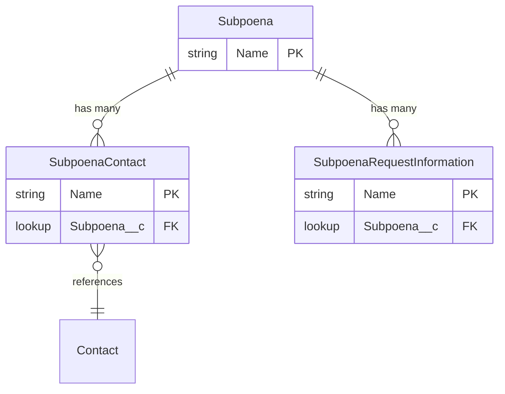

# Subpoena Relationships

## Overview

The Subpoena object tracks legal documents that compel testimony or the production of evidence. The related child objects capture the individuals involved and the specific information being requested.

## Entity Relationship Diagram
{: .text-delta }

### Diagram Legend

| Symbol | Meaning |
|--------|---------|
| <code>&#124;&#124;--o{</code> | One-to-many (master-detail) relationship |
| <code>}o--&#124;&#124;</code> | Many-to-one (lookup) relationship |
| **PK** | Primary Key |
| **FK** | Foreign Key |

## Child Relationships

### Subpoena Contact (Subpoena_Contact__c)
{: .text-delta }

**Purpose**: Links contacts to a specific subpoena, identifying individuals served by or involved in the subpoena
- **Field on Subpoena Contact**: Subpoena__c
- **Relationship Type**: Lookup
- **Deletion Behavior**: Set Null if the parent subpoena is removed
- **Key Considerations**:
  - Create a record for each individual associated with the subpoena
  - Supports tracking of witnesses, custodians, and parties compelled to testify or produce documents

### Subpoena Request Information (Subpoena_Request_Information__c)
{: .text-delta }

**Purpose**: Captures the specific documents, testimony, or information being requested by the subpoena
- **Field on Subpoena Request Information**: Subpoena__c
- **Relationship Type**: Lookup
- **Deletion Behavior**: Set Null if the parent subpoena is removed
- **Key Considerations**:
  - Create a separate record for each distinct request item in the subpoena
  - Use to track fulfillment status per request
  - Supports itemized tracking of compliance with subpoena demands

## Lookup Relationships

### Contact (Contact)
{: .text-delta }

**Purpose**: Associates each Subpoena Contact with an existing Salesforce Contact record
- **Referenced from**: Subpoena_Contact__c (implied via the Contact standard object)
- **Key Considerations**:
  - Ensure contact records exist before linking to subpoena contacts
  - Use contact merges to prevent duplicates

## Implementation Considerations

1. **Subpoena Tracking**
   - Create a subpoena record for each subpoena received or issued
   - Link all served individuals via Subpoena Contact records
   - Itemize all requested information via Subpoena Request Information records

2. **Compliance Workflow**
   - Use request information records to track which items have been fulfilled
   - Monitor outstanding subpoena contacts for service confirmation
   - Consider workflow rules or automation for deadline tracking

3. **Security**
   - Subpoena records use a private sharing model — ensure appropriate access for legal team members
   - Review field-level security on contact and request information details
